# mylo User Manual

mylo is a desktop RSS and Atom reader. It runs on your machine, fetches feeds
directly from the sites that publish them, and keeps everything it has read in
a single SQLite file you own. There is no account, no server and no browser
engine inside it.

You are reading this inside mylo, in the same reading pane articles appear in.
Open it any time from **Help, mylo User Manual**, or press **F1**. Picking any
article in the list puts you back where you were: opening the manual does not
change which feed is selected and does not mark anything read.

Every picture below is generated by driving the application, not taken by
hand, so the manual cannot quietly stop matching the app. To regenerate the
whole set:

```bash
ux-scripts/capture-reader-manual.sh
```

---

## 1. The window

mylo has three panes, left to right: the **sidebar** of feeds, the **article
list** for whatever the sidebar has selected, and the **reading pane**.

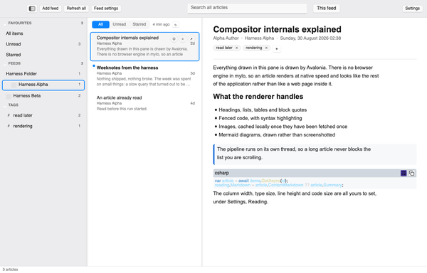

Along the top is one toolbar for the whole window rather than one per pane:
the layout button, Add feed, Refresh all, Feed settings, the search box and
its scope toggle, and Settings. Along the bottom is a status line, which is
where mylo tells you what just happened and what went wrong.

The two dividers between the panes are draggable. The reading column keeps its
own width inside whatever the reading pane ends up being, so widening the
window widens the margins rather than the line length.

---

## 2. The sidebar

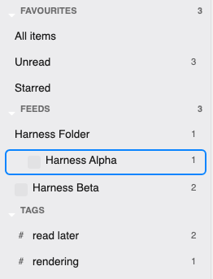

Three groups, each collapsible by clicking its heading.

- **Favourites** holds the three smart rows. **All items** is every article
  from every feed, **Unread** is every article you have not read, and
  **Starred** is everything you starred. The number on the right of Unread is
  the count of unread articles, and it is the same number the menu bar item
  shows.
- **Feeds** holds your subscriptions. A feed inside a folder is indented under
  it, and folders that have unread articles carry a count of their own. Feeds
  that belong to no folder are listed after the folders.
- **Tags** appears only once you have tagged something. Selecting a tag lists
  every article carrying it, across every feed.

A feed with a problem grows a small **!** after its name. Hover it and it says
what the problem is: the last error, or that the feed has been paused.

Right-clicking a feed offers Refresh, Rename, Mark all read, Feed settings and
Unsubscribe, and offers Resume when the feed has been paused. Right-clicking a
tag offers Rename and Delete; both are also on the toolbar whenever a tag is
selected. Renaming a tag renames it on every article carrying it, and renaming
one onto a name already in use merges the two, which is what calling them the
same thing means. Deleting a tag asks first, says how many articles it is on,
and removes only the tag: the articles are kept.

---

## 3. Collapsing panes

The leftmost button on the toolbar collapses panes one at a time. Its icon is
drawn from the current layout, so it always shows which panes are on screen.
Each click removes the leftmost one still showing, and a third click brings
everything back. The reading pane never collapses: whatever else goes, the
article you are reading stays.

| Click | Icon | What is on screen |
|---|---|---|
| Start | 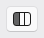 | Sidebar, list and article |
| Once | 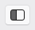 | List and article |
| Twice | 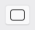 | Article only |

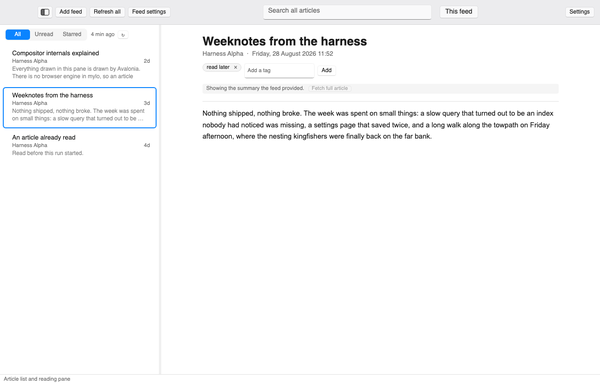

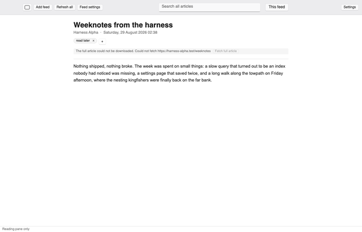

The same three positions are in the **View** menu, along with **Cycle Layout**
which does exactly what the button does. Whichever layout you leave mylo in is
the one it comes back in next time.

---

## 4. Subscribing to a feed

**Add feed** on the toolbar, **File, Add Feed...**, or `Cmd+N` (`Ctrl+N` off
macOS).

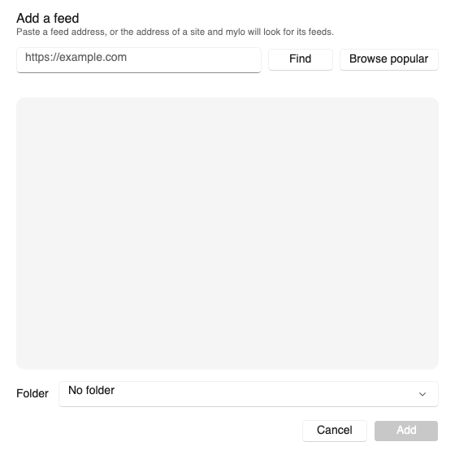

You do not need the feed's address. Paste the address of the site and press
**Find**, and mylo goes looking:

1. `<link rel="alternate">` tags in the page, which is where a site is
   supposed to declare its feeds.
2. Feed-shaped links in the page body, for sites that do not declare them.
3. The conventional addresses (`/feed`, `/rss.xml`, `/atom.xml` and friends).
4. Failing all three, whether the page itself is a list of articles. See
   [Sites with no feed](#sites-with-no-feed) below.

A bare domain is normalised to `https://` before anything is fetched, so
`xkcd.com` is enough.

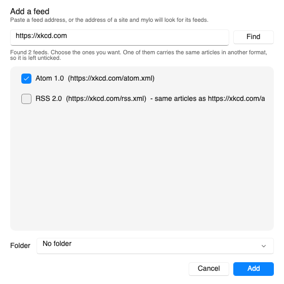

When a site publishes the same articles as both RSS and Atom, mylo says so and
pre-ticks only one of them, so you do not end up subscribed twice to one blog.
Pick a folder if you want one, then **Add**. Anything you add is fetched
immediately rather than waiting for the next scheduled refresh.

### Sites with no feed

Plenty of sites worth reading publish no feed at all. When the three stages
above come back empty, mylo looks at the page you gave it and works out whether
it is an index of articles: a run of repeated blocks, each holding one link
with a real title, usually with a date beside it. That is the shape a template
produces when it lays out a list of posts, and it is what tells a blog index
apart from a nav bar, a tag cloud or a row of *Read more* links.

Three kinds of page it now declines on purpose, because each of them used to be
offered wrongly. A run of links inside a page's own navigation, header, footer
or sidebar is treated as furniture, whatever the link text says. An article with
a list of further reading at the bottom of it is read as the article it is, not
as the short list in its footer. And a run with no dates anywhere in it has to
be a long one before it counts, because a documentation page's card of six
undated links reads exactly like six blog posts and is not one.

It also no longer takes a page's word for it when a site's front page is
mislabelled. Some publishers tag their homepage as a single article; a page
served at the root of a site is never one, so the label is ignored there. On any
other address, a page that calls itself an article has to look overwhelmingly
like an index before mylo will disagree with it, which is why an article with a
*More stories* rail is still not offered.

If it finds a list, it says so, tells you how many articles it found and shows
you some of the titles.

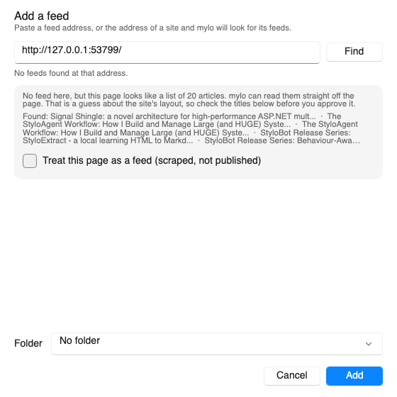

**Nothing is added until you tick the approval box.** This is deliberate. A
discovered feed arrives ticked because the site declared it; this is mylo
guessing at somebody else's page layout, so it is offered unticked, with the
titles in front of you, and **Add** does nothing until you have agreed with the
guess. Read the titles: if they are the articles you expected, approve it. If
they are the site's tags or its navigation, do not.

A page that already publishes a feed is never offered this way. A real feed is
always the better answer, and the detector only runs when there isn't one.

Some sites are laid out in a way mylo's own reading cannot follow. LWN is the
example: every headline on its front page is a heading with no link in it at
all, and the article's address only turns up further down, in the paragraph
underneath, next to whatever else that paragraph happens to link to. When the
first reading finds nothing, a second one is tried, and it will only offer a
page whose entries point at that site's own pages. That rules out the case
worth ruling out, which is a page whose repeated links are citations or further
reading rather than an index: those point away from the site, so they are never
offered. An offer that came from the second reading says so, in as many words,
because it is a guess mylo's first reading disagreed with and the tick is still
yours to give.

Once approved it is an ordinary subscription. It refreshes on the same
schedule, dedupes against your other feeds, supports tags, starring, offline
download and retention exactly as a real feed does; if the site later starts
publishing a feed carrying the same articles, subscribing to that will not give
you everything twice.

The one difference is honesty about what it is. A scraped feed's update line
says **scraped**, and hovering it says why that matters:

> Scraped page, not a published feed. mylo reads the article list out of the
> page's HTML, so it can break when the site changes its layout.

What happens when it does break is covered under
[When a scrape stops working](#when-a-scrape-stops-working).

Addresses that point at loopback, at a link-local address or into a private
network are refused. mylo fetches feeds unattended in the background, so an
address that names something inside your network is not something it will
quietly start requesting.

---

## 5. Importing and exporting OPML

OPML is the interchange format every reader understands. Both directions live
under **File**.

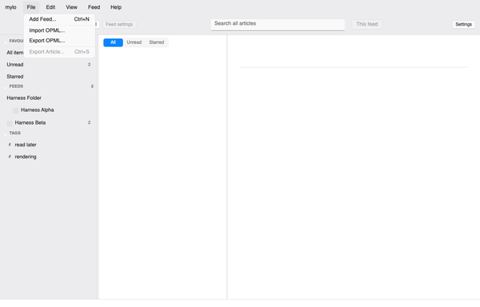

*(The accelerators read `Ctrl` in that picture because the screenshots are
captured on a headless renderer. On macOS they are `Cmd`, and the menus are in
the system menu bar rather than inside the window.)*

**Import OPML...** reads a subscription list and adds everything in it.
Folders in the file become folders here; a file nested deeper than one level
is flattened onto its outermost folder rather than dropped. Feeds you are
already subscribed to are skipped, so re-importing the same file is safe and
adds nothing. Every address in the file is checked before it is stored, and
anything refused is reported rather than silently ignored. mylo then fetches
exactly the feeds this import added, and nothing else.

**Export OPML...** writes everything you are subscribed to, folders included.
A small export looks like this:

```xml
<?xml version="1.0" encoding="UTF-8"?>
<opml version="2.0">
  <head>
    <title>mylo subscriptions</title>
    <dateCreated>Sat, 29 Aug 2026 09:15:00 GMT</dateCreated>
  </head>
  <body>
    <outline text="Development">
      <outline text="mostlylucid" type="rss"
               xmlUrl="https://www.mostlylucid.net/rss.xml"
               htmlUrl="https://www.mostlylucid.net/" />
    </outline>
    <outline text="xkcd" type="rss"
             xmlUrl="https://xkcd.com/atom.xml"
             htmlUrl="https://xkcd.com/" />
  </body>
</opml>
```

If you renamed a feed, the name you gave it is carried in an extra
`lucidTitleOverride` attribute alongside the publisher's own title. Readers
that do not know that attribute ignore it; mylo reads it back on import, so a
round trip through a file keeps your names.

---

## 6. Reading

Click an article, or press `J` and `K` to walk down and up the list.

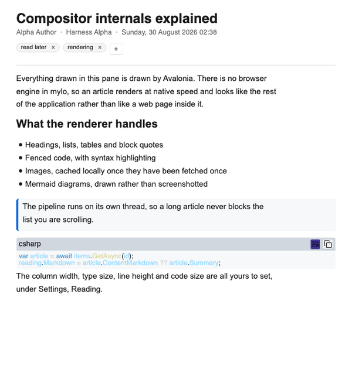

Headings, lists, tables, block quotes, fenced code with syntax highlighting,
images and mermaid diagrams are all drawn by mylo itself. Nothing here is a
web page in disguise.

Links open in your browser. Only `http` and `https` links are ever opened; a
link in a feed pointing anywhere else is refused and the reason goes on the
status line. You can turn browser opening off entirely under **Settings,
Reading**.

Press `O`, or use the arrow on a list row, to open the article on the site it
came from.

### Marking read

Selecting an article marks it read after a short dwell rather than instantly,
so holding `J` to scan a list does not mark everything behind you as read. The
dwell is 800 milliseconds by default and is a setting. `M` toggles read state
by hand, and hovering a list row offers the same thing without selecting it.

### Offline articles and full text

mylo can download each article's full text and convert it to markdown, so the
reading pane shows the piece rather than the two-line summary the feed
carried, and shows it with no network. That is on by default and is both a
global setting and a per-feed one.

When what you are looking at is only the summary, the pane says so and offers
to go and get the rest:

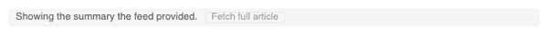

The badge is not shown at all for an article whose full text mylo already has.
A download that failed says so, with the reason, and the button becomes a
retry.

---

## 7. Tags

The tag strip sits under the article's byline. Type a name, press Enter or
click **Add**; click the small × on a chip to take one off.

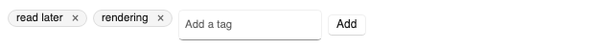

`T` opens a dialog that edits the whole list as comma-separated text, which is
faster when you are changing several at once. **Edit, Edit Tags...** does the
same.

Tags are shared across articles, so the first time you use one it appears in
the sidebar's Tags section and every article you put it on afterwards joins
that list. Names are trimmed, collapsed to single spaces, capped at 32
characters and matched without regard to case, so `read later`, `Read Later`
and `read  later` are one tag rather than three.

---

## 8. Filtering, starring and searching

### The filter segments


The three segments above the list narrow whatever is selected. They apply to
searches too, so a search under **Unread** returns unread articles only.

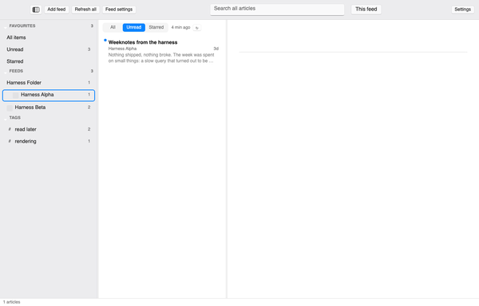

Selecting one of the smart rows in Favourites overrides the segments for its
own filter, because a row called Starred cannot sensibly show unstarred
articles.

`S` stars and unstars the selected article, and the same action is on the
hover row actions.

### Search

Type in the toolbar's search box, or press `/` to jump to it. Results come in
as you type.

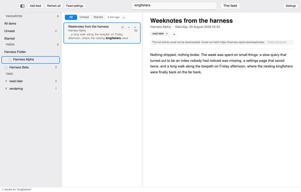

Search covers titles, authors, the publisher's summary and the full text of
anything downloaded. It is ranked rather than merely filtered: a match in a
headline outranks one in a summary, which outranks one buried in paragraph
nine, so the article you meant is usually first.

A matching row replaces its usual preview with the passage that actually
matched, with your terms picked out, so the row can say why it is in the list:

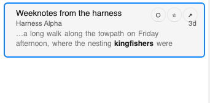

By default search spans every feed, which is the search you usually want
("where did I read that?"). The **This feed** toggle beside the box narrows it
to the selected feed or folder. It is disabled on a smart row, which is not
something to narrow to.

What you type is searched for literally, so FTS5 operator syntax typed into
the box is treated as text rather than parsed. Nothing you type is sent
anywhere: search runs against the local database. The one exception is opt-in
and off by default, and is described under Settings below.

---

## 9. Refreshing

### The per-feed line

Selecting a feed puts a quiet line above its list saying when it last updated,
with a button to fetch it now.

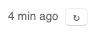

The short form is what fits; hovering it gives the whole sentence, which also
says when the feed is next due, for example *Updated 4 min ago · Next in 26
min*. The line is hidden for folders and for the smart rows: a folder groups
feeds with separate schedules and a smart row spans them all, so neither has a
last-updated time to report.

Other states it can show: **Not updated yet** for a feed added but not yet
fetched, **Last update failed**, **Refreshing now...**, **Paused after
repeated failures**, and **Updates are turned off for this feed** when you
have disabled it in its settings.

### The schedule

mylo checks each feed on an interval, 30 minutes by default, adjustable
globally and per feed. No setting can poll faster than every 5 minutes.

Requests are conditional once mylo has seen a feed: it sends `If-None-Match`
and `If-Modified-Since` and treats `304 Not Modified` as the answer it hoped
for. `Retry-After` is honoured where a server sends it.

A feed that fails backs off exponentially with jitter, from 2 minutes up to a
ceiling of 6 hours, rather than being retried on the same schedule as a
healthy one. After **20 consecutive failures** the feed is paused outright and
mylo stops asking. That is deliberate: a host that has been refusing for days
should not still be receiving requests.

A paused feed shows the **!** marker in the sidebar, and the status line says
how many feeds are in that state. Select it and a **Resume feed** button
appears on the toolbar; the same action is on the feed's right-click menu and
under **Feed, Resume Feed**. Resuming clears the failure count and puts the
feed back into the rotation.

**Refresh all** on the toolbar, or `Shift+R`, queues everything that is due
right now, and if nothing is due it queues every enabled feed anyway, so the
button always does something. `R` refreshes just the selected feed.

If mylo has been closed or the machine asleep, the backlog is worked through a
batch at a time on waking rather than all at once.

### When a scrape stops working

A subscription to a page mylo scrapes depends on that page's markup, and sites
get redesigned. When a refresh of a scraped page finds no articles, mylo treats
it as a **failure**, not as a quiet day.

That distinction is the whole point. Recorded as a success with nothing new,
a scrape that had stopped working would look exactly like a site that had not
posted, and could stay that way for months without ever saying so. Recorded as
a failure it goes down the same path a dead feed goes down: the feed's line
says **Last update failed**, the sidebar shows the **!** marker, hovering it
gives the reason ("This is a scraped page, and it no longer looks like a list
of articles. The site has probably changed its layout."), the schedule backs
off, and after 20 consecutive failures the feed is paused and counted in the
status line.

Nothing already collected is deleted. The articles mylo has are still there to
read while you decide what to do, which is usually one of: check whether the
site now publishes a real feed, or unsubscribe.

### Offline

With **Pause refreshing while offline** on, which is the default, mylo stops
trying when there is no network and says so, then picks up again when the
network comes back. That is a courtesy to the sites you subscribe to as much
as to your battery: nothing is gained by 40 failed requests to a host that is
perfectly fine.

---

## 10. Settings

**Settings** at the right of the toolbar, or `Cmd+,` (`Ctrl+,` off macOS).
Five groups.

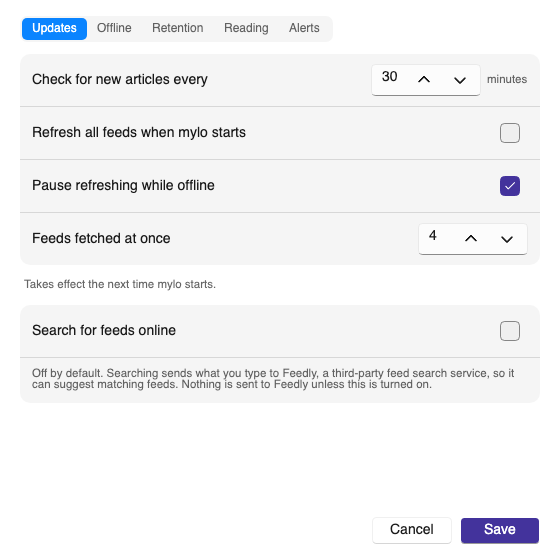

**Updates** is the default refresh interval, whether to refresh everything at
startup, whether to pause while offline, and how many feeds may be fetched at
once. The last one takes effect at the next launch.

The **Search for feeds online** switch at the bottom is the one setting that
lets mylo send anything you typed to a third party: with it on, the add-feed
dialog can ask Feedly's public index for feeds matching a search term. It is
off by default and nothing is sent unless you turn it on.

**Offline** is whether new articles are downloaded for offline reading,
whether their full text is fetched rather than just the feed's summary,
whether images are cached, and how many downloads run at once.

**Retention** is how long articles are kept: read articles for a number of
days, unread ones forever or for a number of days, a cap per feed, and whether
starred articles are exempt from all of it. Starred are exempt by default.
**Clean up now** applies the rules immediately and tells you the database size.

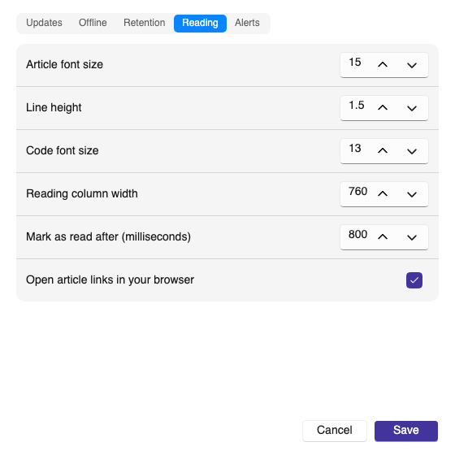

**Reading** is the article typography: font size, line height, code font size,
the reading column width, the mark-as-read dwell, and whether links open in
your browser. Column width is a preference, not a fixed measure: it is capped
by whatever the reading pane can currently show, so narrowing the pane does
not lose the width you chose. `Cmd+=`, `Cmd+-` and `Cmd+0` step the article
text size without opening this dialog.

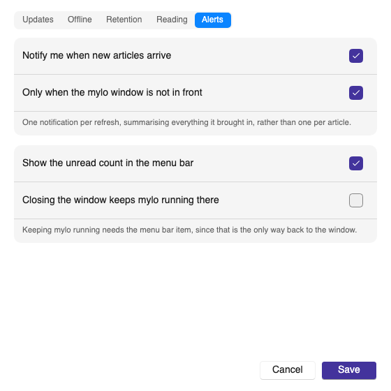

**Alerts** is four switches, because "tell me when something arrives" and "sit
in the menu bar" are separate wants:

- Notify when new articles arrive. One notification per refresh, summarising
  what it brought in, rather than one per article.
- Only when the mylo window is not in front, so a refresh you can already see
  happening does not also interrupt you.
- Show the unread count in the menu bar. That item's menu offers Open mylo,
  Refresh all, Mark all read and Quit.
- Closing the window keeps mylo running there. Off by default, and only
  available while the menu bar item is shown, since otherwise there would be
  no way back to the window.

Both of those depend on the platform, and section 17 has the detail. In short:
the notification is a real system notification on macOS and a toast inside the
mylo window on Windows and Linux, and the status item is a menu bar item on
macOS, a tray icon on Windows, and on Linux only appears if the desktop
session runs a StatusNotifierItem host.

---

## 11. Per-feed settings

Select a feed and press **Feed settings** on the toolbar, or use **Feed, Feed
Settings...**, or the feed's right-click menu.

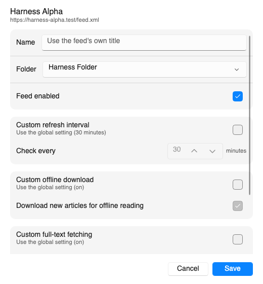

The name and folder are here, along with a switch that turns updates off for
this feed without unsubscribing.

Below that, everything is an override with its own switch. While the switch is
off the feed follows the global setting and the label says what that currently
is, so you can see what you would be changing before you change it. Refresh
interval, offline download, full-text fetching and retention can each be
overridden this way.

---

## 12. The menus


Six menus. On macOS they are in the system menu bar; on Windows and Linux they
are at the top of the window, which is what these pictures show.

- **mylo**: About, Settings, Quit.
- **File**: Add Feed, Import and Export OPML, Export Article (writes the
  current article as a markdown file).
- **Edit**: the usual text actions, plus Find in Article (which puts you in
  the search box, since the reading pane has no find of its own) and Edit
  Tags.
- **View**: the three layouts and Cycle Layout, the three filters, and the
  three text-size steps.
- **Feed**: Refresh All, Refresh Feed, Mark All Read, Feed Settings, Resume
  Feed, Unsubscribe. Everything feed-specific is greyed out unless a feed is
  selected.
- **Help**: this manual, the shortcut list, and the project page.

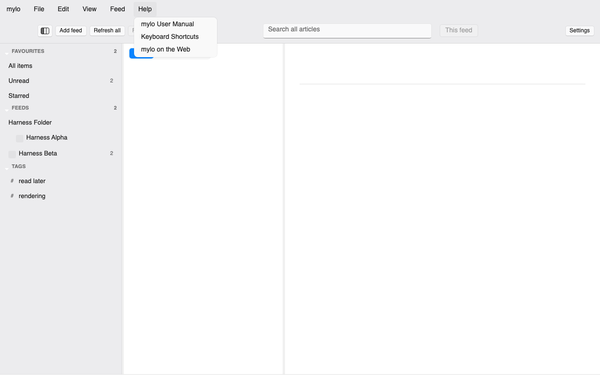

---

## 13. Keyboard shortcuts

The single-letter shortcuts work whenever the keyboard focus is not in a text
box. That exception is not incidental: typing "compositor" into the search box
must type a word, not open a browser, mark an article read and start a fetch.

| Key | What it does |
|---|---|
| `J` | Next article |
| `K` | Previous article |
| `N` | Next unread |
| `P` | Previous unread |
| `M` | Toggle read |
| `S` | Toggle star |
| `R` | Refresh the selected feed |
| `Shift+R` | Refresh every feed |
| `O` | Open the original on the web |
| `T` | Edit this article's tags |
| `/` | Jump to the search box |
| `F1` | This manual |

`F1` is the exception to the rule above: it produces no character, so it
cannot be typed by accident and it works wherever the caret happens to be.

These carry the command modifier, which is `Cmd` on macOS and `Ctrl` on
Windows and Linux. They work while you are typing, the same as everywhere
else.

| Key | What it does |
|---|---|
| `Cmd+N` | Add a feed |
| `Cmd+F` | Find in article, which puts you in the search box |
| `Cmd+S` | Export the current article |
| `Cmd+,` | Settings |
| `Cmd+=` | Bigger article text |
| `Cmd+-` | Smaller article text |
| `Cmd+0` | Default article text size |
| `Cmd+Q` | Quit |

**Help, Keyboard Shortcuts** prints the single-letter list on the status line
if you need a reminder without leaving what you are reading.

---

## 14. Where mylo keeps your data

Everything is in one folder, so copying that folder moves your reader:

| Platform | Folder |
|---|---|
| macOS | `~/Library/Application Support/mylo/` |
| Windows | `%APPDATA%\mylo\` |
| Linux | `$XDG_CONFIG_HOME/mylo/`, or `~/.config/mylo/` |

Inside it:

```
~/Library/Application Support/mylo/
├── reader.db          feeds, folders, articles, tags, read and starred state
├── reader.db-wal      SQLite write-ahead log, present while mylo is running
├── reader.db-shm      SQLite shared memory, likewise
├── settings.json      your preferences, in plain readable JSON
└── scrape-templates.db  where the articles sit on each scraped page
```

`scrape-templates.db` holds nothing of yours. When you subscribe to a page that
has no feed, mylo works out where that page keeps its list of articles and
writes down the answer, so later refreshes go straight to the list instead of
working it out again. If a site redesigns, the note stops matching and mylo
works the page out afresh; a refresh that comes back short is thrown away
rather than shown, because a shortened list looks exactly like a site that has
stopped publishing. Deleting the file is safe and costs nothing but a little
work on the next refresh of each scraped feed.

Cached article images live in a temporary directory instead and are evicted on
a size and age budget. Nothing there is precious; deleting it costs you a
re-download.

mylo has no server side, sends no telemetry and creates no account.

---

## 15. What mylo sends to the sites you read

Every request mylo makes carries the same identification, and it names a page
that explains what it is:

```
mylo/0.2.0 (rss reader; +https://github.com/scottgal/lucidview/blob/main/README-mylo.md)
```

That header goes on feed fetches, article page fetches, autodiscovery and
images alike. Conditional requests are sent once mylo has seen a feed, `304`
answers are treated as success, failures back off, and a feed that keeps
failing is paused rather than retried forever. A subscriber running mylo costs
a publisher a handful of small requests a day.

---

## 16. Getting help

- **Help, Keyboard Shortcuts** for the single-letter list.
- **Help, mylo on the Web** for the project page.
- Bugs and requests: <https://github.com/scottgal/lucidview/issues>

If something in this manual does not match what mylo does, the manual is
wrong. Please say so on the issue tracker.

---

## 17. Installing mylo on another machine

Builds for macOS, Windows and Linux are on the
[releases page](https://github.com/scottgal/lucidview/releases). Every one is
self-contained: the machine does not need a .NET runtime.

Each download is a folder rather than a bare executable, and it has to stay
one. Beside the executable sit the graphics, text-shaping and database
libraries mylo loads at startup, and the `manual/` directory this page is read
from. An executable moved out on its own starts and then fails the moment it
touches the database.

### macOS

With Homebrew, `brew install --cask scottgal/tap/mylo`. By hand:

```bash
cd ~/Downloads
unzip -o mylo-osx-arm64.zip          # mylo-osx-x64.zip on an Intel Mac
mv mylo.app /Applications/
xattr -dr com.apple.quarantine /Applications/mylo.app
open /Applications/mylo.app
```

mylo is ad-hoc codesigned but not notarised with an Apple Developer ID, so
Gatekeeper refuses the first launch and says the developer cannot be verified.
The `xattr` line tells macOS to trust this build. Right-clicking the app and
choosing Open makes the same decision through a dialog, and the Homebrew cask
does it for you after installing.

### Windows

Unzip `mylo-win-x64.zip`, or `mylo-win-arm64.zip` on Windows on Arm, and run
`mylo.exe`. SmartScreen warns on the first run because the build is not signed
with a paid code-signing certificate: choose **More info**, then **Run
anyway**.

### Linux

```bash
tar -xzf mylo-linux-x64.tar.gz       # or mylo-linux-arm64.tar.gz
cd mylo-linux-x64
./mylo
```

A `mylo.desktop` and an icon are in the archive if you want a menu entry, with
the two commands in `install.txt`.

### What differs by platform

The reader itself is the same everywhere. Three things around it are not:

- **The menus.** On macOS they are in the system menu bar at the top of the
  screen. On Windows and Linux they are a menu bar inside the window, above
  the toolbar, which is the native shape on both. Same six menus, same items.
- **The status item** (section 10, Alerts) is a menu bar item on macOS and a
  system tray icon on Windows. On Linux it needs the desktop session to run a
  StatusNotifierItem host: GNOME without an AppIndicator extension has none,
  so the icon will not appear there at all. Nothing is lost when it does not,
  since Open, Refresh all, Mark all read and Quit are all on the menu bar too.
- **New-article alerts** are handed to the system notification centre on
  macOS. On Windows and Linux they are drawn as a toast inside the mylo
  window instead, so they only arrive while mylo is running and visible.
