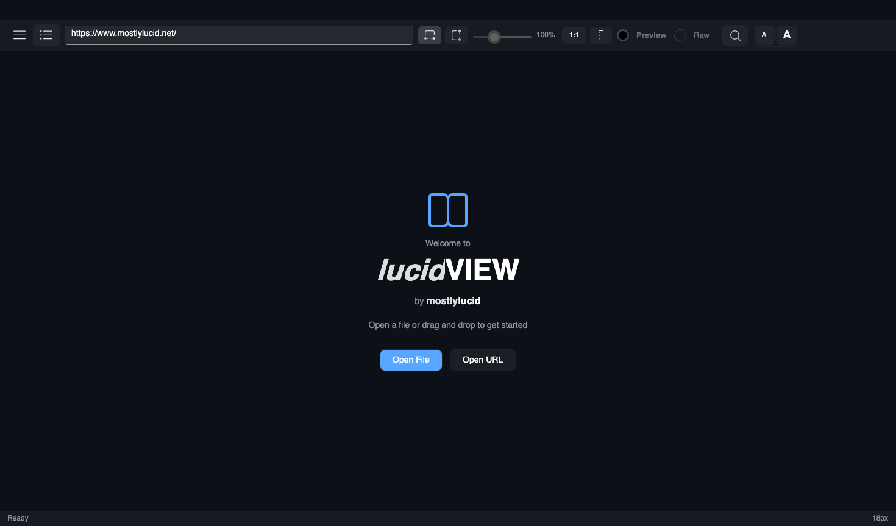
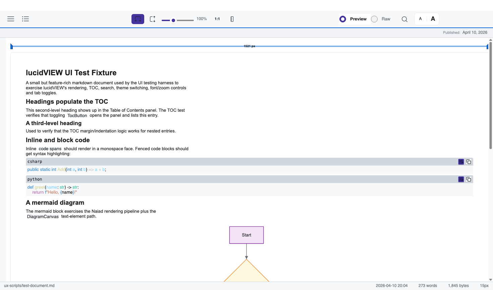
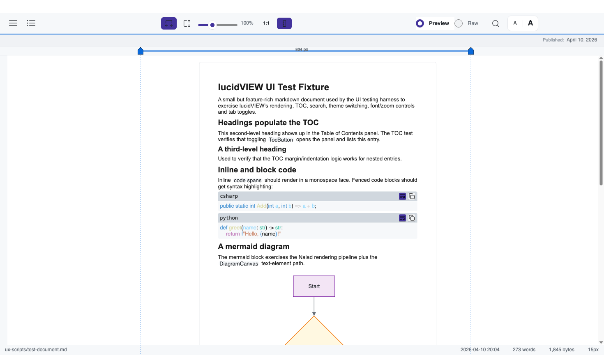
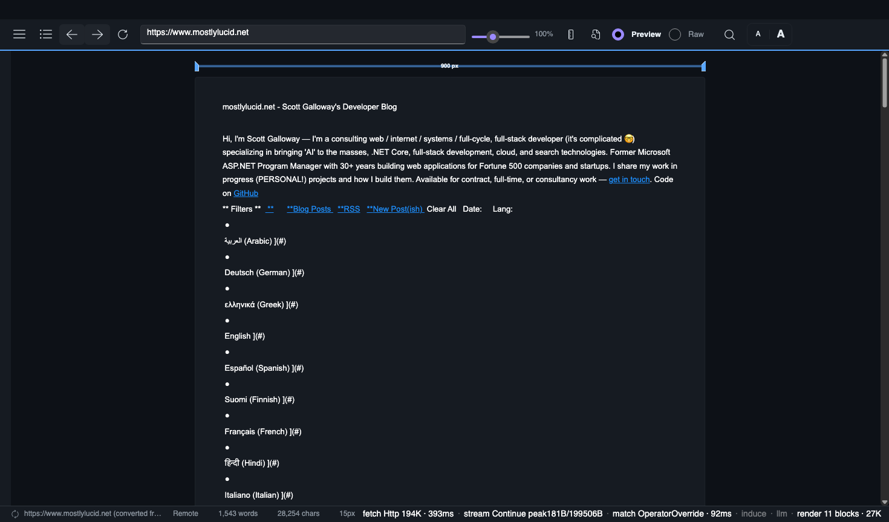
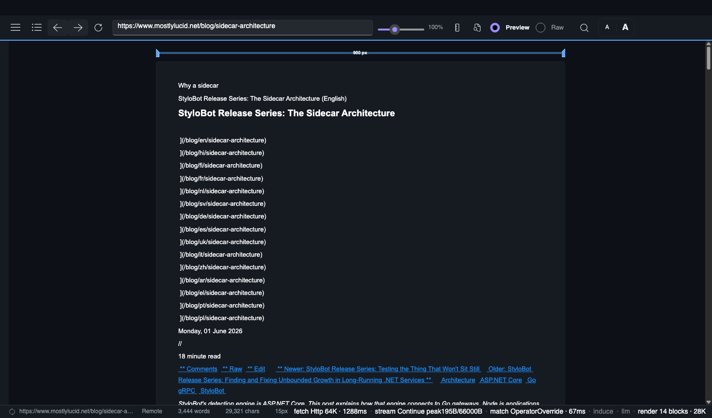

<!--manual-- documentation, help -->
<datetime class="hidden">2026-04-10T12:00</datetime>

# lucidVIEW User Manual

A walk-through of every feature in lucidVIEW. Every screenshot in this manual
is generated automatically from the UI testing harness, so it always matches
the current build. To regenerate, run:

```bash
dotnet run --project MarkdownViewer/MarkdownViewer.csproj -- \
    --ux-test --script ux-scripts/capture-manual.yaml \
    --output MarkdownViewer/Assets/manual/screenshots
```

---

## 1. Welcome screen

When you launch lucidVIEW with no document, you see the welcome panel. From
here you can open a file, paste a URL, or just drag and drop a `.md` file
onto the window.


You can also pass a file path on the command line:

```bash
lucidVIEW README.md
```

---

## 2. Loading a document

Four ways to open a document, all equivalent:

- **Address bar at the top.** Press `Ctrl+L` (or click it) to focus, then
  type a file path or a URL and hit `Enter`. The same control accepts both —
  `~/notes/today.md`, `C:\docs\plan.md`, or `https://example.com/post`. The
  watermark inside the empty bar reads *"Type a URL or path — Enter to
  load"* so you don't have to remember which it accepts.

  

- **Open file...** / **Open URL...** in the side panel.
- **Drag and drop** a `.md` file onto the window.
- **Command line**: `lucidVIEW path/to/file.md` or `lucidVIEW https://...`.

Recent files appear in the side panel for one-click reopening.


The default theme is Light. The window remembers your last theme, font size,
window dimensions, and the last URL you loaded across launches.

---

## 3. The side panel

Click the **☰** button in the top-left (or press `Ctrl+B`) to open the side
panel. From here you reach every menu action: open files, switch themes,
print, export PDF, render a standalone mermaid diagram, search, settings,
help, and exit.


Press `Escape` or click outside the panel to close it.

---

## 4. Themes

lucidVIEW ships with six themes. Switch instantly from the **Theme** group in
the side panel — colors, code blocks, and diagrams all re-theme without
re-rendering the document.

| Theme | Screenshot |
|---|---|
| Dark |  |
| VS Code |  |
| GitHub |  |
| mostlylucid Dark |  |
| mostlylucid Light |  |

Light is the default; use whichever fits your environment.

---

## 5. Table of Contents

Documents with headings get a docked TOC panel. Toggle it with the **≡**
button next to the hamburger menu.


Click any heading in the TOC to scroll the document to that position. Nested
headings indent automatically.

---

## 6. Search (Ctrl+F)

Press `Ctrl+F` (or use the search button in the header) to search inside the
current document. Press `Enter` to jump to the next match, `Shift+Enter` for
the previous, `Escape` to close.


The status bar shows the match count.

---

## 7. Preview vs Raw

Toggle between the rendered preview and the raw markdown source via the
**Preview / Raw** tabs in the header. Useful for copy-pasting code blocks or
checking exact source formatting.


---

## 8. Font size

Use the **A / A** buttons in the top-right (or `Ctrl+=` / `Ctrl+-`) to scale
the document text up and down without changing the layout. The current font
size is shown in the status bar.


---

## 9. Zoom

The header has fit-width and fit-height toggles plus a zoom slider. Hold
`Ctrl` and use the mouse wheel to zoom freely. The **1:1** button resets to
100%.


---

## 10. Fullscreen (F11)

Press `F11` for distraction-free reading — chrome and side panels are hidden,
the document fills the screen. `F11` again or `Escape` returns to normal.


---

## 11. Word-style ruler

Click the ruler icon in the header (next to **1:1**) to show a Word-style ruler
above the document, with two draggable handles and dotted vertical guides at
the column edges. Drag a handle to live-resize the document column — the new
width persists across launches.

Default state (ruler hidden):



With the ruler shown:



The handles are symmetric: dragging the left handle and dragging the right
handle both shrink or grow the centered column by the same amount, just like
Word's text-area markers. Width is shown live in the centre of the ruler in
device-independent pixels.

To reset, drag a handle until the readout matches your preferred width, or
edit `customTheme.contentMaxWidth` in the settings file directly.

---

## 12. Print and Export PDF

- **Print** (`Ctrl+P`) generates a PDF and sends it directly to your default
  printer. On Windows it uses ShellExecute's `print` verb; on macOS and Linux
  it uses `lp` (CUPS).
- **Export PDF...** (`Ctrl+Shift+P`) generates a PDF and lets you save it to
  disk via the system file picker. Mermaid diagrams are rendered to PNG and
  embedded; remote images are downloaded.

Both flows live under the side panel and respect your current font size.

---

## 13. Settings

Open the settings dialog from the side panel (or via the menu) to tweak
default theme, font, syntax-highlighting style, and UI preferences. Settings
persist to `%APPDATA%/MarkdownViewer/settings.json` (or `~/.config/...` on
macOS / Linux).


---

## 14. Standalone mermaid diagrams

Want to render a mermaid diagram without writing a whole markdown document?
Use **Render Diagram...** in the side panel. Paste mermaid syntax into the
dialog and lucidVIEW renders it via the bundled Naiad engine — no Internet
required.


The result can be saved as PNG or SVG via the context menu in the main window.

---

## 15. Drag and drop

Drag any markdown file onto the lucidVIEW window to open it. The drop zone
overlay highlights when a file is being dragged in. Folder drops are not
supported — drop one file at a time.

---

## 16. Recent files

The side panel lists your most recently opened files. Click any to reopen.
The list is capped and persists across launches.

---

## 17. File associations

lucidVIEW registers as a handler for `.md`, `.markdown`, `.mdown`, and `.mkd`
on every platform.

- **Windows**: right-click a markdown file → *Open with* → lucidVIEW. The
  Microsoft Store version (`lucidVIEW.msix`) handles this automatically.
- **macOS**: right-click → *Open With* → lucidVIEW. The `.app` bundle declares
  the file types in `Info.plist`.
- **Linux**: depends on your desktop environment and `.desktop` file (not
  shipped today — drop one in `~/.local/share/applications/` if you want
  full integration).

---

## 18. Keyboard shortcuts

| Shortcut | Action |
|---|---|
| `Ctrl+O` | Open file... |
| `Ctrl+Shift+O` | Open URL... |
| `Ctrl+P` | Print to default printer |
| `Ctrl+Shift+P` | Export PDF... |
| `Ctrl+F` | Search |
| `Ctrl+B` | Toggle side panel |
| `Ctrl+=` / `Ctrl+-` | Increase / decrease font size |
| `Ctrl+wheel` | Zoom |
| `F1` | Open this manual |
| `F11` | Fullscreen |
| `Escape` | Close panels / dialogs / fullscreen |
| `Alt+F4` | Quit |

---

## 19. Where things live

| File | Purpose |
|---|---|
| `%APPDATA%/MarkdownViewer/settings.json` | Persisted user settings |
| `%APPDATA%/MarkdownViewer/crash.log` | Last crash dump (if any) |
| `%APPDATA%/MarkdownViewer/imagecache/` | Cached remote images |

On macOS those paths live under `~/Library/Application Support/MarkdownViewer/`.
On Linux, `~/.config/MarkdownViewer/`.

---

## 20. FULL edition (dogfood only)

lucidVIEW ships in two editions. **Lean** is the public release described in
sections 1-19 above. **FULL** is a sibling build that wires in the preview
StyloExtract pipeline + Playwright + an in-process LLM for template induction —
not shipped in releases, Debug-only CI artefact, used to dogfood the upstream
extractor before each `Mostlylucid.StyloExtract.*` release.

If you're reading this in lean you can skip this section — none of these
features are reachable. If you're running FULL (`MarkdownViewer.Full`), the
status bar gives you a real-time view of how every web page becomes markdown.

### 20.1 The pipeline-stage indicator

Open any URL via `Ctrl+Shift+O`. The bottom-right corner of the status bar
shows six segments separated by `·`:

```
fetch · stream · match · induce · llm · render
```



Each segment starts dim (0.4 opacity). As an extraction phase completes, the
matching segment lights up to full opacity and shows what happened:

| Segment | What lights it up | Detail format |
|---|---|---|
| **`fetch`** | HTTP request returned | `Http <KB>` + duration in ms |
| **`stream`** | StyloExtract.Streaming fence scanner ran over the response body | `<verdict> peak<N>B/<total>B` — the verdict plus the streaming peak-buffered headline |
| **`match`** | StyloExtract.Core parsed, fingerprinted, and matched a template | The match status (`FastPathHit` / `Novel` / `OperatorOverride` / etc.) + duration |
| **`induce`** | Heuristic deterministic inducer or streaming inducer wrote a host template | The host name (+ `(streaming)` if it came from the byte-stream inducer) |
| **`llm`** | LLM template inducer wrote a host template (`LlmEnabled` only) | The host name |
| **`render`** | Markdown handed to LiveMarkdown for paint | `<block count> blocks · <KB>` of output |

Click anywhere on the indicator (or press `F2`) to open the **Extraction
Details** dialog, which shows the most recent extraction plus the last 50 in
a ring buffer so you can scrub backwards through what each visit did.

### 20.2 Streaming — alpha.21 zero-allocation byte-stream fence scanner

The `stream` segment shows the verdict from `StyloExtract.Streaming` — a
sliding-window fence scanner that runs over the HTTP response body as it
arrives. It is **zero-allocation in steady state**: a ref-struct rolling
MinHash + stack-allocated window + ArrayPool rentals only. On a 200 KB
page the in-flight peak stays in the low-kilobyte range — typically a
few hundred bytes after a warm second visit, up to roughly the size of
HttpClient's 16 KB chunk on a cold first visit:



The verdict values you'll see:

- **`Continue`** — scanner is still running (you saw this if you read mid-fetch). Should be terminal-stable by the time the indicator lights up.
- **`Captured`** — scanner matched a known template's content fences and identified the content region. The next visit to this host hits the same skip-path.
- **`Bailout`** — the rolling MinHash drifted too far without a state transition (default 256 events). The template is wrong for this page — falls back to the full slow-path extractor.
- **`NoTemplate`** — no streaming template registered for this host yet. The slow-path extractor runs, and if the page looks HTML-shaped, `StreamingTemplateInducer` writes one so the next visit short-circuits.

### 20.3 Template induction — three kinds

Three different inducers can light up the `induce` and `llm` segments. They
write YAML files into the templates directory and the indicator watches that
directory:

| Inducer | File | Segment | Detail |
|---|---|---|---|
| Heuristic deterministic | `<host>-deterministic.yaml` | `induce` | host name |
| Streaming (byte-stream fences) | written via `IStreamingTemplateStore.UpsertAsync` | `induce` | `host (streaming)` |
| LLM (LlamaSharp, qwen3.5:4b) | `<host>.yaml` | `llm` | host name |

The heuristic inducer fires on every novel host. The LLM inducer fires only
when `LlmEnabled` is on AND the model is downloaded (`--doctor` will tell you
if it isn't). The streaming inducer fires when a `NoTemplate` verdict is
paired with an HTML-shaped body.

### 20.4 Source mode indicator

The status bar's first column shows the source mode icon plus a short label
that tells you how the current document got here:

| Label | Icon | Meaning |
|---|---|---|
| `file` | document | Local markdown file you opened or dropped |
| `markdown` | globe | The URL returned `text/markdown` (no conversion needed) |
| `html→md` | sync arrows | The URL returned HTML and StyloExtract converted it |
| `spa` | warning | Looked like an SPA shell with no static content — conversion impossible |

When the label is followed by a **`✓`** (e.g. `html→md ✓`), the streaming
template store already has a learned template for the current host — meaning
the next visit will skip-path on the streaming scanner. The marker persists
for the whole document so you can tell at a glance "I've taught lucidVIEW
about this host."

### 20.5 CLI verbs (FULL only)

FULL exits before Avalonia starts when given any of these:

```bash
MarkdownViewer.Full --doctor                            # health check (model present? browsers installed?)
MarkdownViewer.Full --install-browsers                  # download the Playwright Chromium snapshot
MarkdownViewer.Full --download-model                    # pull the LLM model from HuggingFace
MarkdownViewer.Full --shot URL OUT.png --wait 10000     # load URL, wait N ms, capture PNG, exit
```

The `--shot` verb is how this manual's FULL screenshots were captured — it
runs the app off-screen so it never steals focus on your real workspace.

---


That's everything. lucidVIEW stays small and fast on purpose — if you need a
feature that isn't here, file an issue at
<https://github.com/scottgal/lucidview/issues>.
