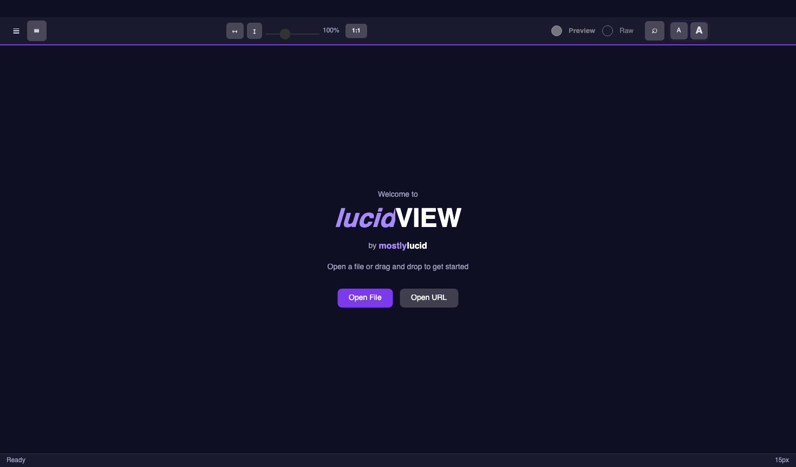
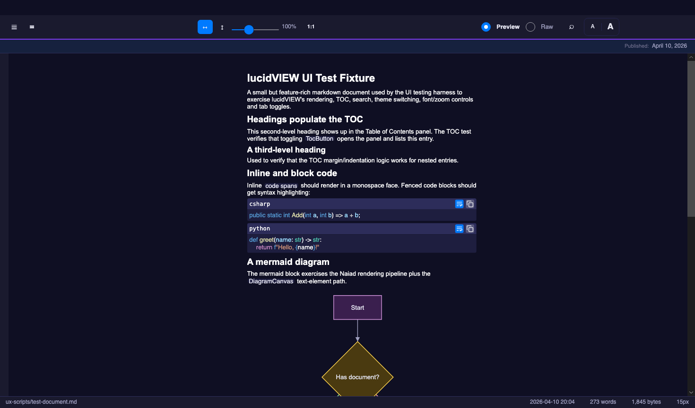
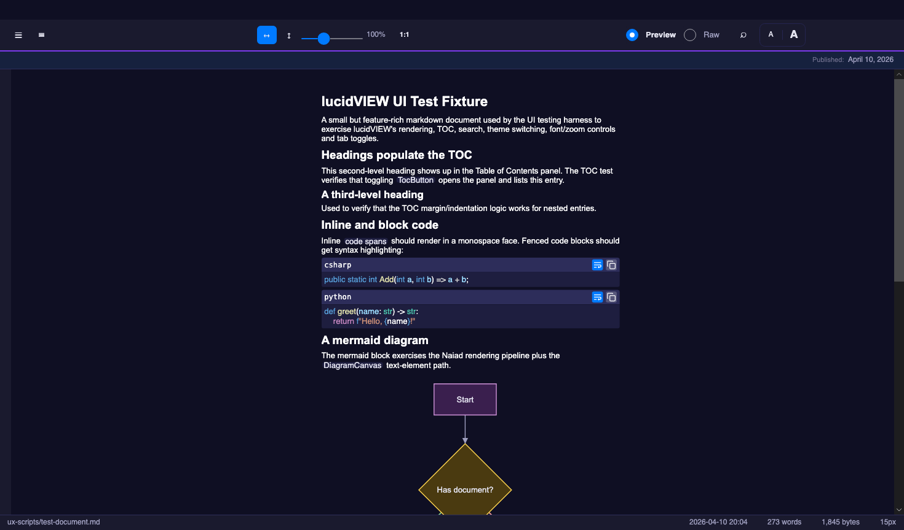
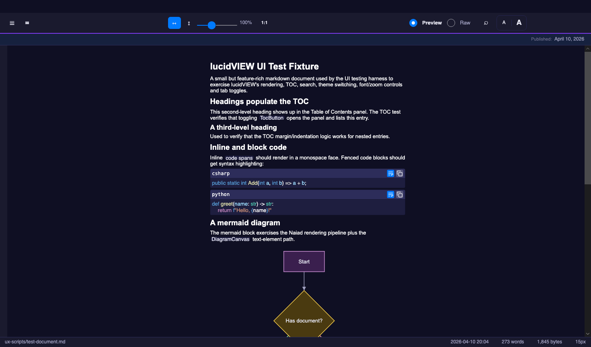
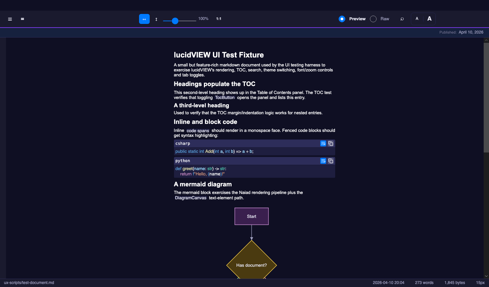
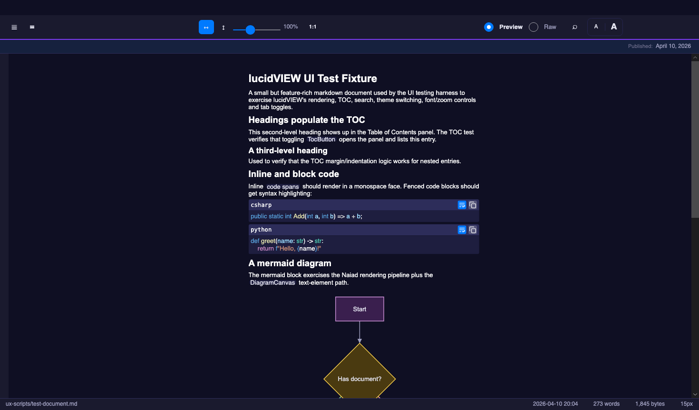
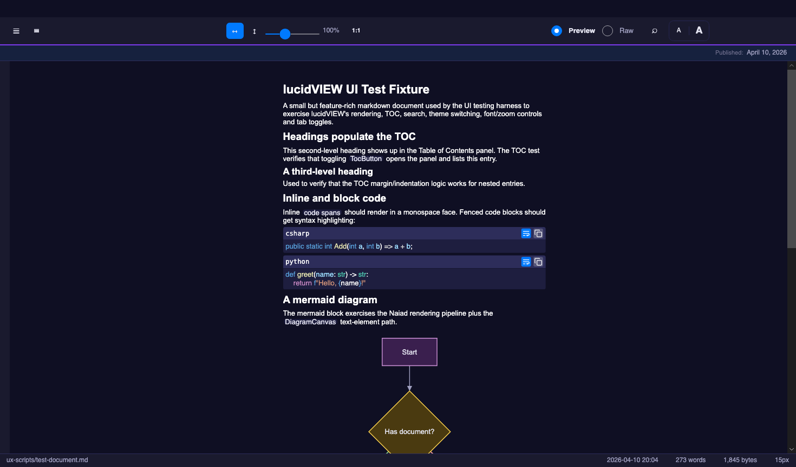
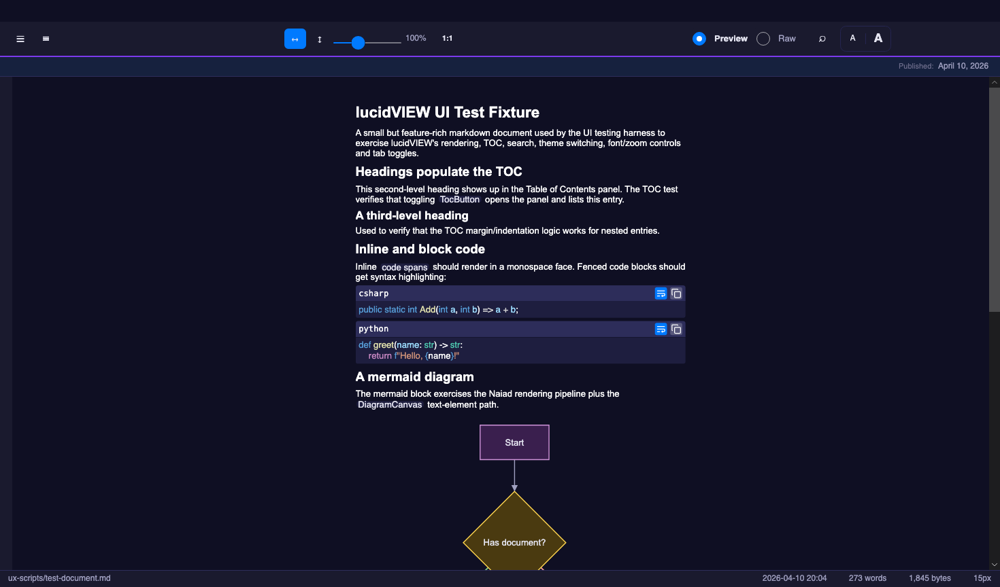
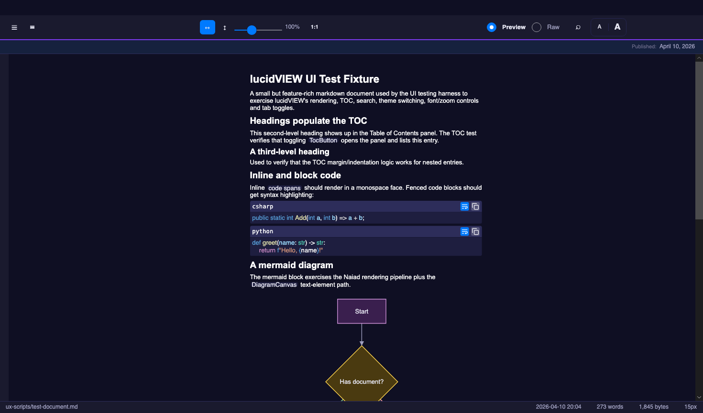

<!--manual-- documentation, help -->
<datetime class="hidden">2026-04-10T12:00</datetime>

# lucidVIEW User Manual

A walk-through of every feature in lucidVIEW. Every screenshot in this manual
is generated automatically from the UI testing harness, so it always matches
the current build. To regenerate, run:

```bash
dotnet run --project MarkdownViewer/MarkdownViewer.csproj -- \
    --ux-test --script ux-scripts/capture-manual.yaml \
    --output MarkdownViewer/Assets/manual/screenshots
```

---

## 1. Welcome screen

When you launch lucidVIEW with no document, you see the welcome panel. From
here you can open a file, paste a URL, or just drag and drop a `.md` file
onto the window.



You can also pass a file path on the command line:

```bash
lucidVIEW README.md
```

---

## 2. Loading a document

Open a markdown file via **Open file...** in the side panel, **Open URL...**
to fetch one over HTTPS, or just drop it on the window. Recent files appear
in the side panel for one-click reopening.


The default theme is Light. The window remembers your last theme, font size,
and window dimensions across launches.

---

## 3. The side panel

Click the **☰** button in the top-left (or press `Ctrl+B`) to open the side
panel. From here you reach every menu action: open files, switch themes,
print, export PDF, render a standalone mermaid diagram, search, settings,
help, and exit.



Press `Escape` or click outside the panel to close it.

---

## 4. Themes

lucidVIEW ships with six themes. Switch instantly from the **Theme** group in
the side panel — colors, code blocks, and diagrams all re-theme without
re-rendering the document.

| Theme | Screenshot |
|---|---|
| Dark |  |
| VS Code |  |
| GitHub |  |
| mostlylucid Dark |  |
| mostlylucid Light |  |

Light is the default; use whichever fits your environment.

---

## 5. Table of Contents

Documents with headings get a docked TOC panel. Toggle it with the **≡**
button next to the hamburger menu.



Click any heading in the TOC to scroll the document to that position. Nested
headings indent automatically.

---

## 6. Search (Ctrl+F)

Press `Ctrl+F` (or use the search button in the header) to search inside the
current document. Press `Enter` to jump to the next match, `Shift+Enter` for
the previous, `Escape` to close.



The status bar shows the match count.

---

## 7. Preview vs Raw

Toggle between the rendered preview and the raw markdown source via the
**Preview / Raw** tabs in the header. Useful for copy-pasting code blocks or
checking exact source formatting.



---

## 8. Font size

Use the **A / A** buttons in the top-right (or `Ctrl+=` / `Ctrl+-`) to scale
the document text up and down without changing the layout. The current font
size is shown in the status bar.



---

## 9. Zoom

The header has fit-width and fit-height toggles plus a zoom slider. Hold
`Ctrl` and use the mouse wheel to zoom freely. The **1:1** button resets to
100%.



---

## 10. Fullscreen (F11)

Press `F11` for distraction-free reading — chrome and side panels are hidden,
the document fills the screen. `F11` again or `Escape` returns to normal.


---

## 11. Print and Export PDF

- **Print** (`Ctrl+P`) generates a PDF and sends it directly to your default
  printer. On Windows it uses ShellExecute's `print` verb; on macOS and Linux
  it uses `lp` (CUPS).
- **Export PDF...** (`Ctrl+Shift+P`) generates a PDF and lets you save it to
  disk via the system file picker. Mermaid diagrams are rendered to PNG and
  embedded; remote images are downloaded.

Both flows live under the side panel and respect your current font size.

---

## 12. Settings

Open the settings dialog from the side panel (or via the menu) to tweak
default theme, font, syntax-highlighting style, and UI preferences. Settings
persist to `%APPDATA%/MarkdownViewer/settings.json` (or `~/.config/...` on
macOS / Linux).



---

## 13. Standalone mermaid diagrams

Want to render a mermaid diagram without writing a whole markdown document?
Use **Render Diagram...** in the side panel. Paste mermaid syntax into the
dialog and lucidVIEW renders it via the bundled Naiad engine — no Internet
required.



The result can be saved as PNG or SVG via the context menu in the main window.

---

## 14. Drag and drop

Drag any markdown file onto the lucidVIEW window to open it. The drop zone
overlay highlights when a file is being dragged in. Folder drops are not
supported — drop one file at a time.

---

## 15. Recent files

The side panel lists your most recently opened files. Click any to reopen.
The list is capped and persists across launches.

---

## 16. File associations

lucidVIEW registers as a handler for `.md`, `.markdown`, `.mdown`, and `.mkd`
on every platform.

- **Windows**: right-click a markdown file → *Open with* → lucidVIEW. The
  Microsoft Store version (`lucidVIEW.msix`) handles this automatically.
- **macOS**: right-click → *Open With* → lucidVIEW. The `.app` bundle declares
  the file types in `Info.plist`.
- **Linux**: depends on your desktop environment and `.desktop` file (not
  shipped today — drop one in `~/.local/share/applications/` if you want
  full integration).

---

## 17. Keyboard shortcuts

| Shortcut | Action |
|---|---|
| `Ctrl+O` | Open file... |
| `Ctrl+Shift+O` | Open URL... |
| `Ctrl+P` | Print to default printer |
| `Ctrl+Shift+P` | Export PDF... |
| `Ctrl+F` | Search |
| `Ctrl+B` | Toggle side panel |
| `Ctrl+=` / `Ctrl+-` | Increase / decrease font size |
| `Ctrl+wheel` | Zoom |
| `F1` | Open this manual |
| `F11` | Fullscreen |
| `Escape` | Close panels / dialogs / fullscreen |
| `Alt+F4` | Quit |

---

## 18. Where things live

| File | Purpose |
|---|---|
| `%APPDATA%/MarkdownViewer/settings.json` | Persisted user settings |
| `%APPDATA%/MarkdownViewer/crash.log` | Last crash dump (if any) |
| `%APPDATA%/MarkdownViewer/imagecache/` | Cached remote images |

On macOS those paths live under `~/Library/Application Support/MarkdownViewer/`.
On Linux, `~/.config/MarkdownViewer/`.

---


That's everything. lucidVIEW stays small and fast on purpose — if you need a
feature that isn't here, file an issue at
<https://github.com/scottgal/lucidview/issues>.
