# 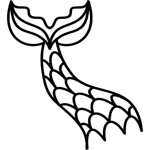 Naiad

[](https://ci.appveyor.com/project/SimonCropp/Naiad)
[](https://www.nuget.org/packages/Naiad/)

A .NET library for rendering [Mermaid](https://mermaid.js.org/) diagrams to SVG. No browser or JavaScript runtime required.

> **Temporary fork notice:** [Naiad](https://github.com/SimonCropp/Naiad) is owned and maintained by [Simon Cropp](https://github.com/SimonCropp). This fork (`Mostlylucid.Naiad`) is a temporary package containing experimental features and new diagram types. The intention is to contribute these changes back to the upstream Naiad project - this fork is not intended as a permanent alternative.

<p align="center">
  
</p>


## NuGet package

https://nuget.org/packages/Naiad/


## Usage

```cs
var svg = Mermaid.Render(
    """
    flowchart LR
        A[Start] --> B[Process] --> C[End]
    """);
```

The diagram type is automatically detected from the input.


### Render Options

```cs
var svg = Mermaid.Render(
    input,
    new RenderOptions
    {
        Padding = 20,
        FontSize = 14,
        FontFamily = "Arial, sans-serif"
    });
```


## Supported Diagram Types

Naiad supports **32 diagram types** - every Mermaid diagram type plus several Naiad originals. All rendered natively in .NET, no JavaScript required.

### Structural Diagrams

| Diagram | Syntax | Preview |
|---------|--------|---------|
| [Flowchart](https://mermaid.js.org/syntax/flowchart.html) | `flowchart LR` |  |
| [Class](https://mermaid.js.org/syntax/classDiagram.html) | `classDiagram` | 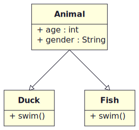 |
| [State](https://mermaid.js.org/syntax/stateDiagram.html) | `stateDiagram-v2` |  |
| [ER](https://mermaid.js.org/syntax/entityRelationshipDiagram.html) | `erDiagram` | 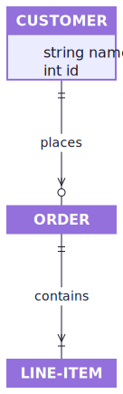 |
| [Block](https://mermaid.js.org/syntax/block.html) | `block-beta` | 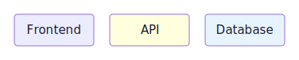 |
| [Architecture](https://mermaid.js.org/syntax/architecture.html) | `architecture-beta` | 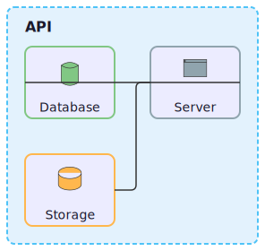 |
| [Requirement](https://mermaid.js.org/syntax/requirementDiagram.html) | `requirementDiagram` | 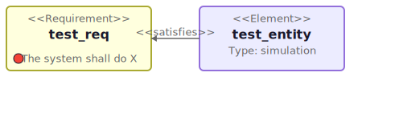 |

### Behavioral Diagrams

| Diagram | Syntax | Preview |
|---------|--------|---------|
| [Sequence](https://mermaid.js.org/syntax/sequenceDiagram.html) | `sequenceDiagram` | 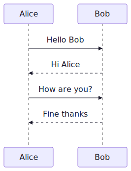 |
| [User Journey](https://mermaid.js.org/syntax/userJourney.html) | `journey` | 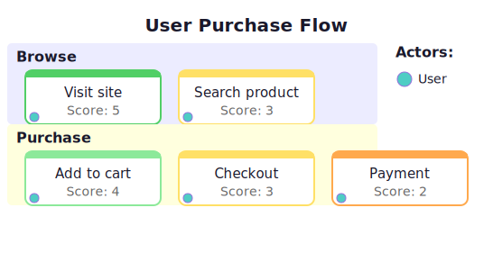 |
| [Gantt](https://mermaid.js.org/syntax/gantt.html) | `gantt` |  |
| [Git Graph](https://mermaid.js.org/syntax/gitgraph.html) | `gitGraph` | 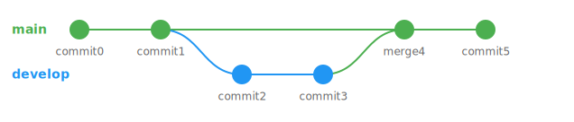 |
| [Timeline](https://mermaid.js.org/syntax/timeline.html) | `timeline` | 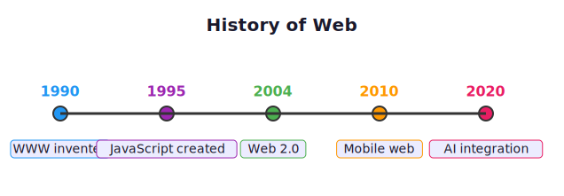 |
| [Kanban](https://mermaid.js.org/syntax/kanban.html) | `kanban` | 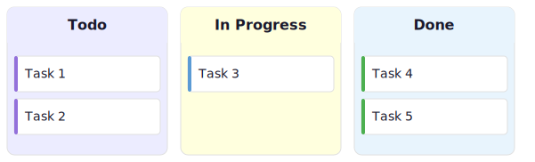 |
| [BPMN](https://www.omg.org/spec/BPMN/) | XML `<definitions>` | 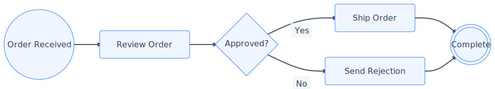 |

### Data Visualization

| Diagram | Syntax | Preview |
|---------|--------|---------|
| [Pie](https://mermaid.js.org/syntax/pie.html) | `pie` | 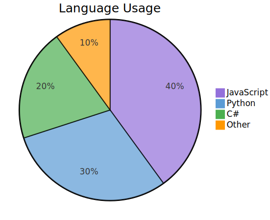 |
| [XY Chart](https://mermaid.js.org/syntax/xyChart.html) | `xychart-beta` | 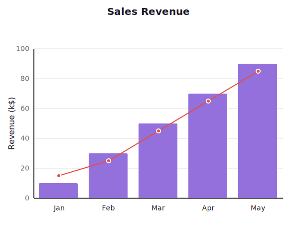 |
| [Sankey](https://mermaid.js.org/syntax/sankey.html) | `sankey-beta` | 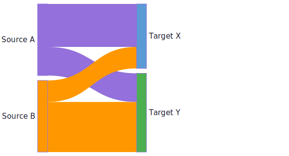 |
| [Quadrant](https://mermaid.js.org/syntax/quadrantChart.html) | `quadrantChart` | 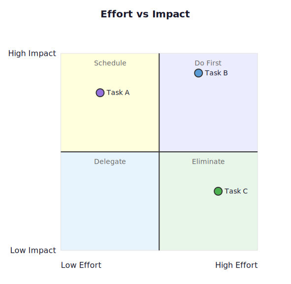 |
| [Radar](https://mermaid.js.org/syntax/radar.html) | `radar-beta` | 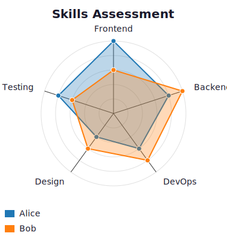 |
| [Treemap](https://mermaid.js.org/syntax/treemap.html) | `treemap-beta` | 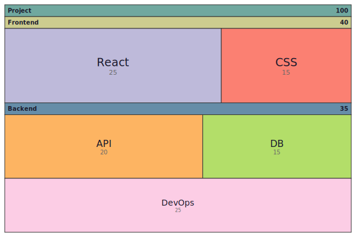 |
| [Packet](https://mermaid.js.org/syntax/packet.html) | `packet-beta` | 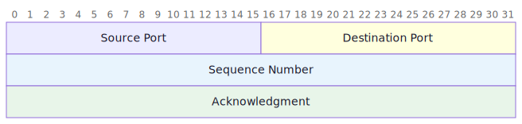 |

### C4 Model

| Diagram | Syntax | Preview |
|---------|--------|---------|
| [C4 Context](https://mermaid.js.org/syntax/c4.html) | `C4Context` | 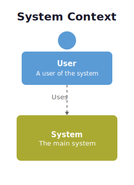 |
| C4 Container | `C4Container` | 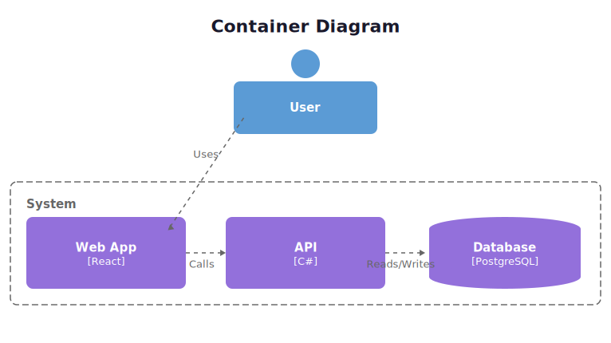 |
| C4 Component | `C4Component` | 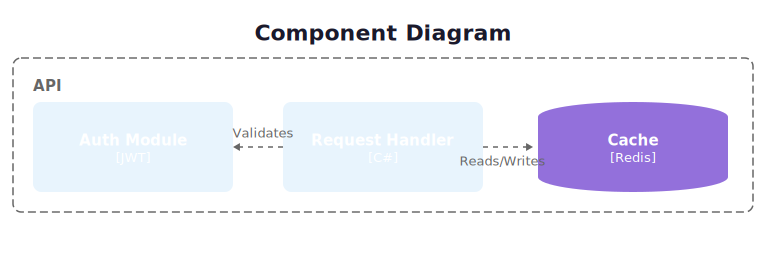 |
| C4 Deployment | `C4Deployment` | 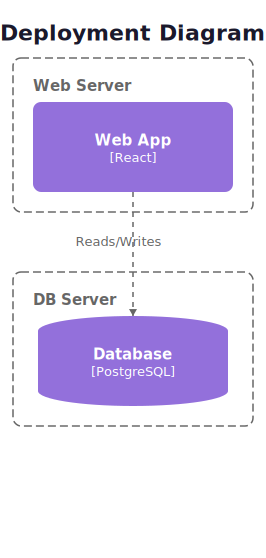 |

### Hierarchical & Spatial

| Diagram | Syntax | Preview |
|---------|--------|---------|
| [Mindmap](https://mermaid.js.org/syntax/mindmap.html) | `mindmap` | 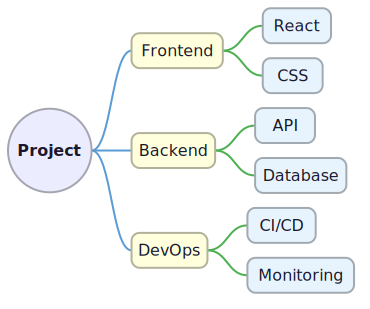 |

### Naiad Originals

These diagram types are unique to Naiad and not available in Mermaid.

| Diagram | Syntax | Preview |
|---------|--------|---------|
| Dendrogram | `dendrogram` | 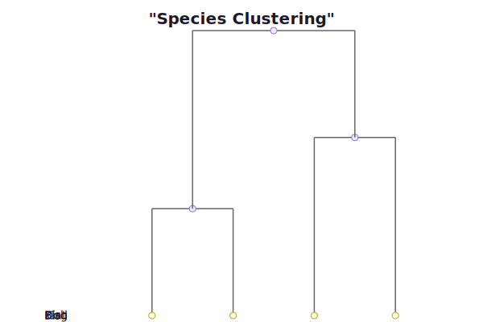 |
| Bubble Pack | `bubblepack` | 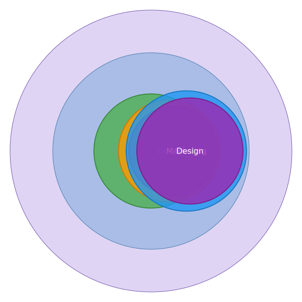 |
| Voronoi | `voronoi` | 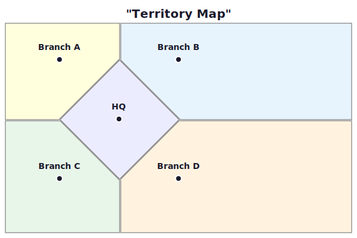 |
| Parallel Coordinates | `parallelcoords` | 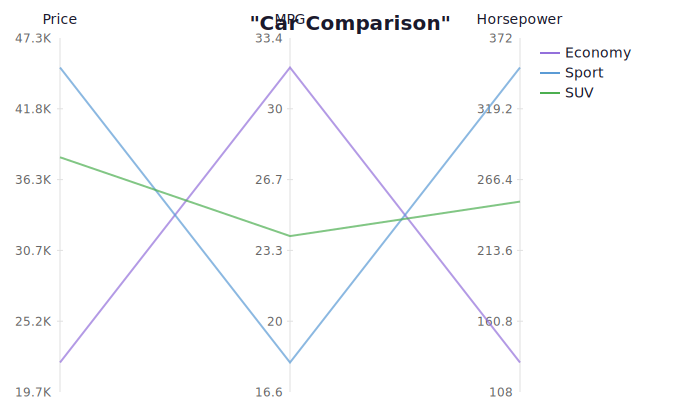 |
| Geo Map | `geo` | 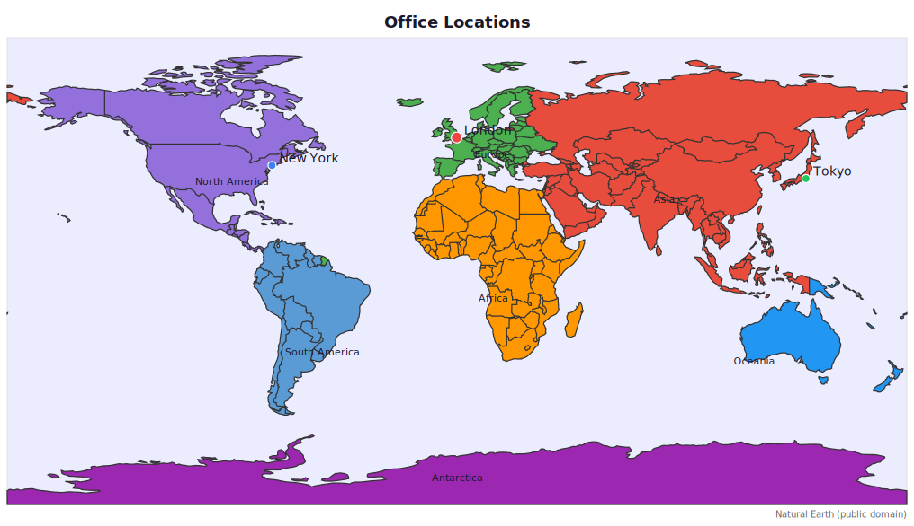 |

### Skin Packs

| Diagram | Syntax | Preview |
|---------|--------|---------|
| Wireframe | `%% naiad: skinPack=wireframe` | 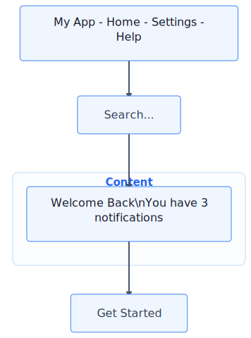 |

### Interoperability

| Format | Description | Preview |
|--------|-------------|---------|
| [Tulip TLP](docs/tulip/README.md) | Import/export [Tulip](https://tulip.labri.fr) graph files | 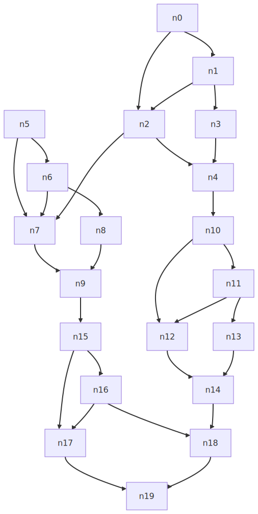 |

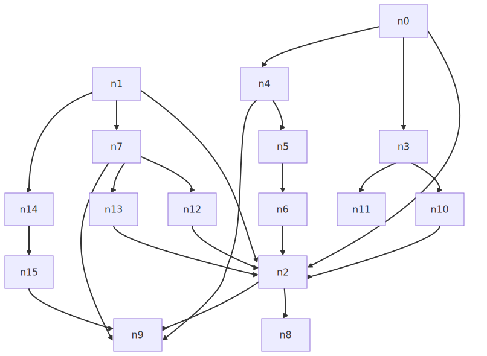 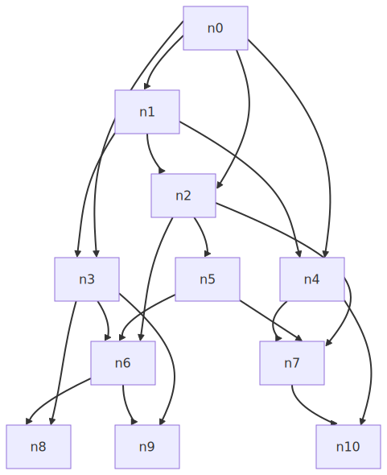


## Rendering Surfaces

Naiad's core outputs SVG. Multiple rendering surfaces transform that SVG into other formats — or bypass SVG entirely for native rendering:

| Surface | Package | Description |
|---------|---------|-------------|
| SVG (built-in) | `Mostlylucid.Naiad` | Core renderer — all diagram types produce SVG natively |
| [SkiaSharp](src/Naiad.Surfaces.Skia/README.md) | `Mostlylucid.Naiad.Surfaces.Skia` | Rasterize SVG → PNG/JPEG via SkiaSharp (native libs) |
| [ImageSharp](src/Naiad.Surfaces.ImageSharp/README.md) | `Mostlylucid.Naiad.Surfaces.ImageSharp` | Rasterize SVG → PNG/JPEG — pure managed, no native deps |
| [Blazor](src/Naiad.Blazor/README.md) | `Mostlylucid.Naiad.Blazor` | `<NaiadDiagram>` Blazor component wrapping the WASM web component |
| [WebAssembly](src/Naiad.Wasm/README.md) | — | `net10.0-browser` target: `RenderSvg`, `DetectDiagramType` exports |
| Console | — | ANSI half-block art renderer ([tutorial](../docs/blog/2026-02-21-building-a-renderer-for-naiad.md)) |

Building a custom surface? See [Building a Custom Renderer for Naiad](../docs/blog/2026-02-21-building-a-renderer-for-naiad.md) — a step-by-step guide implementing a console renderer in ~120 lines.


## Plugin System

Naiad is extensible at multiple levels:

- **Render Surface Plugins** (`IDiagramRenderSurfacePlugin`) — Add new output formats. Register via `DiagramRenderSurfaceRegistry`. See [Building a Renderer](../docs/blog/2026-02-21-building-a-renderer-for-naiad.md).
- **Skin Packs** — Custom node/edge styling per diagram type (e.g., [Wireframe](src/Naiad.Skins.Showcase/README.md), [Cats](src/Naiad.Skins.Cats/README.md)).
- **Fluent API Plugins** (`IFluentDiagramPlugin`) — Typed C# builders for authoring diagrams programmatically. See the [Fluent Plugin Spec](../docs/plans/2026-02-21-fluent-plugin-spec.md) and [Fluent API Design](../docs/plans/2026-02-21-mermaid-fluent-api-design.md).
- **Meta Packages** — [Mermaid-only](src/Naiad.Meta.Mermaid/README.md) or [Complete](src/Naiad.Meta.Complete/README.md) diagram type bundles.

For Avalonia-specific rendering (interactive flowcharts with hover, click navigation, and context menus), see the [MarkdownViewer Plugin README](../MarkdownViewer/Plugins/README.md) and [Naiad Mermaid Rendering Guide](../docs/NAIAD_MERMAID_RENDERING.md).


## Theming

Naiad supports light and dark themes out of the box:

```cs
var darkSvg = Mermaid.Render(input, new RenderOptions
{
    Theme = MermaidTheme.Dark
});
```


## Test Renders<!-- include: renders. path: src/test-renders/renders.include.md -->

Auto-generated documentation from the test suite.

- [C4](src/test-renders/C4.md)
- [Class](src/test-renders/Class.md)
- [EntityRelationship](src/test-renders/EntityRelationship.md)
- [Flowchart](src/test-renders/Flowchart.md)
- [Gantt](src/test-renders/Gantt.md)
- [GitGraph](src/test-renders/GitGraph.md)
- [Kanban](src/test-renders/Kanban.md)
- [Mindmap](src/test-renders/Mindmap.md)
- [Pie](src/test-renders/Pie.md)
- [Quadrant](src/test-renders/Quadrant.md)
- [Requirement](src/test-renders/Requirement.md)
- [Sequence](src/test-renders/Sequence.md)
- [State](src/test-renders/State.md)
- [Timeline](src/test-renders/Timeline.md)
- [UserJourney](src/test-renders/UserJourney.md)

### Beta diagram types

- [Architecture](src/test-renders/Architecture.md)
- [Block](src/test-renders/Block.md)
- [BPMN](src/test-renders/BPMN.md)
- [Packet](src/test-renders/Packet.md)
- [Radar](src/test-renders/Radar.md)
- [Sankey](src/test-renders/Sankey.md)
- [Treemap](src/test-renders/Treemap.md)
- [Wireframe](src/test-renders/Wireframe.md)
- [XYChart](src/test-renders/XYChart.md)<!-- endInclude -->


## Icon

[Mermaid Tail](https://thenounproject.com/icon/mermaid-tail-1908145//) designed by [Olena Panasovska](https://thenounproject.com/creator/zzyzz/) from [The Noun Project](https://thenounproject.com).
