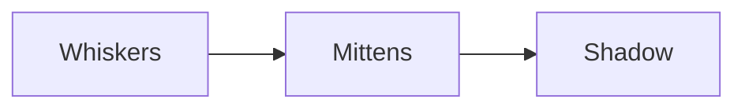

# Mostlylucid.Naiad.Skins.Cats

Cat-themed skin pack for Naiad flowchart shapes.

## Install

```bash
dotnet add package Mostlylucid.Naiad.Skins.Cats
```

## Quick Start

```csharp
using Naiad.Skins.Cats;

// Register the cat skin pack
NaiadSkinPacksCatsExtensions.RegisterCatsSkinPacks();
```

Then use in your Mermaid source:



## What's Included

- `cats` skin pack with cat-themed SVG node shapes for flowchart diagrams

## License

[Unlicense](https://unlicense.org/)
