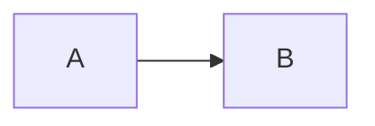

# Naiad.Skins.Showcase

Color-forward plugin skin packs for Naiad flowchart-like shapes.

Included packs:

- `prism3d` (aliases: `3d`, `prism`, `prism-3d`)
- `neon` (aliases: `cyber`, `neon-city`)
- `sunset` (aliases: `vibrant`, `warm`)

All packs use layered SVG paths and `<defs>` (gradients/filters/clip paths).

## Registration

```csharp
using MermaidSharp.Rendering.Skins.Showcase;

MermaidSkinPacksShowcaseExtensions.RegisterShowcaseSkinPacks();
```

Use in Mermaid:



## Colorful SVG Source Ideas (Free)

When curating future variants, these Vecteezy free categories are good starting points:

- https://www.vecteezy.com/free-vector/3d-icon
- https://www.vecteezy.com/free-vector/3d-illustration
- https://www.vecteezy.com/free-vector/glassmorphism
- https://www.vecteezy.com/free-vector/gradient-icon
- https://www.vecteezy.com/free-vector/neon-icon

Always verify license terms and attribution requirements before distributing imported assets.
