# All Diagram Types Test

This document contains one mermaid code block per diagram type supported by Naiad.
Open in lucidVIEW to verify all render as native vector (not PNG).

## 1. Flowchart

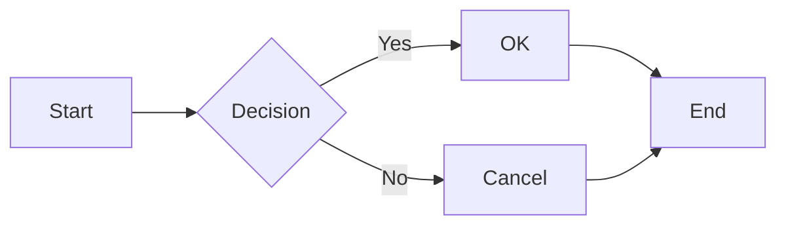

## 2. Sequence Diagram

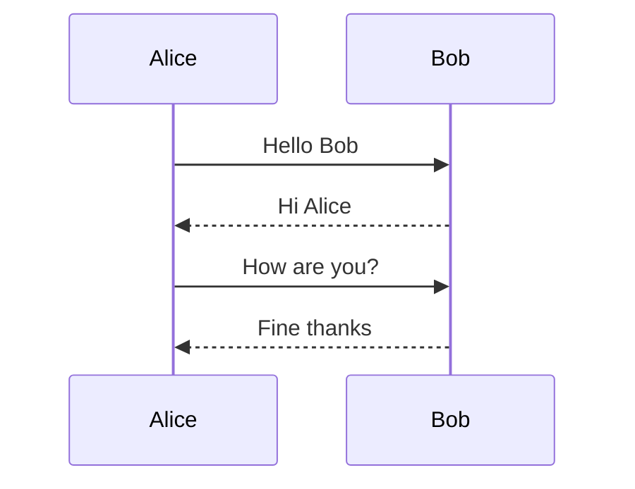

## 3. Class Diagram

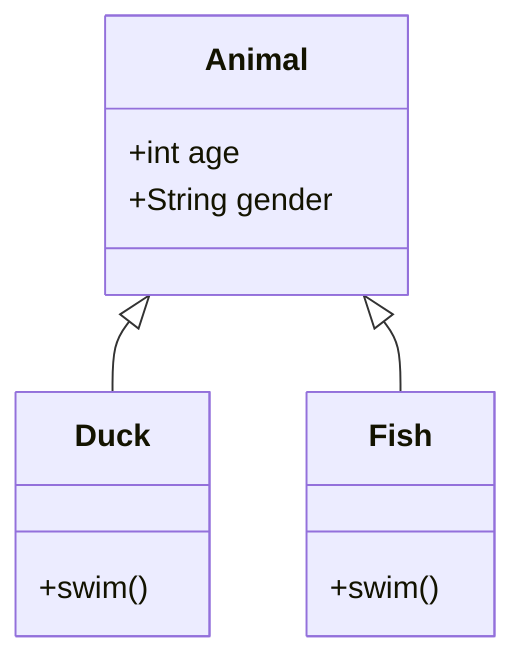

## 4. State Diagram

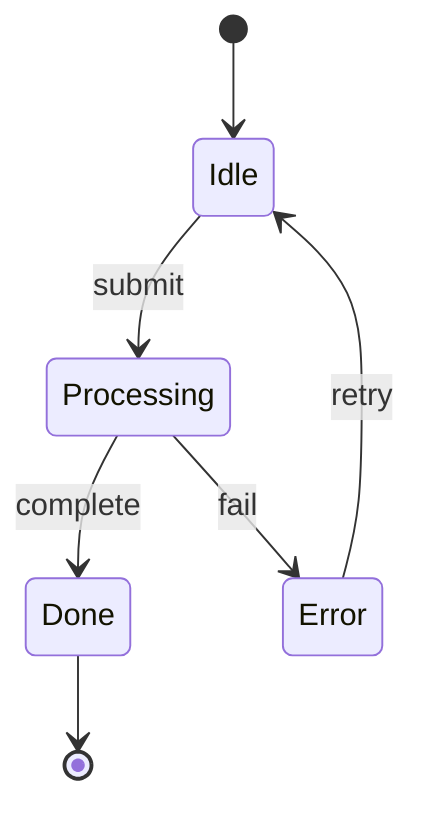

## 5. Entity Relationship

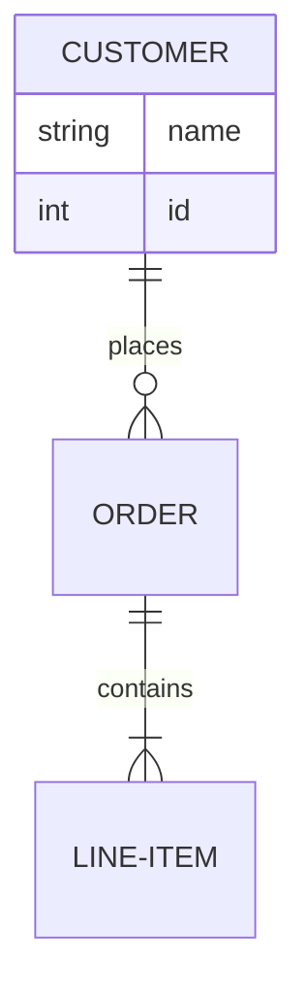

## 6. Gantt Chart

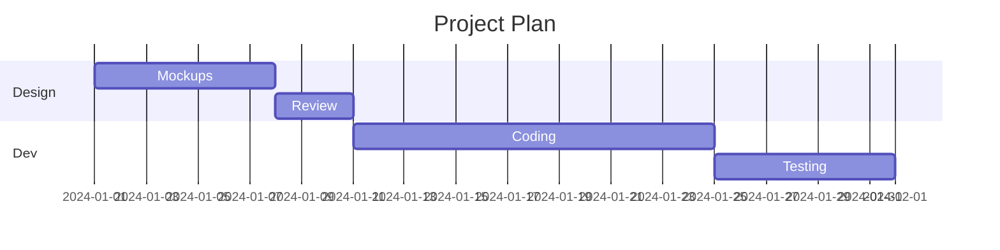

## 7. Git Graph

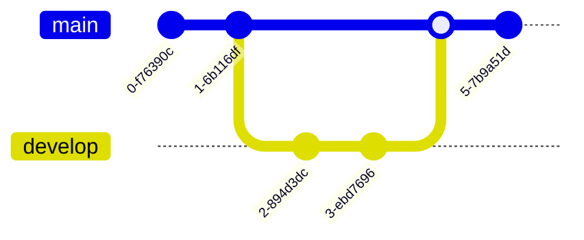

## 8. Mindmap

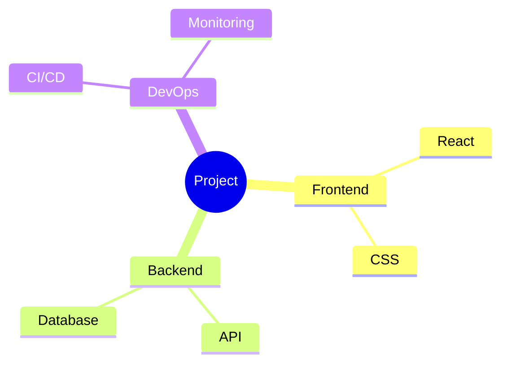

## 9. Timeline

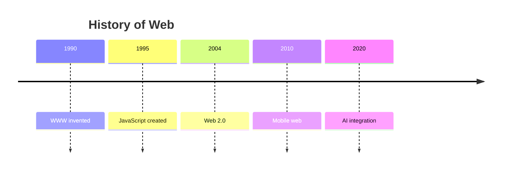

## 10. User Journey

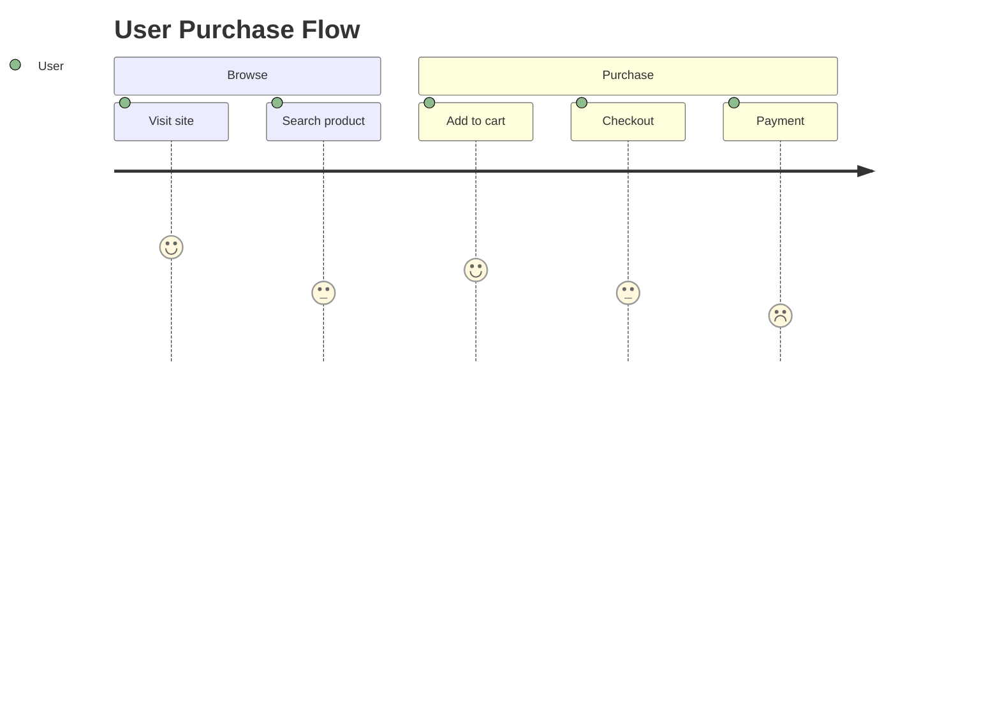

## 11. Pie Chart

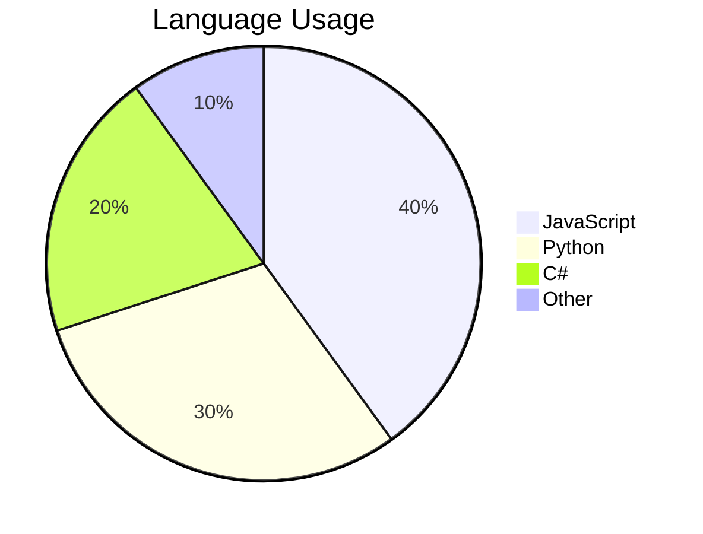

## 12. Quadrant Chart

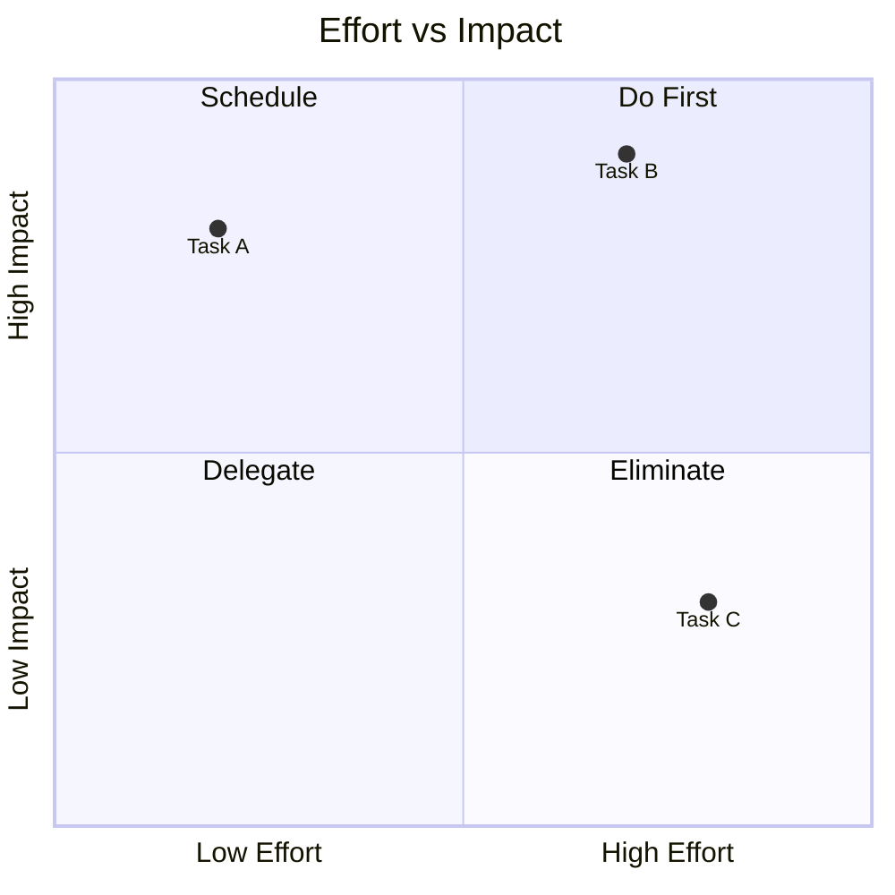

## 13. XY Chart

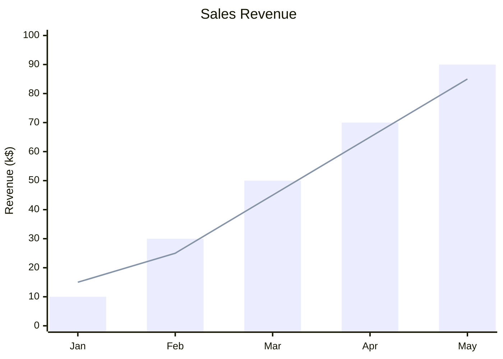

## 14. Sankey Diagram

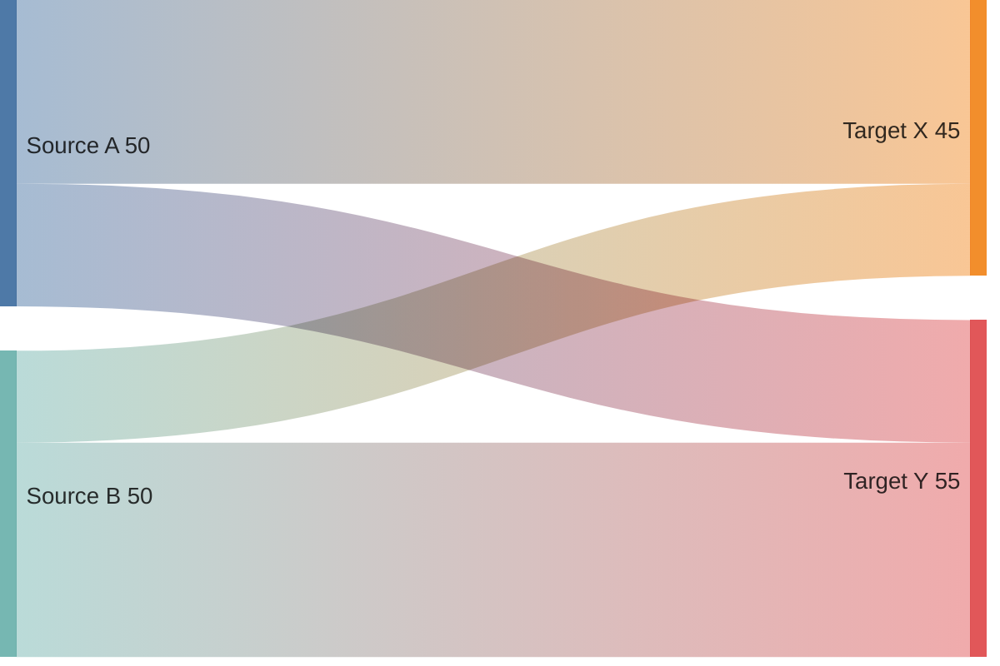

## 15. Block Diagram

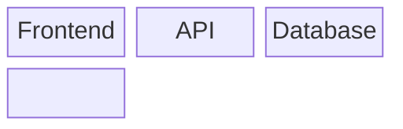

## 16. Kanban Board

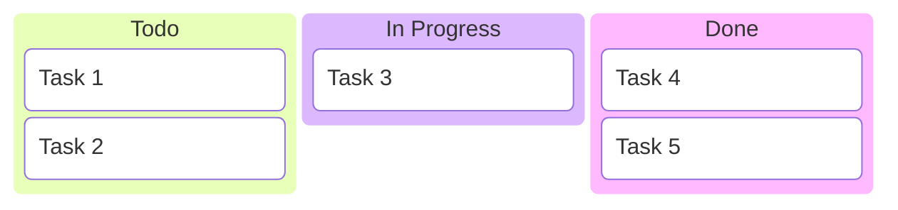

## 17. Packet Diagram

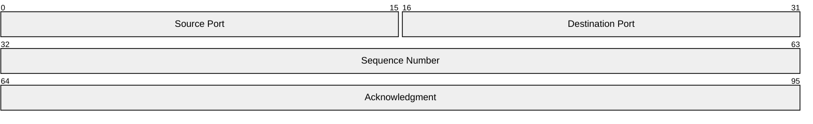

## 18. C4 Context

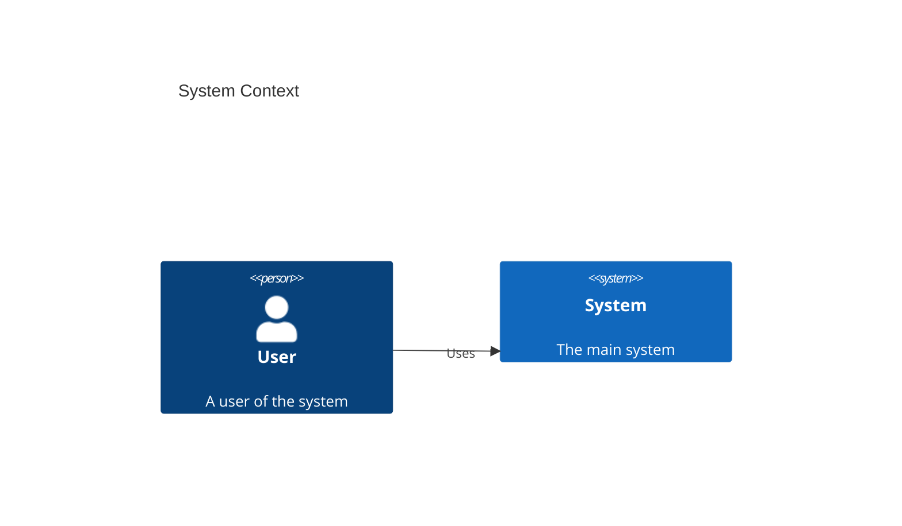

## 19. C4 Container

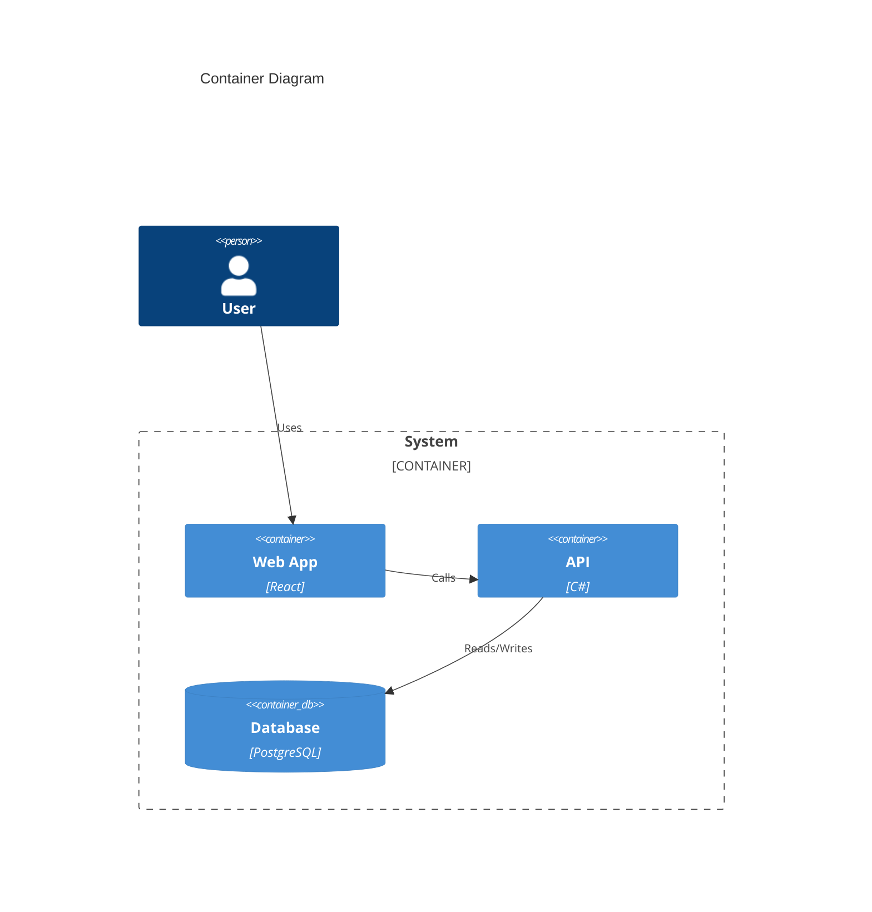

## 20. C4 Component

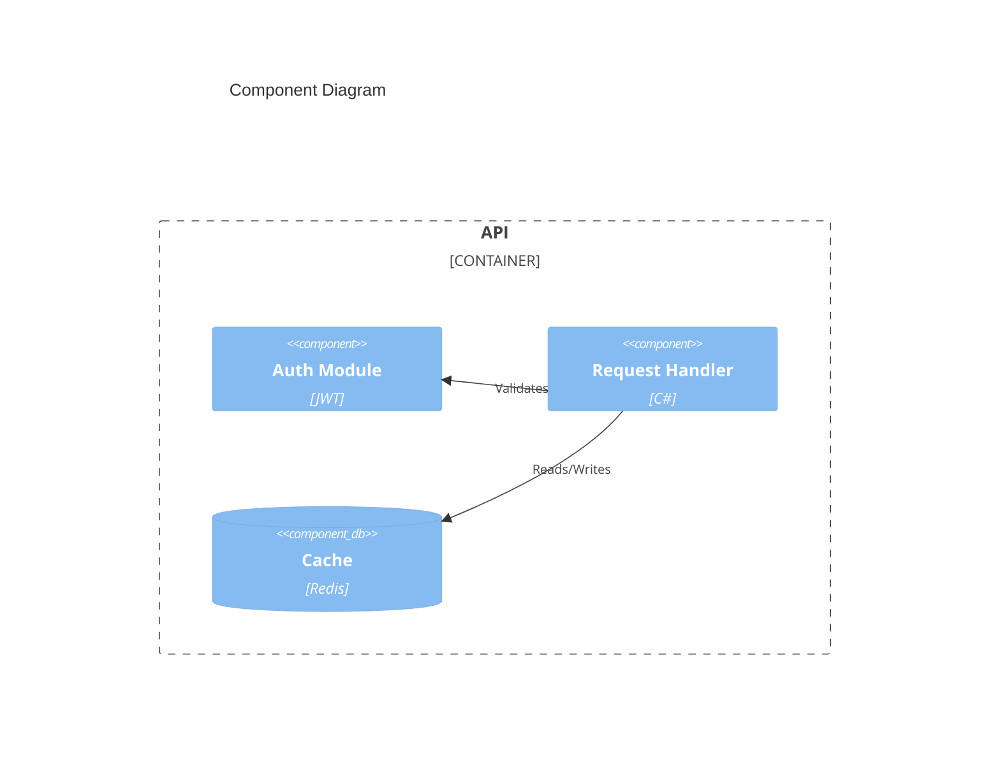

## 21. C4 Deployment

```mermaid
C4Deployment
    title Deployment Diagram
    Deployment_Node(prod, "Production") {
        Deployment_Node(web, "Web Server") {
            Container(app, "Web App", "React")
        }
        Deployment_Node(db, "DB Server") {
            ContainerDb(store, "Database", "PostgreSQL")
        }
    }
    Rel(app, store, "Reads/Writes")
```

## 22. Requirement Diagram

```mermaid
requirementDiagram
    requirement test_req {
        id: 1
        text: The system shall do X
        risk: high
        verifymethod: test
    }
    element test_entity {
        type: simulation
    }
    test_entity - satisfies -> test_req
```

## 23. Architecture Diagram

```mermaid
architecture-beta
    group api(cloud)[API]

    service db(database)[Database] in api
    service server(server)[Server] in api
    service disk(disk)[Storage] in api

    db:L -- R:server
    server:L -- R:disk
```

## 24. Radar Chart

```mermaid
radar-beta
    title Skills Assessment
    axis Frontend, Backend, DevOps, Design, Testing
    curve a["Alice"]{5, 4, 3, 2, 4}
    curve b["Bob"]{3, 5, 4, 3, 3}
```

## 25. Treemap

```mermaid
treemap-beta
    "Project": 100
        "Frontend": 40
            "React": 25
            "CSS": 15
        "Backend": 35
            "API": 20
            "DB": 15
        "DevOps": 25
```

## 26. BPMN

```bpmn
<?xml version="1.0" encoding="UTF-8"?>
<definitions xmlns="http://www.omg.org/spec/BPMN/20100524/MODEL" id="definitions1">
  <process id="orderProcess" isExecutable="false">
    <startEvent id="start" name="Order Received"/>
    <task id="review" name="Review Order"/>
    <exclusiveGateway id="gw1" name="Approved?"/>
    <task id="ship" name="Ship Order"/>
    <task id="reject" name="Send Rejection"/>
    <endEvent id="end" name="Complete"/>
    <sequenceFlow id="f1" sourceRef="start" targetRef="review"/>
    <sequenceFlow id="f2" sourceRef="review" targetRef="gw1"/>
    <sequenceFlow id="f3" sourceRef="gw1" targetRef="ship" name="Yes"/>
    <sequenceFlow id="f4" sourceRef="gw1" targetRef="reject" name="No"/>
    <sequenceFlow id="f5" sourceRef="ship" targetRef="end"/>
    <sequenceFlow id="f6" sourceRef="reject" targetRef="end"/>
  </process>
</definitions>
```

## 27. Parallel Coordinates

```mermaid
parallelcoords
    title "Car Comparison"
    axis Price, MPG, Horsepower
    dataset "Economy"{22000, 32, 130}
    dataset "Sport"{45000, 18, 350}
    dataset "SUV"{38000, 24, 250}
```

## 28. Dendrogram

```mermaid
dendrogram
    title "Species Clustering"
    leaf "Cat", "Dog", "Fish", "Bird"
    merge "Cat"-"Dog":0.3
    merge "Fish"-"Bird":0.5
    merge "CatDog"-"FishBird":0.8
```

## 29. Bubble Pack

```mermaid
bubblepack
    "Company"
        "Engineering": 120
            "Frontend": 40
            "Backend": 50
            "DevOps": 30
        "Design": 35
        "Marketing": 45
```

## 30. Voronoi

```mermaid
voronoi
    title "Territory Map"
    site "HQ" at 200, 200
    site "Branch A" at 100, 100
    site "Branch B" at 300, 100
    site "Branch C" at 100, 300
    site "Branch D" at 300, 300
```

## 31. Geo Map

```mermaid
geo
    title "Office Locations"
    map world
    town "London" country=uk color=#ef4444 size=6
    town "New York" country=us color=#3b82f6
    town "Tokyo" country=jp color=#22c55e
```

## 32. Wireframe

```mermaid
%% naiad: skinPack=wireframe
%% naiad: shapes nav=navbar, card=card, btn=button, srch=searchbar
flowchart TD
    nav["My App - Home - Settings - Help"]
    srch["Search..."]
    subgraph main["Content"]
        card["Welcome Back\nYou have 3 notifications"]
    end
    btn["Get Started"]
    nav --> srch
    srch --> main
    main --> btn
```

---

**Expected result:** All diagrams above should render as native Avalonia vector graphics (DiagramCanvas or FlowchartCanvas), not as rasterized PNG images. Verify by right-clicking any diagram - the context menu should show "Save Diagram as PNG..." and "Save Diagram as SVG...".
