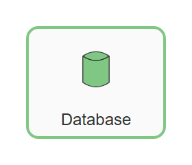
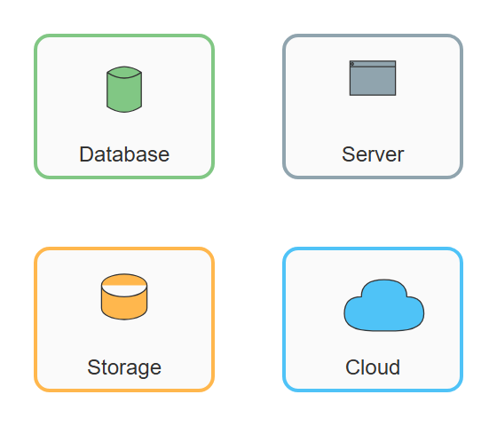
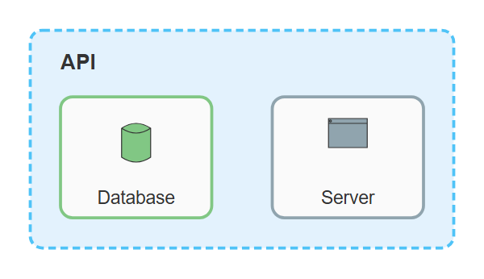
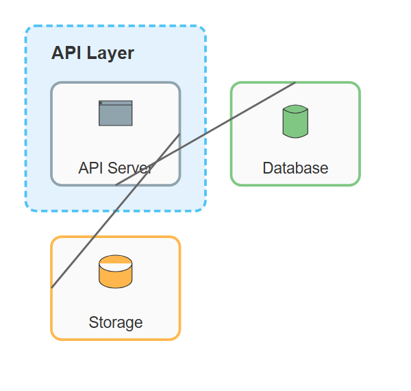
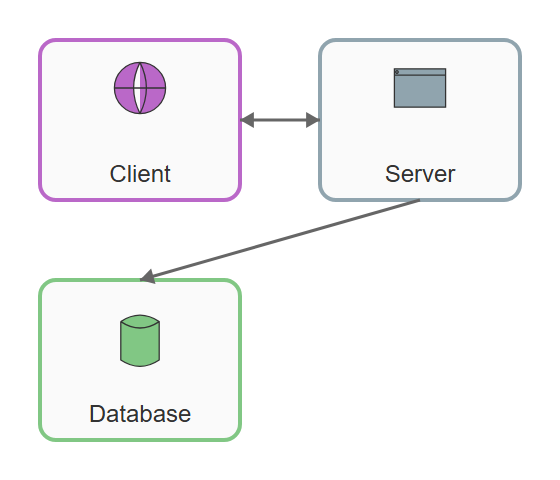

# Architecture

## BasicService

**Input:**
```
architecture-beta
service db(database)[Database]
```
**Rendered by Naiad:**

<p align="center">
  
</p>


[Open in Mermaid Live](https://mermaid.live/edit#base64:eyJjb2RlIjoiYXJjaGl0ZWN0dXJlLWJldGFcbnNlcnZpY2UgZGIoZGF0YWJhc2UpW0RhdGFiYXNlXSIsIm1lcm1haWQiOnsidGhlbWUiOiJkZWZhdWx0In19)

## ServiceWithDifferentIcons

**Input:**
```
architecture-beta
service db(database)[Database]
service srv(server)[Server]
service disk1(disk)[Storage]
service cloud1(cloud)[Cloud]
```
**Rendered by Naiad:**

<p align="center">
  
</p>


[Open in Mermaid Live](https://mermaid.live/edit#base64:eyJjb2RlIjoiYXJjaGl0ZWN0dXJlLWJldGFcbnNlcnZpY2UgZGIoZGF0YWJhc2UpW0RhdGFiYXNlXVxuc2VydmljZSBzcnYoc2VydmVyKVtTZXJ2ZXJdXG5zZXJ2aWNlIGRpc2sxKGRpc2spW1N0b3JhZ2VdXG5zZXJ2aWNlIGNsb3VkMShjbG91ZClbQ2xvdWRdIiwibWVybWFpZCI6eyJ0aGVtZSI6ImRlZmF1bHQifX0=)

## ServiceWithGroup

**Input:**
```
architecture-beta
group api(cloud)[API]
service db(database)[Database] in api
service server(server)[Server] in api
```
**Rendered by Naiad:**

<p align="center">
  
</p>


[Open in Mermaid Live](https://mermaid.live/edit#base64:eyJjb2RlIjoiYXJjaGl0ZWN0dXJlLWJldGFcbmdyb3VwIGFwaShjbG91ZClbQVBJXVxuc2VydmljZSBkYihkYXRhYmFzZSlbRGF0YWJhc2VdIGluIGFwaVxuc2VydmljZSBzZXJ2ZXIoc2VydmVyKVtTZXJ2ZXJdIGluIGFwaSIsIm1lcm1haWQiOnsidGhlbWUiOiJkZWZhdWx0In19)

## ServicesWithEdge

**Input:**
```
architecture-beta
service db(database)[Database]
service server(server)[Server]
db:R -- L:server
```
**Rendered by Naiad:**

<p align="center">
  
</p>


[Open in Mermaid Live](https://mermaid.live/edit#base64:eyJjb2RlIjoiYXJjaGl0ZWN0dXJlLWJldGFcbnNlcnZpY2UgZGIoZGF0YWJhc2UpW0RhdGFiYXNlXVxuc2VydmljZSBzZXJ2ZXIoc2VydmVyKVtTZXJ2ZXJdXG5kYjpSIC0tIEw6c2VydmVyIiwibWVybWFpZCI6eyJ0aGVtZSI6ImRlZmF1bHQifX0=)

## Complex

**Input:**
```
architecture-beta
group api(cloud)[API Layer]
service server(server)[API Server] in api
service db(database)[Database]
service disk1(disk)[Storage]
server:B -- T:db
server:R -- L:disk1
```
**Rendered by Naiad:**

<p align="center">
  
</p>


[Open in Mermaid Live](https://mermaid.live/edit#base64:eyJjb2RlIjoiYXJjaGl0ZWN0dXJlLWJldGFcbmdyb3VwIGFwaShjbG91ZClbQVBJIExheWVyXVxuc2VydmljZSBzZXJ2ZXIoc2VydmVyKVtBUEkgU2VydmVyXSBpbiBhcGlcbnNlcnZpY2UgZGIoZGF0YWJhc2UpW0RhdGFiYXNlXVxuc2VydmljZSBkaXNrMShkaXNrKVtTdG9yYWdlXVxuc2VydmVyOkIgLS0gVDpkYlxuc2VydmVyOlIgLS0gTDpkaXNrMSIsIm1lcm1haWQiOnsidGhlbWUiOiJkZWZhdWx0In19)

## EdgeWithArrows

**Input:**
```
architecture-beta
service client(internet)[Client]
service server(server)[Server]
service db(database)[Database]
<client:R -- L>:server
server:B -- T>:db
```
**Rendered by Naiad:**

<p align="center">
  
</p>


[Open in Mermaid Live](https://mermaid.live/edit#base64:eyJjb2RlIjoiYXJjaGl0ZWN0dXJlLWJldGFcbnNlcnZpY2UgY2xpZW50KGludGVybmV0KVtDbGllbnRdXG5zZXJ2aWNlIHNlcnZlcihzZXJ2ZXIpW1NlcnZlcl1cbnNlcnZpY2UgZGIoZGF0YWJhc2UpW0RhdGFiYXNlXVxuXHUwMDNDY2xpZW50OlIgLS0gTFx1MDAzRTpzZXJ2ZXJcbnNlcnZlcjpCIC0tIFRcdTAwM0U6ZGIiLCJtZXJtYWlkIjp7InRoZW1lIjoiZGVmYXVsdCJ9fQ==)

