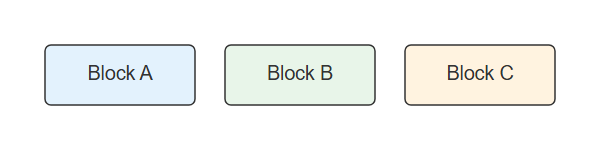
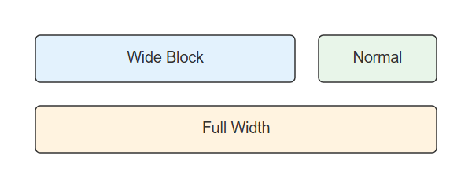
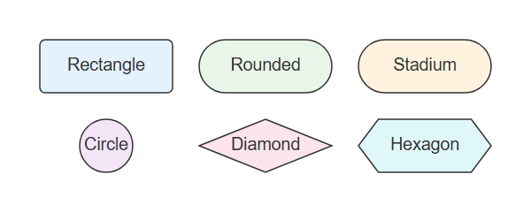
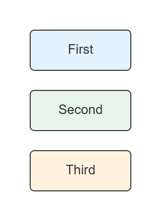
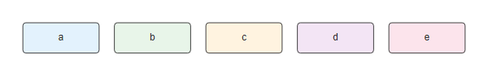
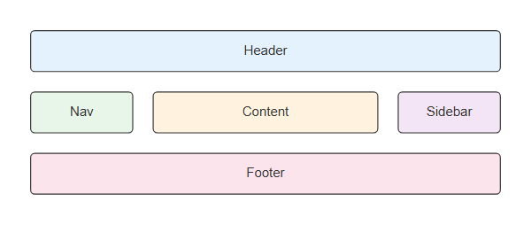

# Block

## Simple

**Input:**
```
block-beta
    columns 3
    a["Block A"] b["Block B"] c["Block C"]
```
**Rendered by Naiad:**

<p align="center">
  
</p>


[Open in Mermaid Live](https://mermaid.live/edit#base64:eyJjb2RlIjoiYmxvY2stYmV0YVxuICAgIGNvbHVtbnMgM1xuICAgIGFbXHUwMDIyQmxvY2sgQVx1MDAyMl0gYltcdTAwMjJCbG9jayBCXHUwMDIyXSBjW1x1MDAyMkJsb2NrIENcdTAwMjJdIiwibWVybWFpZCI6eyJ0aGVtZSI6ImRlZmF1bHQifX0=)

## Span

**Input:**
```
block-beta
    columns 3
    a["Wide Block"]:2 b["Normal"]
    c["Full Width"]:3
```
**Rendered by Naiad:**

<p align="center">
  
</p>


[Open in Mermaid Live](https://mermaid.live/edit#base64:eyJjb2RlIjoiYmxvY2stYmV0YVxuICAgIGNvbHVtbnMgM1xuICAgIGFbXHUwMDIyV2lkZSBCbG9ja1x1MDAyMl06MiBiW1x1MDAyMk5vcm1hbFx1MDAyMl1cbiAgICBjW1x1MDAyMkZ1bGwgV2lkdGhcdTAwMjJdOjMiLCJtZXJtYWlkIjp7InRoZW1lIjoiZGVmYXVsdCJ9fQ==)

## DifferentShapes

**Input:**
```
block-beta
    columns 3
    a["Rectangle"] b("Rounded") c(["Stadium"])
    d(("Circle")) e{"Diamond"} f{{"Hexagon"}}
```
**Rendered by Naiad:**

<p align="center">
  
</p>


[Open in Mermaid Live](https://mermaid.live/edit#base64:eyJjb2RlIjoiYmxvY2stYmV0YVxuICAgIGNvbHVtbnMgM1xuICAgIGFbXHUwMDIyUmVjdGFuZ2xlXHUwMDIyXSBiKFx1MDAyMlJvdW5kZWRcdTAwMjIpIGMoW1x1MDAyMlN0YWRpdW1cdTAwMjJdKVxuICAgIGQoKFx1MDAyMkNpcmNsZVx1MDAyMikpIGV7XHUwMDIyRGlhbW9uZFx1MDAyMn0gZnt7XHUwMDIySGV4YWdvblx1MDAyMn19IiwibWVybWFpZCI6eyJ0aGVtZSI6ImRlZmF1bHQifX0=)

## Column

**Input:**
```
block-beta
    columns 1
    a["First"]
    b["Second"]
    c["Third"]
```
**Rendered by Naiad:**

<p align="center">
  
</p>


[Open in Mermaid Live](https://mermaid.live/edit#base64:eyJjb2RlIjoiYmxvY2stYmV0YVxuICAgIGNvbHVtbnMgMVxuICAgIGFbXHUwMDIyRmlyc3RcdTAwMjJdXG4gICAgYltcdTAwMjJTZWNvbmRcdTAwMjJdXG4gICAgY1tcdTAwMjJUaGlyZFx1MDAyMl0iLCJtZXJtYWlkIjp7InRoZW1lIjoiZGVmYXVsdCJ9fQ==)

## ManyColumns

**Input:**
```
block-beta
    columns 5
    a b c d e
```
**Rendered by Naiad:**

<p align="center">
  
</p>


[Open in Mermaid Live](https://mermaid.live/edit#base64:eyJjb2RlIjoiYmxvY2stYmV0YVxuICAgIGNvbHVtbnMgNVxuICAgIGEgYiBjIGQgZSIsIm1lcm1haWQiOnsidGhlbWUiOiJkZWZhdWx0In19)

## MixedLayout

**Input:**
```
block-beta
    columns 4
    header["Header"]:4
    nav["Nav"] content["Content"]:2 side["Sidebar"]
    footer["Footer"]:4
```
**Rendered by Naiad:**

<p align="center">
  
</p>


[Open in Mermaid Live](https://mermaid.live/edit#base64:eyJjb2RlIjoiYmxvY2stYmV0YVxuICAgIGNvbHVtbnMgNFxuICAgIGhlYWRlcltcdTAwMjJIZWFkZXJcdTAwMjJdOjRcbiAgICBuYXZbXHUwMDIyTmF2XHUwMDIyXSBjb250ZW50W1x1MDAyMkNvbnRlbnRcdTAwMjJdOjIgc2lkZVtcdTAwMjJTaWRlYmFyXHUwMDIyXVxuICAgIGZvb3RlcltcdTAwMjJGb290ZXJcdTAwMjJdOjQiLCJtZXJtYWlkIjp7InRoZW1lIjoiZGVmYXVsdCJ9fQ==)

