# Class

## Simple

**Input:**
```
classDiagram
    class Animal
```
**Rendered by Naiad:**

<p align="center">
  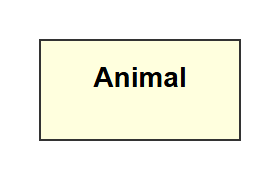
</p>

**Rendered by Mermaid:**
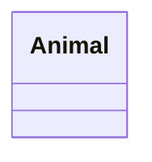

[Open in Mermaid Live](https://mermaid.live/edit#base64:eyJjb2RlIjoiY2xhc3NEaWFncmFtXG4gICAgY2xhc3MgQW5pbWFsIiwibWVybWFpZCI6eyJ0aGVtZSI6ImRlZmF1bHQifX0=)

## Members

**Input:**
```
classDiagram
    class Animal {
        +String name
        +int age
    }
```
**Rendered by Naiad:**

<p align="center">
  
</p>

**Rendered by Mermaid:**
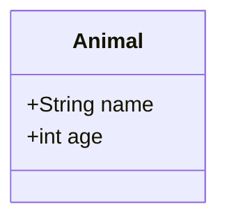

[Open in Mermaid Live](https://mermaid.live/edit#base64:eyJjb2RlIjoiY2xhc3NEaWFncmFtXG4gICAgY2xhc3MgQW5pbWFsIHtcbiAgICAgICAgXHUwMDJCU3RyaW5nIG5hbWVcbiAgICAgICAgXHUwMDJCaW50IGFnZVxuICAgIH0iLCJtZXJtYWlkIjp7InRoZW1lIjoiZGVmYXVsdCJ9fQ==)

## Methods

**Input:**
```
classDiagram
    class Animal {
        +makeSound()
        +move() : void
    }
```
**Rendered by Naiad:**

<p align="center">
  
</p>

**Rendered by Mermaid:**
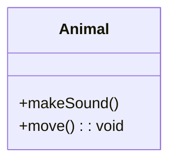

[Open in Mermaid Live](https://mermaid.live/edit#base64:eyJjb2RlIjoiY2xhc3NEaWFncmFtXG4gICAgY2xhc3MgQW5pbWFsIHtcbiAgICAgICAgXHUwMDJCbWFrZVNvdW5kKClcbiAgICAgICAgXHUwMDJCbW92ZSgpIDogdm9pZFxuICAgIH0iLCJtZXJtYWlkIjp7InRoZW1lIjoiZGVmYXVsdCJ9fQ==)

## MembersAndMethods

**Input:**
```
classDiagram
    class Animal {
        +String name
        +int age
        +makeSound() : void
        +move(int distance) : void
    }
```
**Rendered by Naiad:**

<p align="center">
  
</p>

**Rendered by Mermaid:**
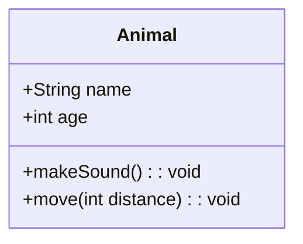

[Open in Mermaid Live](https://mermaid.live/edit#base64:eyJjb2RlIjoiY2xhc3NEaWFncmFtXG4gICAgY2xhc3MgQW5pbWFsIHtcbiAgICAgICAgXHUwMDJCU3RyaW5nIG5hbWVcbiAgICAgICAgXHUwMDJCaW50IGFnZVxuICAgICAgICBcdTAwMkJtYWtlU291bmQoKSA6IHZvaWRcbiAgICAgICAgXHUwMDJCbW92ZShpbnQgZGlzdGFuY2UpIDogdm9pZFxuICAgIH0iLCJtZXJtYWlkIjp7InRoZW1lIjoiZGVmYXVsdCJ9fQ==)

## Inheritance

**Input:**
```
classDiagram
    Animal <|-- Dog
    Animal <|-- Cat
```
**Rendered by Naiad:**

<p align="center">
  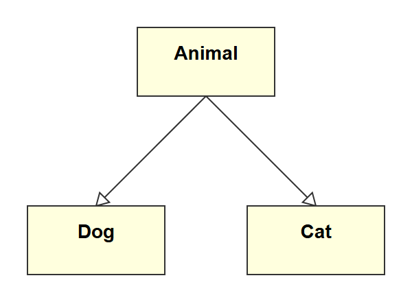
</p>

**Rendered by Mermaid:**
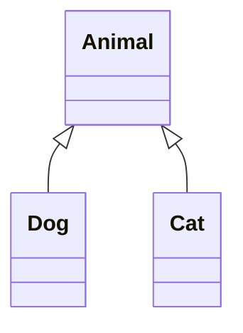

[Open in Mermaid Live](https://mermaid.live/edit#base64:eyJjb2RlIjoiY2xhc3NEaWFncmFtXG4gICAgQW5pbWFsIFx1MDAzQ3wtLSBEb2dcbiAgICBBbmltYWwgXHUwMDNDfC0tIENhdCIsIm1lcm1haWQiOnsidGhlbWUiOiJkZWZhdWx0In19)

## Composition

**Input:**
```
classDiagram
    Car *-- Engine
    Car *-- Wheel
```
**Rendered by Naiad:**

<p align="center">
  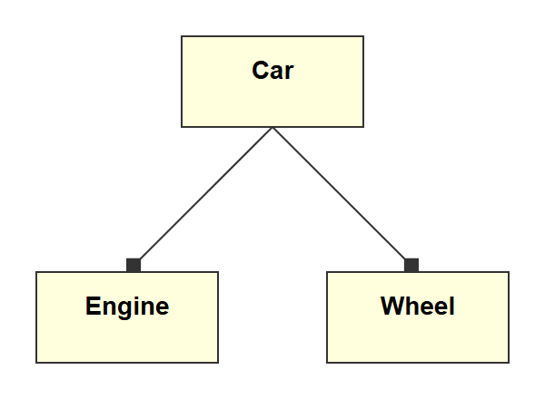
</p>

**Rendered by Mermaid:**
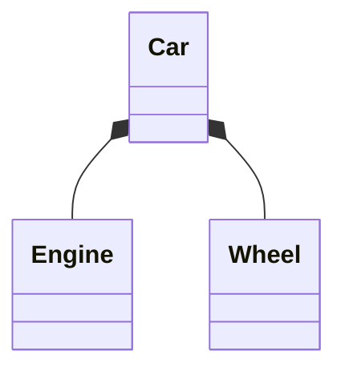

[Open in Mermaid Live](https://mermaid.live/edit#base64:eyJjb2RlIjoiY2xhc3NEaWFncmFtXG4gICAgQ2FyICotLSBFbmdpbmVcbiAgICBDYXIgKi0tIFdoZWVsIiwibWVybWFpZCI6eyJ0aGVtZSI6ImRlZmF1bHQifX0=)

## Aggregation

**Input:**
```
classDiagram
    Library o-- Book
```
**Rendered by Naiad:**

<p align="center">
  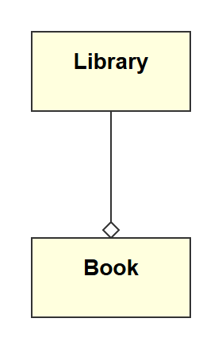
</p>

**Rendered by Mermaid:**
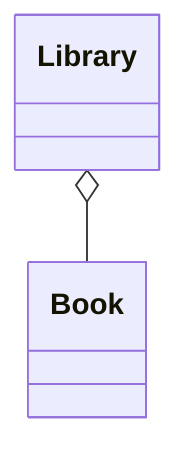

[Open in Mermaid Live](https://mermaid.live/edit#base64:eyJjb2RlIjoiY2xhc3NEaWFncmFtXG4gICAgTGlicmFyeSBvLS0gQm9vayIsIm1lcm1haWQiOnsidGhlbWUiOiJkZWZhdWx0In19)

## Association

**Input:**
```
classDiagram
    Student --> Course : enrolls
```
**Rendered by Naiad:**

<p align="center">
  
</p>

**Rendered by Mermaid:**
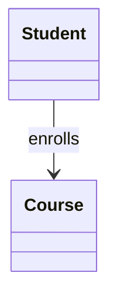

[Open in Mermaid Live](https://mermaid.live/edit#base64:eyJjb2RlIjoiY2xhc3NEaWFncmFtXG4gICAgU3R1ZGVudCAtLVx1MDAzRSBDb3Vyc2UgOiBlbnJvbGxzIiwibWVybWFpZCI6eyJ0aGVtZSI6ImRlZmF1bHQifX0=)

## InterfaceAnnotation

**Input:**
```
classDiagram
    class IFlyable {
        <<interface>>
        +fly() : void
    }
```
**Rendered by Naiad:**

<p align="center">
  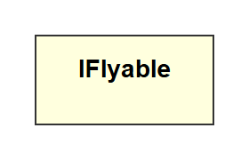
</p>

**Rendered by Mermaid:**
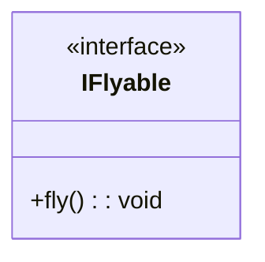

[Open in Mermaid Live](https://mermaid.live/edit#base64:eyJjb2RlIjoiY2xhc3NEaWFncmFtXG4gICAgY2xhc3MgSUZseWFibGUge1xuICAgICAgICBcdTAwM0NcdTAwM0NpbnRlcmZhY2VcdTAwM0VcdTAwM0VcbiAgICAgICAgXHUwMDJCZmx5KCkgOiB2b2lkXG4gICAgfSIsIm1lcm1haWQiOnsidGhlbWUiOiJkZWZhdWx0In19)

## Complex

**Input:**
```
classDiagram
class IRepository~T~ {
    <<interface>>
    +get(id: int) T
    +save(entity: T) void
    +delete(id: int) void
}

class AbstractEntity {
    <<abstract>>
    #int id
    #DateTime createdAt
    #DateTime updatedAt
    +getId() int
}

class UserService {
    <<service>>
    -IUserRepository repository
    -ILogger logger
    +createUser(name: String) User
    +findUser(id: int) User
    +deleteUser(id: int) void
}

class Status {
    <<enumeration>>
    ACTIVE
    INACTIVE
    PENDING
    DELETED
}

class User {
    +String name
    +String email
    -String passwordHash
    ~Status status
    +validate()$ bool
    +hashPassword(password: String)$ String
}

class Address {
    +String street
    +String city
    +String zipCode
}

class Order {
    +int orderId
    +List~Item~ items
    +calculateTotal() Decimal
}

class Item {
    +String name
    +Decimal price
    +int quantity
}

IRepository~T~ <|.. UserRepository : implements
AbstractEntity <|-- User : extends
UserService ..> IRepository~T~ : uses
User "1" --> "1..*" Address : has
User "1" o-- "*" Order : places
Order "1" *-- "1..*" Item : contains
```
**Rendered by Naiad:**

<p align="center">
  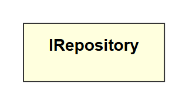
</p>

**Rendered by Mermaid:**
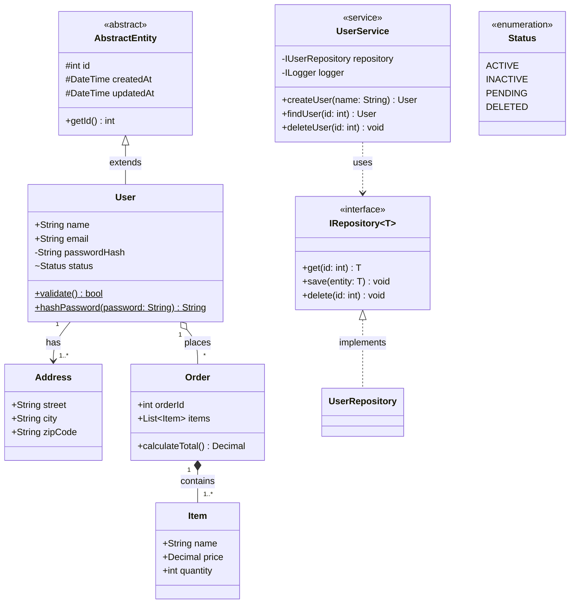

[Open in Mermaid Live](https://mermaid.live/edit#base64:eyJjb2RlIjoiY2xhc3NEaWFncmFtXG5jbGFzcyBJUmVwb3NpdG9yeX5UfiB7XG4gICAgXHUwMDNDXHUwMDNDaW50ZXJmYWNlXHUwMDNFXHUwMDNFXG4gICAgXHUwMDJCZ2V0KGlkOiBpbnQpIFRcbiAgICBcdTAwMkJzYXZlKGVudGl0eTogVCkgdm9pZFxuICAgIFx1MDAyQmRlbGV0ZShpZDogaW50KSB2b2lkXG59XG5cbmNsYXNzIEFic3RyYWN0RW50aXR5IHtcbiAgICBcdTAwM0NcdTAwM0NhYnN0cmFjdFx1MDAzRVx1MDAzRVxuICAgICNpbnQgaWRcbiAgICAjRGF0ZVRpbWUgY3JlYXRlZEF0XG4gICAgI0RhdGVUaW1lIHVwZGF0ZWRBdFxuICAgIFx1MDAyQmdldElkKCkgaW50XG59XG5cbmNsYXNzIFVzZXJTZXJ2aWNlIHtcbiAgICBcdTAwM0NcdTAwM0NzZXJ2aWNlXHUwMDNFXHUwMDNFXG4gICAgLUlVc2VyUmVwb3NpdG9yeSByZXBvc2l0b3J5XG4gICAgLUlMb2dnZXIgbG9nZ2VyXG4gICAgXHUwMDJCY3JlYXRlVXNlcihuYW1lOiBTdHJpbmcpIFVzZXJcbiAgICBcdTAwMkJmaW5kVXNlcihpZDogaW50KSBVc2VyXG4gICAgXHUwMDJCZGVsZXRlVXNlcihpZDogaW50KSB2b2lkXG59XG5cbmNsYXNzIFN0YXR1cyB7XG4gICAgXHUwMDNDXHUwMDNDZW51bWVyYXRpb25cdTAwM0VcdTAwM0VcbiAgICBBQ1RJVkVcbiAgICBJTkFDVElWRVxuICAgIFBFTkRJTkdcbiAgICBERUxFVEVEXG59XG5cbmNsYXNzIFVzZXIge1xuICAgIFx1MDAyQlN0cmluZyBuYW1lXG4gICAgXHUwMDJCU3RyaW5nIGVtYWlsXG4gICAgLVN0cmluZyBwYXNzd29yZEhhc2hcbiAgICB+U3RhdHVzIHN0YXR1c1xuICAgIFx1MDAyQnZhbGlkYXRlKCkkIGJvb2xcbiAgICBcdTAwMkJoYXNoUGFzc3dvcmQocGFzc3dvcmQ6IFN0cmluZykkIFN0cmluZ1xufVxuXG5jbGFzcyBBZGRyZXNzIHtcbiAgICBcdTAwMkJTdHJpbmcgc3RyZWV0XG4gICAgXHUwMDJCU3RyaW5nIGNpdHlcbiAgICBcdTAwMkJTdHJpbmcgemlwQ29kZVxufVxuXG5jbGFzcyBPcmRlciB7XG4gICAgXHUwMDJCaW50IG9yZGVySWRcbiAgICBcdTAwMkJMaXN0fkl0ZW1+IGl0ZW1zXG4gICAgXHUwMDJCY2FsY3VsYXRlVG90YWwoKSBEZWNpbWFsXG59XG5cbmNsYXNzIEl0ZW0ge1xuICAgIFx1MDAyQlN0cmluZyBuYW1lXG4gICAgXHUwMDJCRGVjaW1hbCBwcmljZVxuICAgIFx1MDAyQmludCBxdWFudGl0eVxufVxuXG5JUmVwb3NpdG9yeX5UfiBcdTAwM0N8Li4gVXNlclJlcG9zaXRvcnkgOiBpbXBsZW1lbnRzXG5BYnN0cmFjdEVudGl0eSBcdTAwM0N8LS0gVXNlciA6IGV4dGVuZHNcblVzZXJTZXJ2aWNlIC4uXHUwMDNFIElSZXBvc2l0b3J5flR+IDogdXNlc1xuVXNlciBcdTAwMjIxXHUwMDIyIC0tXHUwMDNFIFx1MDAyMjEuLipcdTAwMjIgQWRkcmVzcyA6IGhhc1xuVXNlciBcdTAwMjIxXHUwMDIyIG8tLSBcdTAwMjIqXHUwMDIyIE9yZGVyIDogcGxhY2VzXG5PcmRlciBcdTAwMjIxXHUwMDIyICotLSBcdTAwMjIxLi4qXHUwMDIyIEl0ZW0gOiBjb250YWlucyIsIm1lcm1haWQiOnsidGhlbWUiOiJkZWZhdWx0In19)

