# EntityRelationship

## Simple

**Input:**
```
erDiagram
    CUSTOMER ||--o{ ORDER : places
```
**Rendered by Naiad:**

<p align="center">
  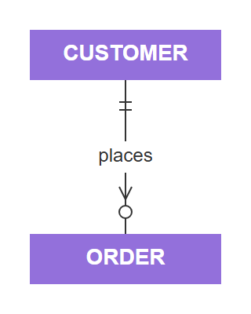
</p>

**Rendered by Mermaid:**
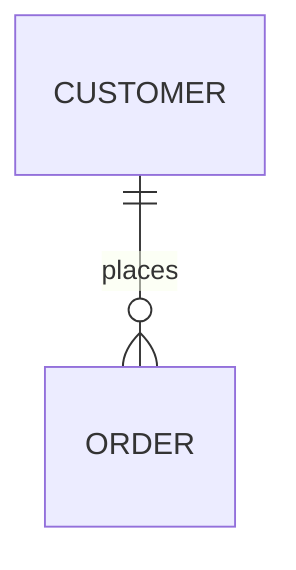

[Open in Mermaid Live](https://mermaid.live/edit#base64:eyJjb2RlIjoiZXJEaWFncmFtXG4gICAgQ1VTVE9NRVIgfHwtLW97IE9SREVSIDogcGxhY2VzIiwibWVybWFpZCI6eyJ0aGVtZSI6ImRlZmF1bHQifX0=)

## MultipleRelationships

**Input:**
```
erDiagram
    CUSTOMER ||--o{ ORDER : places
    ORDER ||--|{ LINE-ITEM : contains
    PRODUCT ||--o{ LINE-ITEM : includes
```
**Rendered by Naiad:**

<p align="center">
  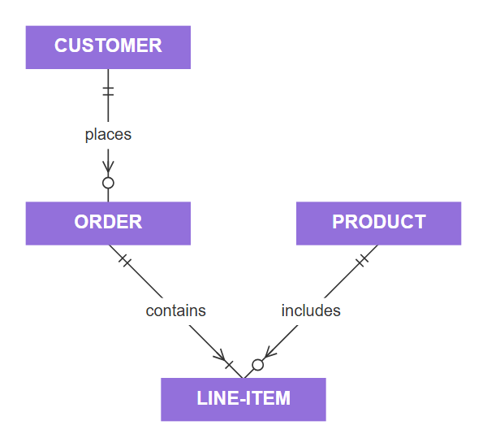
</p>

**Rendered by Mermaid:**
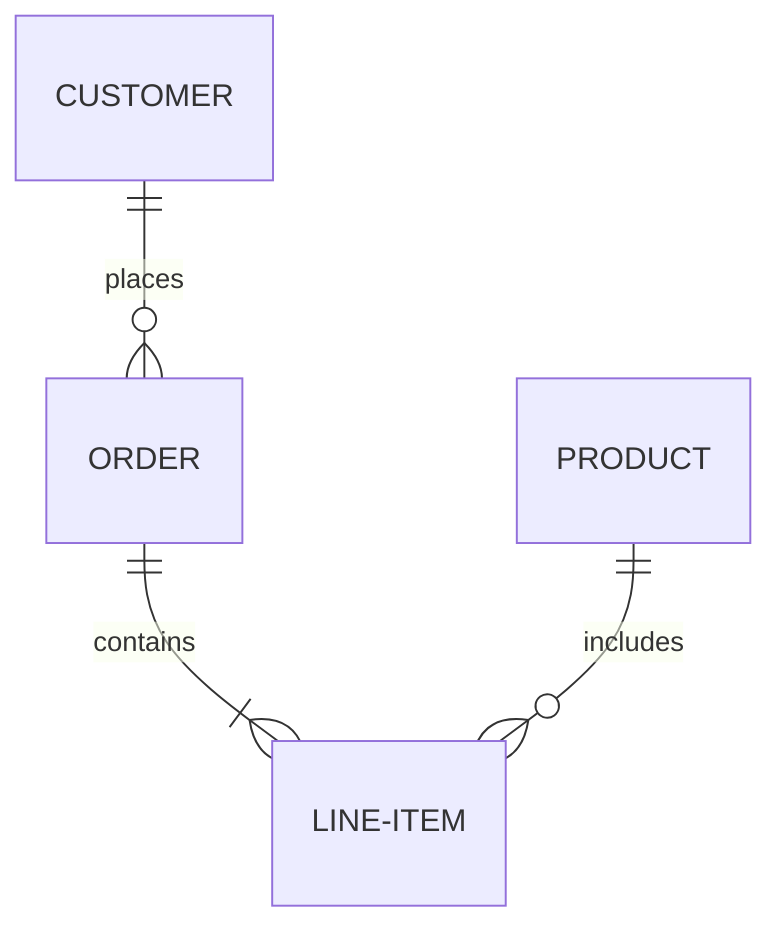

[Open in Mermaid Live](https://mermaid.live/edit#base64:eyJjb2RlIjoiZXJEaWFncmFtXG4gICAgQ1VTVE9NRVIgfHwtLW97IE9SREVSIDogcGxhY2VzXG4gICAgT1JERVIgfHwtLXx7IExJTkUtSVRFTSA6IGNvbnRhaW5zXG4gICAgUFJPRFVDVCB8fC0tb3sgTElORS1JVEVNIDogaW5jbHVkZXMiLCJtZXJtYWlkIjp7InRoZW1lIjoiZGVmYXVsdCJ9fQ==)

## Attributes

**Input:**
```
erDiagram
    CUSTOMER {
        string name
        string email
        int age
    }
```
**Rendered by Naiad:**

<p align="center">
  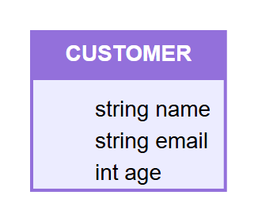
</p>

**Rendered by Mermaid:**
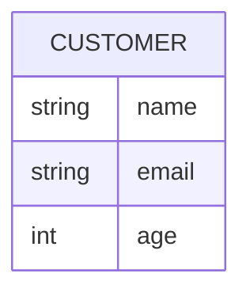

[Open in Mermaid Live](https://mermaid.live/edit#base64:eyJjb2RlIjoiZXJEaWFncmFtXG4gICAgQ1VTVE9NRVIge1xuICAgICAgICBzdHJpbmcgbmFtZVxuICAgICAgICBzdHJpbmcgZW1haWxcbiAgICAgICAgaW50IGFnZVxuICAgIH0iLCJtZXJtYWlkIjp7InRoZW1lIjoiZGVmYXVsdCJ9fQ==)

## KeyTypes

**Input:**
```
erDiagram
    CUSTOMER {
        int id PK
        string name
        string email UK
    }
```
**Rendered by Naiad:**

<p align="center">
  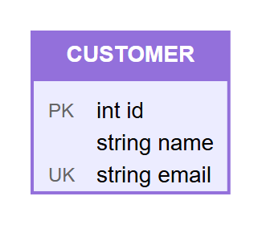
</p>

**Rendered by Mermaid:**
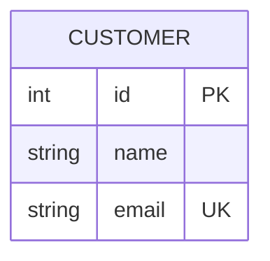

[Open in Mermaid Live](https://mermaid.live/edit#base64:eyJjb2RlIjoiZXJEaWFncmFtXG4gICAgQ1VTVE9NRVIge1xuICAgICAgICBpbnQgaWQgUEtcbiAgICAgICAgc3RyaW5nIG5hbWVcbiAgICAgICAgc3RyaW5nIGVtYWlsIFVLXG4gICAgfSIsIm1lcm1haWQiOnsidGhlbWUiOiJkZWZhdWx0In19)

## Comments

**Input:**
```
erDiagram
    CUSTOMER {
        int id PK "Primary key"
        string name "Customer name"
    }
```
**Rendered by Naiad:**

<p align="center">
  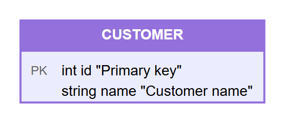
</p>

**Rendered by Mermaid:**
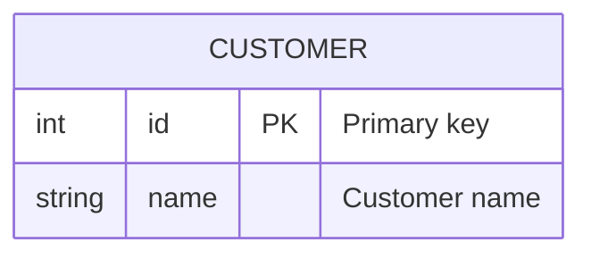

[Open in Mermaid Live](https://mermaid.live/edit#base64:eyJjb2RlIjoiZXJEaWFncmFtXG4gICAgQ1VTVE9NRVIge1xuICAgICAgICBpbnQgaWQgUEsgXHUwMDIyUHJpbWFyeSBrZXlcdTAwMjJcbiAgICAgICAgc3RyaW5nIG5hbWUgXHUwMDIyQ3VzdG9tZXIgbmFtZVx1MDAyMlxuICAgIH0iLCJtZXJtYWlkIjp7InRoZW1lIjoiZGVmYXVsdCJ9fQ==)

## OneToOne

**Input:**
```
erDiagram
    PERSON ||--|| PASSPORT : has
```
**Rendered by Naiad:**

<p align="center">
  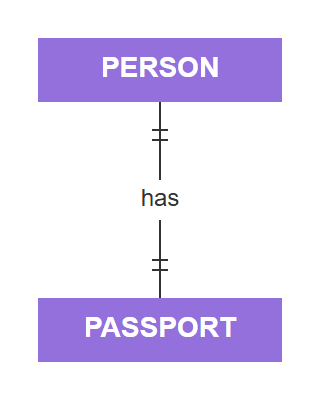
</p>

**Rendered by Mermaid:**
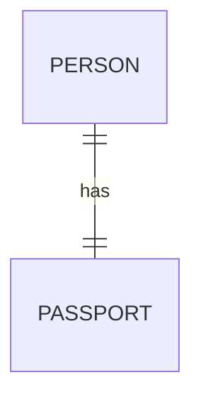

[Open in Mermaid Live](https://mermaid.live/edit#base64:eyJjb2RlIjoiZXJEaWFncmFtXG4gICAgUEVSU09OIHx8LS18fCBQQVNTUE9SVCA6IGhhcyIsIm1lcm1haWQiOnsidGhlbWUiOiJkZWZhdWx0In19)

## ZeroOrOne

**Input:**
```
erDiagram
    EMPLOYEE |o--o| PARKING-SPACE : uses
```
**Rendered by Naiad:**

<p align="center">
  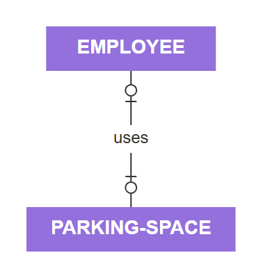
</p>

**Rendered by Mermaid:**
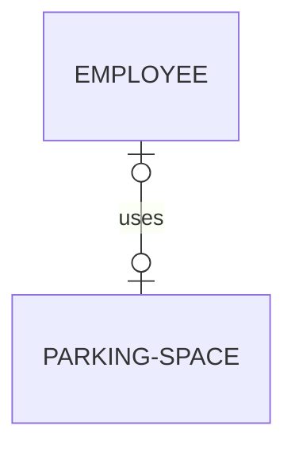

[Open in Mermaid Live](https://mermaid.live/edit#base64:eyJjb2RlIjoiZXJEaWFncmFtXG4gICAgRU1QTE9ZRUUgfG8tLW98IFBBUktJTkctU1BBQ0UgOiB1c2VzIiwibWVybWFpZCI6eyJ0aGVtZSI6ImRlZmF1bHQifX0=)

## NonIdentifying

**Input:**
```
erDiagram
    CUSTOMER ||..o{ ORDER : places
```
**Rendered by Naiad:**

<p align="center">
  
</p>

**Rendered by Mermaid:**
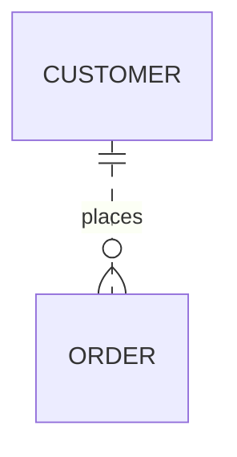

[Open in Mermaid Live](https://mermaid.live/edit#base64:eyJjb2RlIjoiZXJEaWFncmFtXG4gICAgQ1VTVE9NRVIgfHwuLm97IE9SREVSIDogcGxhY2VzIiwibWVybWFpZCI6eyJ0aGVtZSI6ImRlZmF1bHQifX0=)

## Compelx

**Input:**
```
erDiagram
CUSTOMER {
    int customer_id PK "Primary key"
    string first_name "Customer first name"
    string last_name "Customer last name"
    string email UK "Unique email address"
    date date_of_birth
    string phone
    boolean is_active
}

ADDRESS {
    int address_id PK
    int customer_id FK
    string street
    string city
    string state
    string postal_code
    string country
    string address_type "billing or shipping"
}

ORDER {
    int order_id PK
    int customer_id FK
    int shipping_address_id FK
    int billing_address_id FK
    datetime order_date
    datetime shipped_date
    string status
    decimal total_amount
}

ORDER_ITEM {
    int item_id PK
    int order_id FK
    int product_id FK
    int quantity
    decimal unit_price
    decimal discount
}

PRODUCT {
    int product_id PK
    int category_id FK
    string name
    string description
    decimal price
    int stock_quantity
    string sku UK
}

CATEGORY {
    int category_id PK
    int parent_id FK "Self-referencing"
    string name
    string description
}

CUSTOMER ||--o{ ORDER : places
CUSTOMER ||--o{ ADDRESS : has
ORDER ||--|{ ORDER_ITEM : contains
ORDER }o--|| ADDRESS : "ships to"
ORDER }o--|| ADDRESS : "bills to"
PRODUCT ||--o{ ORDER_ITEM : "included in"
CATEGORY ||--o{ PRODUCT : categorizes
CATEGORY |o--o| CATEGORY : "parent of"
```
**Rendered by Naiad:**

<p align="center">
  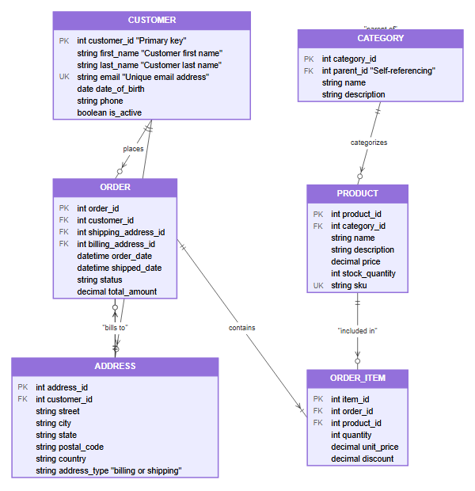
</p>

**Rendered by Mermaid:**
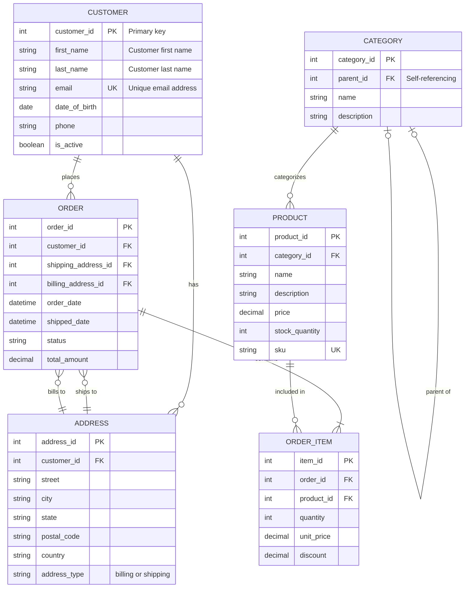

[Open in Mermaid Live](https://mermaid.live/edit#base64:eyJjb2RlIjoiZXJEaWFncmFtXG5DVVNUT01FUiB7XG4gICAgaW50IGN1c3RvbWVyX2lkIFBLIFx1MDAyMlByaW1hcnkga2V5XHUwMDIyXG4gICAgc3RyaW5nIGZpcnN0X25hbWUgXHUwMDIyQ3VzdG9tZXIgZmlyc3QgbmFtZVx1MDAyMlxuICAgIHN0cmluZyBsYXN0X25hbWUgXHUwMDIyQ3VzdG9tZXIgbGFzdCBuYW1lXHUwMDIyXG4gICAgc3RyaW5nIGVtYWlsIFVLIFx1MDAyMlVuaXF1ZSBlbWFpbCBhZGRyZXNzXHUwMDIyXG4gICAgZGF0ZSBkYXRlX29mX2JpcnRoXG4gICAgc3RyaW5nIHBob25lXG4gICAgYm9vbGVhbiBpc19hY3RpdmVcbn1cblxuQUREUkVTUyB7XG4gICAgaW50IGFkZHJlc3NfaWQgUEtcbiAgICBpbnQgY3VzdG9tZXJfaWQgRktcbiAgICBzdHJpbmcgc3RyZWV0XG4gICAgc3RyaW5nIGNpdHlcbiAgICBzdHJpbmcgc3RhdGVcbiAgICBzdHJpbmcgcG9zdGFsX2NvZGVcbiAgICBzdHJpbmcgY291bnRyeVxuICAgIHN0cmluZyBhZGRyZXNzX3R5cGUgXHUwMDIyYmlsbGluZyBvciBzaGlwcGluZ1x1MDAyMlxufVxuXG5PUkRFUiB7XG4gICAgaW50IG9yZGVyX2lkIFBLXG4gICAgaW50IGN1c3RvbWVyX2lkIEZLXG4gICAgaW50IHNoaXBwaW5nX2FkZHJlc3NfaWQgRktcbiAgICBpbnQgYmlsbGluZ19hZGRyZXNzX2lkIEZLXG4gICAgZGF0ZXRpbWUgb3JkZXJfZGF0ZVxuICAgIGRhdGV0aW1lIHNoaXBwZWRfZGF0ZVxuICAgIHN0cmluZyBzdGF0dXNcbiAgICBkZWNpbWFsIHRvdGFsX2Ftb3VudFxufVxuXG5PUkRFUl9JVEVNIHtcbiAgICBpbnQgaXRlbV9pZCBQS1xuICAgIGludCBvcmRlcl9pZCBGS1xuICAgIGludCBwcm9kdWN0X2lkIEZLXG4gICAgaW50IHF1YW50aXR5XG4gICAgZGVjaW1hbCB1bml0X3ByaWNlXG4gICAgZGVjaW1hbCBkaXNjb3VudFxufVxuXG5QUk9EVUNUIHtcbiAgICBpbnQgcHJvZHVjdF9pZCBQS1xuICAgIGludCBjYXRlZ29yeV9pZCBGS1xuICAgIHN0cmluZyBuYW1lXG4gICAgc3RyaW5nIGRlc2NyaXB0aW9uXG4gICAgZGVjaW1hbCBwcmljZVxuICAgIGludCBzdG9ja19xdWFudGl0eVxuICAgIHN0cmluZyBza3UgVUtcbn1cblxuQ0FURUdPUlkge1xuICAgIGludCBjYXRlZ29yeV9pZCBQS1xuICAgIGludCBwYXJlbnRfaWQgRksgXHUwMDIyU2VsZi1yZWZlcmVuY2luZ1x1MDAyMlxuICAgIHN0cmluZyBuYW1lXG4gICAgc3RyaW5nIGRlc2NyaXB0aW9uXG59XG5cbkNVU1RPTUVSIHx8LS1veyBPUkRFUiA6IHBsYWNlc1xuQ1VTVE9NRVIgfHwtLW97IEFERFJFU1MgOiBoYXNcbk9SREVSIHx8LS18eyBPUkRFUl9JVEVNIDogY29udGFpbnNcbk9SREVSIH1vLS18fCBBRERSRVNTIDogXHUwMDIyc2hpcHMgdG9cdTAwMjJcbk9SREVSIH1vLS18fCBBRERSRVNTIDogXHUwMDIyYmlsbHMgdG9cdTAwMjJcblBST0RVQ1QgfHwtLW97IE9SREVSX0lURU0gOiBcdTAwMjJpbmNsdWRlZCBpblx1MDAyMlxuQ0FURUdPUlkgfHwtLW97IFBST0RVQ1QgOiBjYXRlZ29yaXplc1xuQ0FURUdPUlkgfG8tLW98IENBVEVHT1JZIDogXHUwMDIycGFyZW50IG9mXHUwMDIyIiwibWVybWFpZCI6eyJ0aGVtZSI6ImRlZmF1bHQifX0=)

