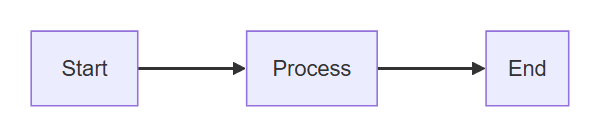
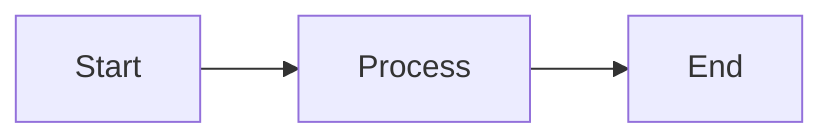
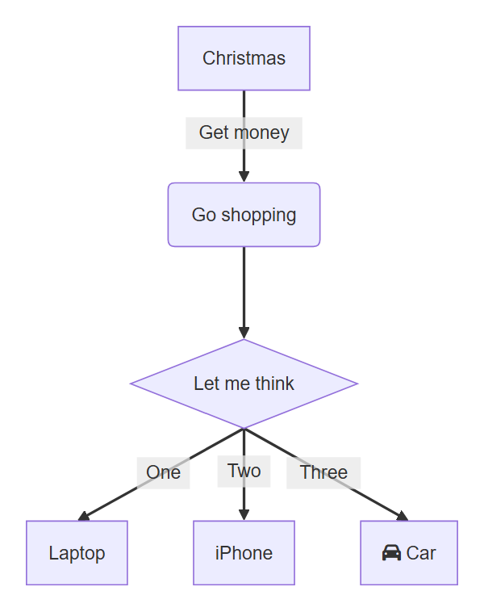
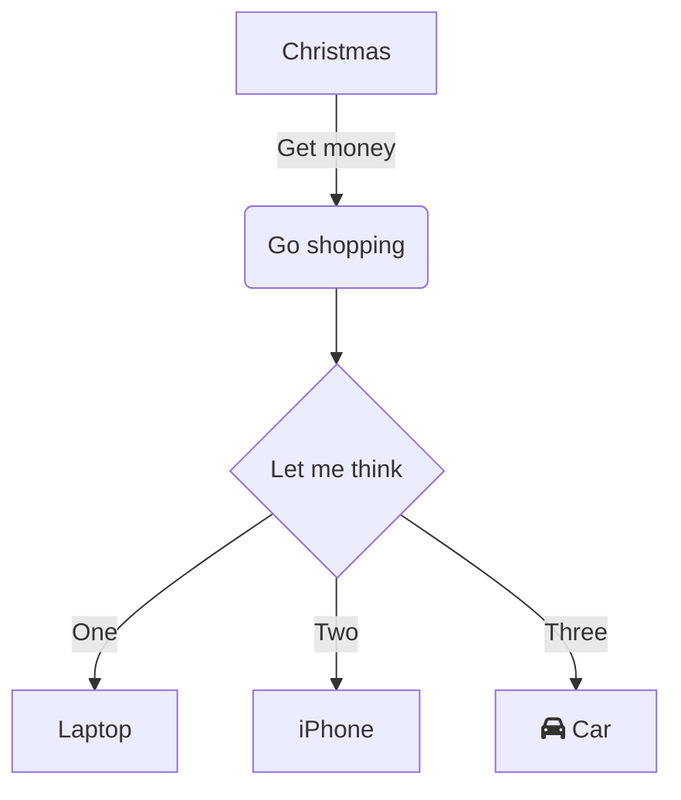
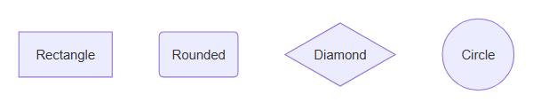
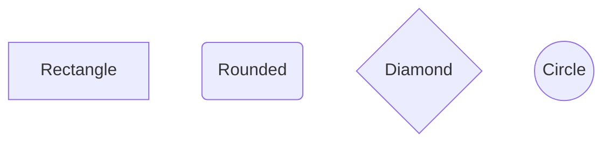
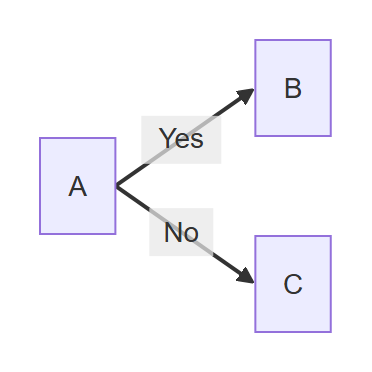
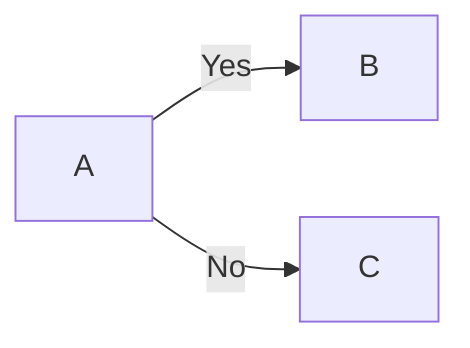
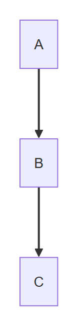
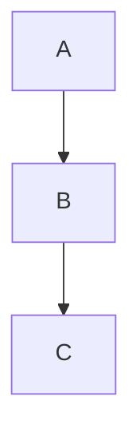

# Flowchart

## Simple

**Input:**
```
flowchart LR
    A[Start] --> B[Process] --> C[End]
```
**Rendered by Naiad:**

<p align="center">
  
</p>

**Rendered by Mermaid:**


[Open in Mermaid Live](https://mermaid.live/edit#base64:eyJjb2RlIjoiZmxvd2NoYXJ0IExSXG4gICAgQVtTdGFydF0gLS1cdTAwM0UgQltQcm9jZXNzXSAtLVx1MDAzRSBDW0VuZF0iLCJtZXJtYWlkIjp7InRoZW1lIjoiZGVmYXVsdCJ9fQ==)

## Complex

**Input:**
```
flowchart TD
    A[Christmas] -->|Get money| B(Go shopping)
    B --> C{Let me think}
    C -->|One| D[Laptop]
    C -->|Two| E[iPhone]
    C -->|Three| F[fa:fa-car Car]
```
**Rendered by Naiad:**

<p align="center">
  
</p>

**Rendered by Mermaid:**


[Open in Mermaid Live](https://mermaid.live/edit#base64:eyJjb2RlIjoiZmxvd2NoYXJ0IFREXG4gICAgQVtDaHJpc3RtYXNdIC0tXHUwMDNFfEdldCBtb25leXwgQihHbyBzaG9wcGluZylcbiAgICBCIC0tXHUwMDNFIEN7TGV0IG1lIHRoaW5rfVxuICAgIEMgLS1cdTAwM0V8T25lfCBEW0xhcHRvcF1cbiAgICBDIC0tXHUwMDNFfFR3b3wgRVtpUGhvbmVdXG4gICAgQyAtLVx1MDAzRXxUaHJlZXwgRltmYTpmYS1jYXIgQ2FyXSIsIm1lcm1haWQiOnsidGhlbWUiOiJkZWZhdWx0In19)

## Shapes

**Input:**
```
flowchart TD
    A[Rectangle]
    B(Rounded)
    C{Diamond}
    D((Circle))
```
**Rendered by Naiad:**

<p align="center">
  
</p>

**Rendered by Mermaid:**


[Open in Mermaid Live](https://mermaid.live/edit#base64:eyJjb2RlIjoiZmxvd2NoYXJ0IFREXG4gICAgQVtSZWN0YW5nbGVdXG4gICAgQihSb3VuZGVkKVxuICAgIEN7RGlhbW9uZH1cbiAgICBEKChDaXJjbGUpKSIsIm1lcm1haWQiOnsidGhlbWUiOiJkZWZhdWx0In19)

## EdgeLabels

**Input:**
```
flowchart LR
    A --> |Yes| B
    A --> |No| C
```
**Rendered by Naiad:**

<p align="center">
  
</p>

**Rendered by Mermaid:**


[Open in Mermaid Live](https://mermaid.live/edit#base64:eyJjb2RlIjoiZmxvd2NoYXJ0IExSXG4gICAgQSAtLVx1MDAzRSB8WWVzfCBCXG4gICAgQSAtLVx1MDAzRSB8Tm98IEMiLCJtZXJtYWlkIjp7InRoZW1lIjoiZGVmYXVsdCJ9fQ==)

## GraphKeyword

**Input:**
```
graph TD
    A --> B --> C
```
**Rendered by Naiad:**

<p align="center">
  
</p>

**Rendered by Mermaid:**


[Open in Mermaid Live](https://mermaid.live/edit#base64:eyJjb2RlIjoiZ3JhcGggVERcbiAgICBBIC0tXHUwMDNFIEIgLS1cdTAwM0UgQyIsIm1lcm1haWQiOnsidGhlbWUiOiJkZWZhdWx0In19)

