# Gantt

## Simple

**Input:**
```
gantt
    title Simple Gantt
    Task A :a1, 2024-01-01, 30d
    Task B :b1, 2024-01-15, 20d
```
**Rendered by Naiad:**

<p align="center">
  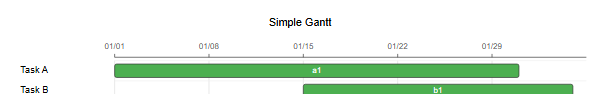
</p>

**Rendered by Mermaid:**
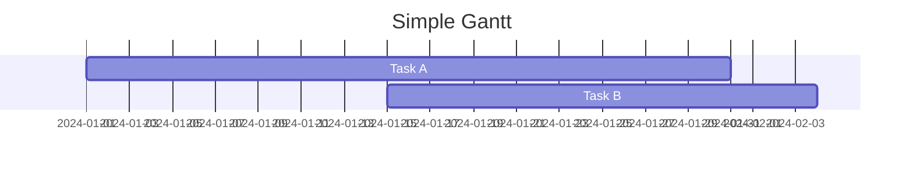

[Open in Mermaid Live](https://mermaid.live/edit#base64:eyJjb2RlIjoiZ2FudHRcbiAgICB0aXRsZSBTaW1wbGUgR2FudHRcbiAgICBUYXNrIEEgOmExLCAyMDI0LTAxLTAxLCAzMGRcbiAgICBUYXNrIEIgOmIxLCAyMDI0LTAxLTE1LCAyMGQiLCJtZXJtYWlkIjp7InRoZW1lIjoiZGVmYXVsdCJ9fQ==)

## TaskWithDependency

**Input:**
```
gantt
    title Dependent Tasks
    Task A :a1, 2024-01-01, 10d
    Task B :b1, after a1, 15d
```
**Rendered by Naiad:**

<p align="center">
  
</p>

**Rendered by Mermaid:**
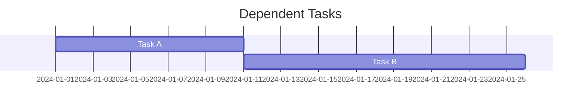

[Open in Mermaid Live](https://mermaid.live/edit#base64:eyJjb2RlIjoiZ2FudHRcbiAgICB0aXRsZSBEZXBlbmRlbnQgVGFza3NcbiAgICBUYXNrIEEgOmExLCAyMDI0LTAxLTAxLCAxMGRcbiAgICBUYXNrIEIgOmIxLCBhZnRlciBhMSwgMTVkIiwibWVybWFpZCI6eyJ0aGVtZSI6ImRlZmF1bHQifX0=)

## Sections

**Input:**
```
gantt
    title Project Timeline
    section Planning
        Research :a1, 2024-01-01, 7d
        Design :a2, after a1, 14d
    section Development
        Coding :b1, after a2, 30d
        Testing :b2, after b1, 14d
```
**Rendered by Naiad:**

<p align="center">
  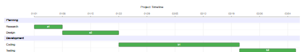
</p>

**Rendered by Mermaid:**
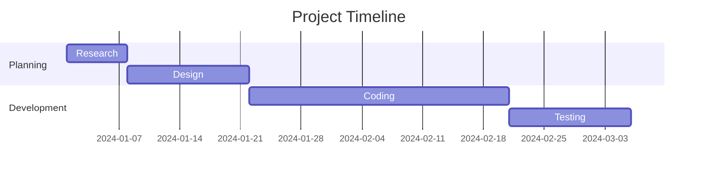

[Open in Mermaid Live](https://mermaid.live/edit#base64:eyJjb2RlIjoiZ2FudHRcbiAgICB0aXRsZSBQcm9qZWN0IFRpbWVsaW5lXG4gICAgc2VjdGlvbiBQbGFubmluZ1xuICAgICAgICBSZXNlYXJjaCA6YTEsIDIwMjQtMDEtMDEsIDdkXG4gICAgICAgIERlc2lnbiA6YTIsIGFmdGVyIGExLCAxNGRcbiAgICBzZWN0aW9uIERldmVsb3BtZW50XG4gICAgICAgIENvZGluZyA6YjEsIGFmdGVyIGEyLCAzMGRcbiAgICAgICAgVGVzdGluZyA6YjIsIGFmdGVyIGIxLCAxNGQiLCJtZXJtYWlkIjp7InRoZW1lIjoiZGVmYXVsdCJ9fQ==)

## Statuses

**Input:**
```
gantt
    title Task Statuses
    Done Task :done, d1, 2024-01-01, 10d
    Active Task :active, a1, 2024-01-11, 10d
    Normal Task :n1, 2024-01-21, 10d
```
**Rendered by Naiad:**

<p align="center">
  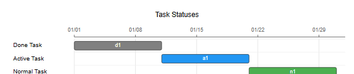
</p>

**Rendered by Mermaid:**
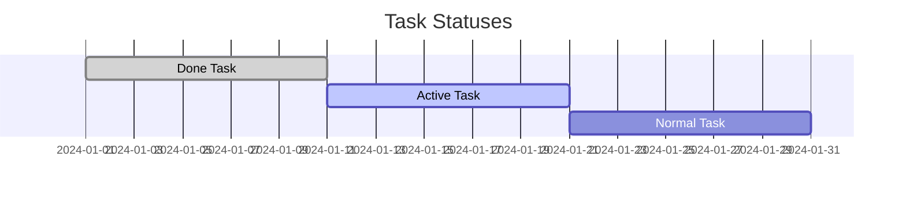

[Open in Mermaid Live](https://mermaid.live/edit#base64:eyJjb2RlIjoiZ2FudHRcbiAgICB0aXRsZSBUYXNrIFN0YXR1c2VzXG4gICAgRG9uZSBUYXNrIDpkb25lLCBkMSwgMjAyNC0wMS0wMSwgMTBkXG4gICAgQWN0aXZlIFRhc2sgOmFjdGl2ZSwgYTEsIDIwMjQtMDEtMTEsIDEwZFxuICAgIE5vcm1hbCBUYXNrIDpuMSwgMjAyNC0wMS0yMSwgMTBkIiwibWVybWFpZCI6eyJ0aGVtZSI6ImRlZmF1bHQifX0=)

## Critical

**Input:**
```
gantt
    title Critical Path
    Normal :n1, 2024-01-01, 10d
    Critical :crit, c1, 2024-01-11, 10d
    Also Critical :crit, c2, after c1, 10d
```
**Rendered by Naiad:**

<p align="center">
  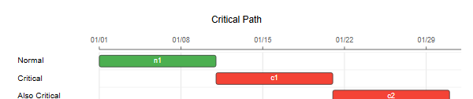
</p>

**Rendered by Mermaid:**
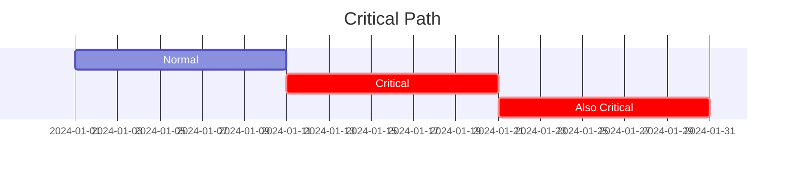

[Open in Mermaid Live](https://mermaid.live/edit#base64:eyJjb2RlIjoiZ2FudHRcbiAgICB0aXRsZSBDcml0aWNhbCBQYXRoXG4gICAgTm9ybWFsIDpuMSwgMjAyNC0wMS0wMSwgMTBkXG4gICAgQ3JpdGljYWwgOmNyaXQsIGMxLCAyMDI0LTAxLTExLCAxMGRcbiAgICBBbHNvIENyaXRpY2FsIDpjcml0LCBjMiwgYWZ0ZXIgYzEsIDEwZCIsIm1lcm1haWQiOnsidGhlbWUiOiJkZWZhdWx0In19)

## Milestones

**Input:**
```
gantt
    title With Milestones
    Development :d1, 2024-01-01, 30d
    Release :milestone, m1, 2024-01-31, 0d
```
**Rendered by Naiad:**

<p align="center">
  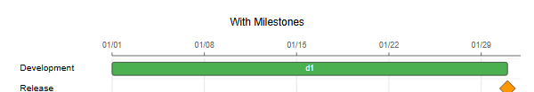
</p>

**Rendered by Mermaid:**
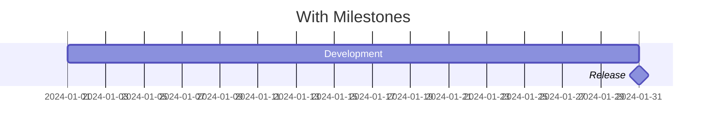

[Open in Mermaid Live](https://mermaid.live/edit#base64:eyJjb2RlIjoiZ2FudHRcbiAgICB0aXRsZSBXaXRoIE1pbGVzdG9uZXNcbiAgICBEZXZlbG9wbWVudCA6ZDEsIDIwMjQtMDEtMDEsIDMwZFxuICAgIFJlbGVhc2UgOm1pbGVzdG9uZSwgbTEsIDIwMjQtMDEtMzEsIDBkIiwibWVybWFpZCI6eyJ0aGVtZSI6ImRlZmF1bHQifX0=)

## Complex

**Input:**
```
gantt
    title Complete Project
    dateFormat YYYY-MM-DD
    section Phase 1
        Planning :done, p1, 2024-01-01, 7d
        Design :done, p2, after p1, 14d
    section Phase 2
        Development :active, d1, after p2, 30d
        Code Review :crit, d2, after d1, 7d
    section Phase 3
        Testing :t1, after d2, 14d
        Deployment :t2, after t1, 3d
        Go Live :milestone, m1, after t2, 0d
```
**Rendered by Naiad:**

<p align="center">
  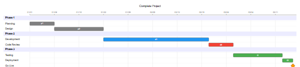
</p>

**Rendered by Mermaid:**
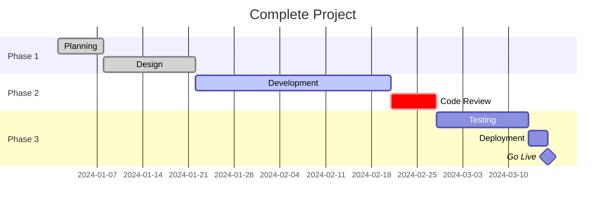

[Open in Mermaid Live](https://mermaid.live/edit#base64:eyJjb2RlIjoiZ2FudHRcbiAgICB0aXRsZSBDb21wbGV0ZSBQcm9qZWN0XG4gICAgZGF0ZUZvcm1hdCBZWVlZLU1NLUREXG4gICAgc2VjdGlvbiBQaGFzZSAxXG4gICAgICAgIFBsYW5uaW5nIDpkb25lLCBwMSwgMjAyNC0wMS0wMSwgN2RcbiAgICAgICAgRGVzaWduIDpkb25lLCBwMiwgYWZ0ZXIgcDEsIDE0ZFxuICAgIHNlY3Rpb24gUGhhc2UgMlxuICAgICAgICBEZXZlbG9wbWVudCA6YWN0aXZlLCBkMSwgYWZ0ZXIgcDIsIDMwZFxuICAgICAgICBDb2RlIFJldmlldyA6Y3JpdCwgZDIsIGFmdGVyIGQxLCA3ZFxuICAgIHNlY3Rpb24gUGhhc2UgM1xuICAgICAgICBUZXN0aW5nIDp0MSwgYWZ0ZXIgZDIsIDE0ZFxuICAgICAgICBEZXBsb3ltZW50IDp0MiwgYWZ0ZXIgdDEsIDNkXG4gICAgICAgIEdvIExpdmUgOm1pbGVzdG9uZSwgbTEsIGFmdGVyIHQyLCAwZCIsIm1lcm1haWQiOnsidGhlbWUiOiJkZWZhdWx0In19)

## WeeklyDuration

**Input:**
```
gantt
    title Weekly Tasks
    Week Task :w1, 2024-01-01, 2w
    Day Task :d1, after w1, 5d
```
**Rendered by Naiad:**

<p align="center">
  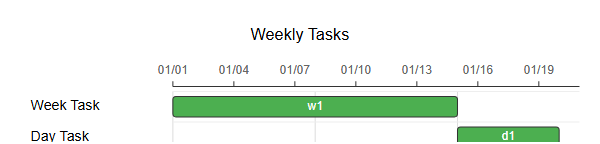
</p>

**Rendered by Mermaid:**
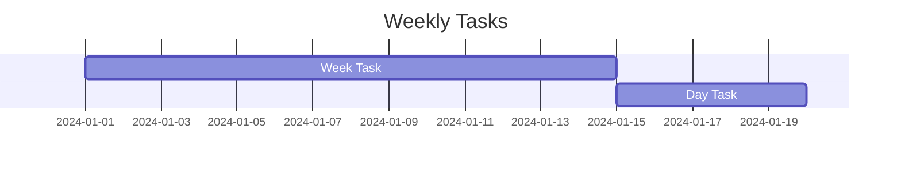

[Open in Mermaid Live](https://mermaid.live/edit#base64:eyJjb2RlIjoiZ2FudHRcbiAgICB0aXRsZSBXZWVrbHkgVGFza3NcbiAgICBXZWVrIFRhc2sgOncxLCAyMDI0LTAxLTAxLCAyd1xuICAgIERheSBUYXNrIDpkMSwgYWZ0ZXIgdzEsIDVkIiwibWVybWFpZCI6eyJ0aGVtZSI6ImRlZmF1bHQifX0=)

