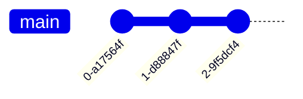
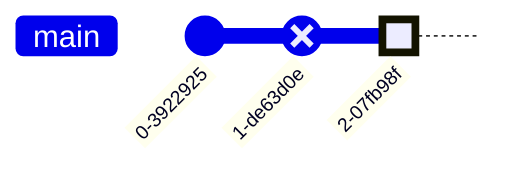
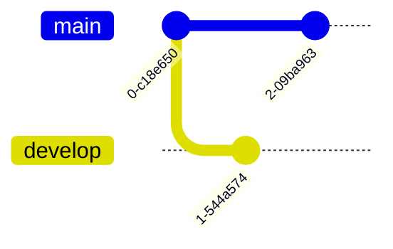
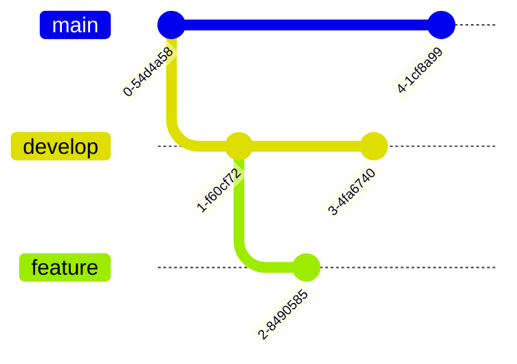

# GitGraph

## Simple

**Input:**
```
gitGraph
    commit
    commit
    commit
```
**Rendered by Naiad:**

<p align="center">
  
</p>

**Rendered by Mermaid:**


[Open in Mermaid Live](https://mermaid.live/edit#base64:eyJjb2RlIjoiZ2l0R3JhcGhcbiAgICBjb21taXRcbiAgICBjb21taXRcbiAgICBjb21taXQiLCJtZXJtYWlkIjp7InRoZW1lIjoiZGVmYXVsdCJ9fQ==)

## Id

**Input:**
```
gitGraph
    commit id: "alpha"
    commit id: "beta"
    commit id: "gamma"
```
**Rendered by Naiad:**

<p align="center">
  
</p>

**Rendered by Mermaid:**


[Open in Mermaid Live](https://mermaid.live/edit#base64:eyJjb2RlIjoiZ2l0R3JhcGhcbiAgICBjb21taXQgaWQ6IFx1MDAyMmFscGhhXHUwMDIyXG4gICAgY29tbWl0IGlkOiBcdTAwMjJiZXRhXHUwMDIyXG4gICAgY29tbWl0IGlkOiBcdTAwMjJnYW1tYVx1MDAyMiIsIm1lcm1haWQiOnsidGhlbWUiOiJkZWZhdWx0In19)

## Tag

**Input:**
```
gitGraph
    commit
    commit tag: "v1.0.0"
    commit
```
**Rendered by Naiad:**

<p align="center">
  
</p>

**Rendered by Mermaid:**


[Open in Mermaid Live](https://mermaid.live/edit#base64:eyJjb2RlIjoiZ2l0R3JhcGhcbiAgICBjb21taXRcbiAgICBjb21taXQgdGFnOiBcdTAwMjJ2MS4wLjBcdTAwMjJcbiAgICBjb21taXQiLCJtZXJtYWlkIjp7InRoZW1lIjoiZGVmYXVsdCJ9fQ==)

## Message

**Input:**
```
gitGraph
    commit id: "init" msg: "Initial commit"
    commit id: "feat" msg: "Add feature"
```
**Rendered by Naiad:**

<p align="center">
  
</p>

**Rendered by Mermaid:**


[Open in Mermaid Live](https://mermaid.live/edit#base64:eyJjb2RlIjoiZ2l0R3JhcGhcbiAgICBjb21taXQgaWQ6IFx1MDAyMmluaXRcdTAwMjIgbXNnOiBcdTAwMjJJbml0aWFsIGNvbW1pdFx1MDAyMlxuICAgIGNvbW1pdCBpZDogXHUwMDIyZmVhdFx1MDAyMiBtc2c6IFx1MDAyMkFkZCBmZWF0dXJlXHUwMDIyIiwibWVybWFpZCI6eyJ0aGVtZSI6ImRlZmF1bHQifX0=)

## Types

**Input:**
```
gitGraph
    commit type: NORMAL
    commit type: REVERSE
    commit type: HIGHLIGHT
```
**Rendered by Naiad:**

<p align="center">
  
</p>

**Rendered by Mermaid:**


[Open in Mermaid Live](https://mermaid.live/edit#base64:eyJjb2RlIjoiZ2l0R3JhcGhcbiAgICBjb21taXQgdHlwZTogTk9STUFMXG4gICAgY29tbWl0IHR5cGU6IFJFVkVSU0VcbiAgICBjb21taXQgdHlwZTogSElHSExJR0hUIiwibWVybWFpZCI6eyJ0aGVtZSI6ImRlZmF1bHQifX0=)

## BranchAndCheckout

**Input:**
```
gitGraph
    commit
    branch develop
    commit
    checkout main
    commit
```
**Rendered by Naiad:**

<p align="center">
  
</p>

**Rendered by Mermaid:**


[Open in Mermaid Live](https://mermaid.live/edit#base64:eyJjb2RlIjoiZ2l0R3JhcGhcbiAgICBjb21taXRcbiAgICBicmFuY2ggZGV2ZWxvcFxuICAgIGNvbW1pdFxuICAgIGNoZWNrb3V0IG1haW5cbiAgICBjb21taXQiLCJtZXJtYWlkIjp7InRoZW1lIjoiZGVmYXVsdCJ9fQ==)

## MultipleBranches

**Input:**
```
gitGraph
    commit
    branch develop
    commit
    branch feature
    commit
    checkout develop
    commit
    checkout main
    commit
```
**Rendered by Naiad:**

<p align="center">
  
</p>

**Rendered by Mermaid:**


[Open in Mermaid Live](https://mermaid.live/edit#base64:eyJjb2RlIjoiZ2l0R3JhcGhcbiAgICBjb21taXRcbiAgICBicmFuY2ggZGV2ZWxvcFxuICAgIGNvbW1pdFxuICAgIGJyYW5jaCBmZWF0dXJlXG4gICAgY29tbWl0XG4gICAgY2hlY2tvdXQgZGV2ZWxvcFxuICAgIGNvbW1pdFxuICAgIGNoZWNrb3V0IG1haW5cbiAgICBjb21taXQiLCJtZXJtYWlkIjp7InRoZW1lIjoiZGVmYXVsdCJ9fQ==)

## MergeBranch

**Input:**
```
gitGraph
    commit
    branch develop
    commit
    commit
    checkout main
    merge develop
    commit
```
**Rendered by Naiad:**

<p align="center">
  
</p>

**Rendered by Mermaid:**


[Open in Mermaid Live](https://mermaid.live/edit#base64:eyJjb2RlIjoiZ2l0R3JhcGhcbiAgICBjb21taXRcbiAgICBicmFuY2ggZGV2ZWxvcFxuICAgIGNvbW1pdFxuICAgIGNvbW1pdFxuICAgIGNoZWNrb3V0IG1haW5cbiAgICBtZXJnZSBkZXZlbG9wXG4gICAgY29tbWl0IiwibWVybWFpZCI6eyJ0aGVtZSI6ImRlZmF1bHQifX0=)

## MergeWithTag

**Input:**
```
gitGraph
    commit
    branch develop
    commit
    checkout main
    merge develop tag: "v2.0.0"
```
**Rendered by Naiad:**

<p align="center">
  
</p>

**Rendered by Mermaid:**


[Open in Mermaid Live](https://mermaid.live/edit#base64:eyJjb2RlIjoiZ2l0R3JhcGhcbiAgICBjb21taXRcbiAgICBicmFuY2ggZGV2ZWxvcFxuICAgIGNvbW1pdFxuICAgIGNoZWNrb3V0IG1haW5cbiAgICBtZXJnZSBkZXZlbG9wIHRhZzogXHUwMDIydjIuMC4wXHUwMDIyIiwibWVybWFpZCI6eyJ0aGVtZSI6ImRlZmF1bHQifX0=)

## CherryPick

**Input:**
```
gitGraph
    commit id: "one"
    branch develop
    commit id: "two"
    checkout main
    cherry-pick id: "two"
```
**Rendered by Naiad:**

<p align="center">
  
</p>

**Rendered by Mermaid:**


[Open in Mermaid Live](https://mermaid.live/edit#base64:eyJjb2RlIjoiZ2l0R3JhcGhcbiAgICBjb21taXQgaWQ6IFx1MDAyMm9uZVx1MDAyMlxuICAgIGJyYW5jaCBkZXZlbG9wXG4gICAgY29tbWl0IGlkOiBcdTAwMjJ0d29cdTAwMjJcbiAgICBjaGVja291dCBtYWluXG4gICAgY2hlcnJ5LXBpY2sgaWQ6IFx1MDAyMnR3b1x1MDAyMiIsIm1lcm1haWQiOnsidGhlbWUiOiJkZWZhdWx0In19)

## Complex

**Input:**
```
gitGraph
    commit id: "init" tag: "v1.0"
    branch develop
    commit id: "dev1"
    commit id: "dev2"
    branch feature
    commit id: "feat1"
    checkout develop
    merge feature
    checkout main
    merge develop tag: "v2.0"
    commit id: "hotfix" type: HIGHLIGHT
```
**Rendered by Naiad:**

<p align="center">
  
</p>

**Rendered by Mermaid:**


[Open in Mermaid Live](https://mermaid.live/edit#base64:eyJjb2RlIjoiZ2l0R3JhcGhcbiAgICBjb21taXQgaWQ6IFx1MDAyMmluaXRcdTAwMjIgdGFnOiBcdTAwMjJ2MS4wXHUwMDIyXG4gICAgYnJhbmNoIGRldmVsb3BcbiAgICBjb21taXQgaWQ6IFx1MDAyMmRldjFcdTAwMjJcbiAgICBjb21taXQgaWQ6IFx1MDAyMmRldjJcdTAwMjJcbiAgICBicmFuY2ggZmVhdHVyZVxuICAgIGNvbW1pdCBpZDogXHUwMDIyZmVhdDFcdTAwMjJcbiAgICBjaGVja291dCBkZXZlbG9wXG4gICAgbWVyZ2UgZmVhdHVyZVxuICAgIGNoZWNrb3V0IG1haW5cbiAgICBtZXJnZSBkZXZlbG9wIHRhZzogXHUwMDIydjIuMFx1MDAyMlxuICAgIGNvbW1pdCBpZDogXHUwMDIyaG90Zml4XHUwMDIyIHR5cGU6IEhJR0hMSUdIVCIsIm1lcm1haWQiOnsidGhlbWUiOiJkZWZhdWx0In19)

