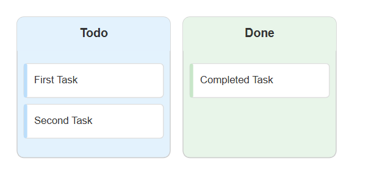
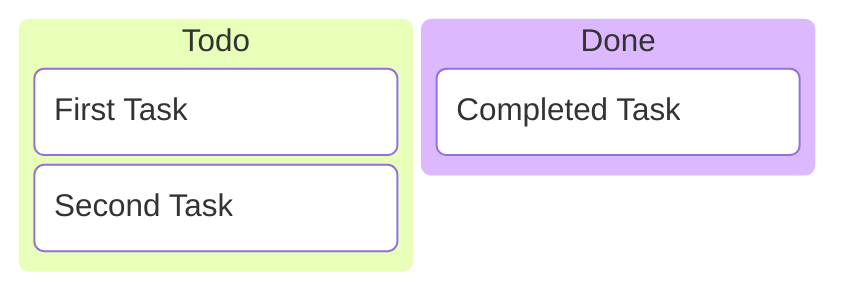
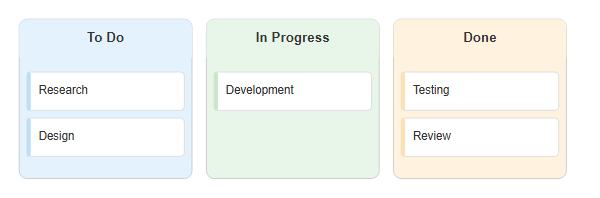
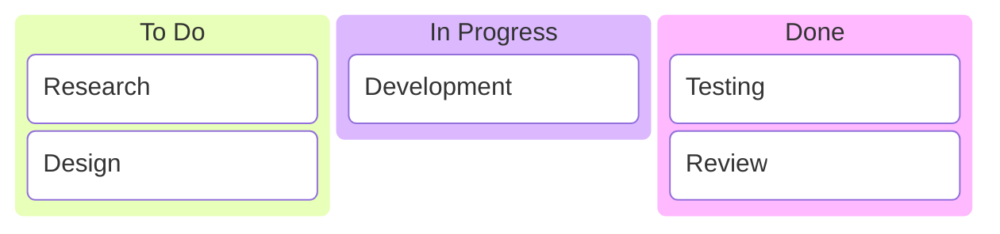
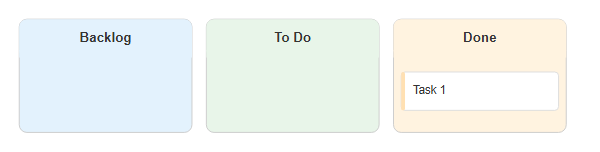
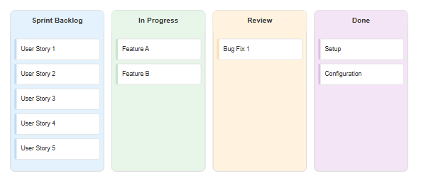
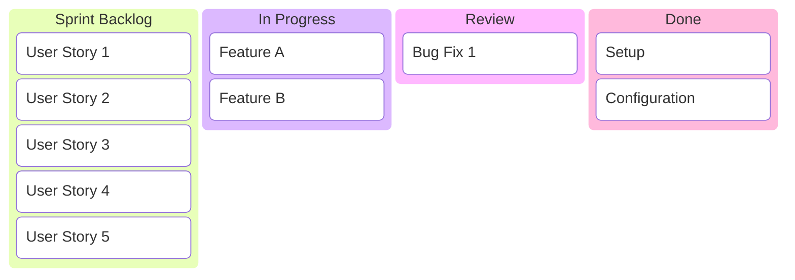
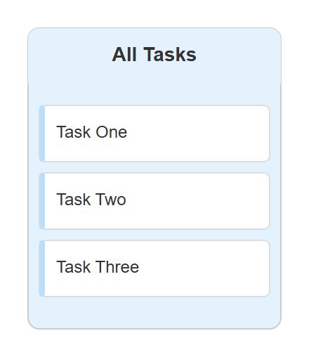
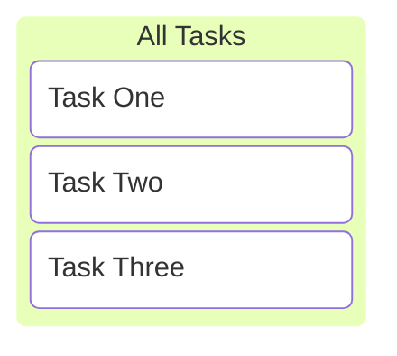

# Kanban

## Simple

**Input:**
```
kanban
todo[Todo]
    task1[First Task]
    task2[Second Task]
done[Done]
    task3[Completed Task]
```
**Rendered by Naiad:**

<p align="center">
  
</p>

**Rendered by Mermaid:**


[Open in Mermaid Live](https://mermaid.live/edit#base64:eyJjb2RlIjoia2FuYmFuXG50b2RvW1RvZG9dXG4gICAgdGFzazFbRmlyc3QgVGFza11cbiAgICB0YXNrMltTZWNvbmQgVGFza11cbmRvbmVbRG9uZV1cbiAgICB0YXNrM1tDb21wbGV0ZWQgVGFza10iLCJtZXJtYWlkIjp7InRoZW1lIjoiZGVmYXVsdCJ9fQ==)

## ThreeColumns

**Input:**
```
kanban
todo[To Do]
    t1[Research]
    t2[Design]
wip[In Progress]
    t3[Development]
done[Done]
    t4[Testing]
    t5[Review]
```
**Rendered by Naiad:**

<p align="center">
  
</p>

**Rendered by Mermaid:**


[Open in Mermaid Live](https://mermaid.live/edit#base64:eyJjb2RlIjoia2FuYmFuXG50b2RvW1RvIERvXVxuICAgIHQxW1Jlc2VhcmNoXVxuICAgIHQyW0Rlc2lnbl1cbndpcFtJbiBQcm9ncmVzc11cbiAgICB0M1tEZXZlbG9wbWVudF1cbmRvbmVbRG9uZV1cbiAgICB0NFtUZXN0aW5nXVxuICAgIHQ1W1Jldmlld10iLCJtZXJtYWlkIjp7InRoZW1lIjoiZGVmYXVsdCJ9fQ==)

## EmptyColumns

**Input:**
```
kanban
backlog[Backlog]
todo[To Do]
done[Done]
    t1[Task 1]
```
**Rendered by Naiad:**

<p align="center">
  
</p>

**Rendered by Mermaid:**


[Open in Mermaid Live](https://mermaid.live/edit#base64:eyJjb2RlIjoia2FuYmFuXG5iYWNrbG9nW0JhY2tsb2ddXG50b2RvW1RvIERvXVxuZG9uZVtEb25lXVxuICAgIHQxW1Rhc2sgMV0iLCJtZXJtYWlkIjp7InRoZW1lIjoiZGVmYXVsdCJ9fQ==)

## ManyTasks

**Input:**
```
kanban
col1[Sprint Backlog]
    t1[User Story 1]
    t2[User Story 2]
    t3[User Story 3]
    t4[User Story 4]
    t5[User Story 5]
col2[In Progress]
    t6[Feature A]
    t7[Feature B]
col3[Review]
    t8[Bug Fix 1]
col4[Done]
    t9[Setup]
    t10[Configuration]
```
**Rendered by Naiad:**

<p align="center">
  
</p>

**Rendered by Mermaid:**


[Open in Mermaid Live](https://mermaid.live/edit#base64:eyJjb2RlIjoia2FuYmFuXG5jb2wxW1NwcmludCBCYWNrbG9nXVxuICAgIHQxW1VzZXIgU3RvcnkgMV1cbiAgICB0MltVc2VyIFN0b3J5IDJdXG4gICAgdDNbVXNlciBTdG9yeSAzXVxuICAgIHQ0W1VzZXIgU3RvcnkgNF1cbiAgICB0NVtVc2VyIFN0b3J5IDVdXG5jb2wyW0luIFByb2dyZXNzXVxuICAgIHQ2W0ZlYXR1cmUgQV1cbiAgICB0N1tGZWF0dXJlIEJdXG5jb2wzW1Jldmlld11cbiAgICB0OFtCdWcgRml4IDFdXG5jb2w0W0RvbmVdXG4gICAgdDlbU2V0dXBdXG4gICAgdDEwW0NvbmZpZ3VyYXRpb25dIiwibWVybWFpZCI6eyJ0aGVtZSI6ImRlZmF1bHQifX0=)

## SingleColumn

**Input:**
```
kanban
tasks[All Tasks]
    t1[Task One]
    t2[Task Two]
    t3[Task Three]
```
**Rendered by Naiad:**

<p align="center">
  
</p>

**Rendered by Mermaid:**


[Open in Mermaid Live](https://mermaid.live/edit#base64:eyJjb2RlIjoia2FuYmFuXG50YXNrc1tBbGwgVGFza3NdXG4gICAgdDFbVGFzayBPbmVdXG4gICAgdDJbVGFzayBUd29dXG4gICAgdDNbVGFzayBUaHJlZV0iLCJtZXJtYWlkIjp7InRoZW1lIjoiZGVmYXVsdCJ9fQ==)

