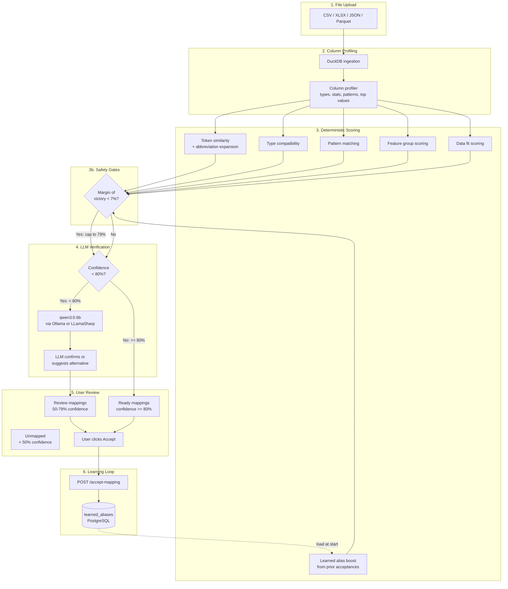
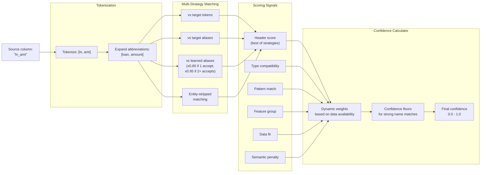
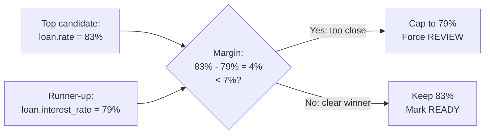
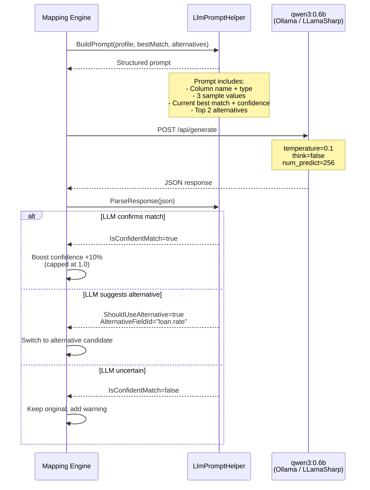
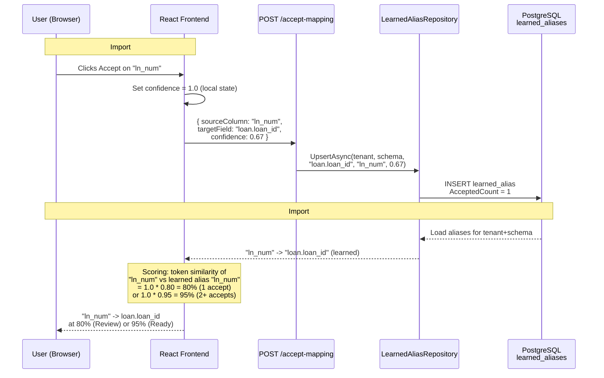
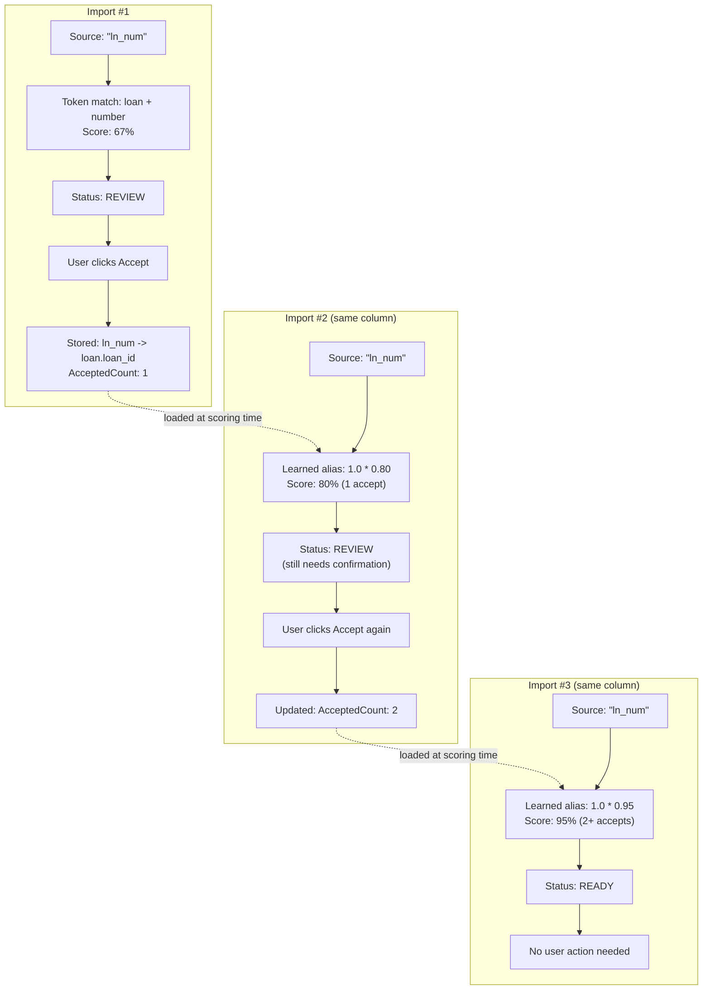
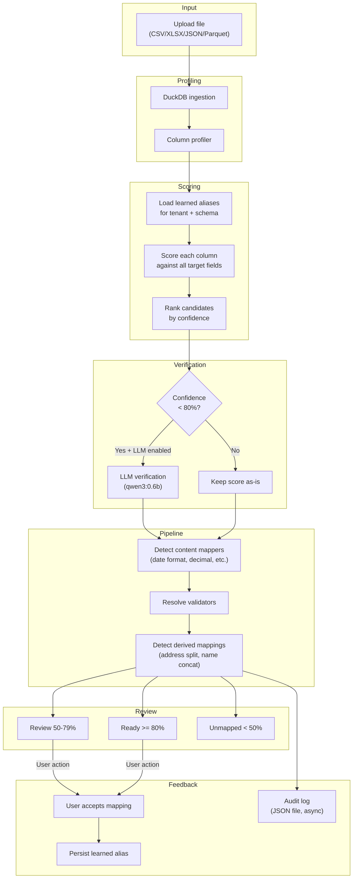

# LLM Field Mapping Diagrams

## Overview Flow

## Scoring Pipeline

## Margin-of-Victory Gate

## LLM Verification Flow

## Learning System Flow

## Learning Lifecycle (Graduated Trust)

## End-to-End Data Flow

