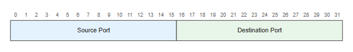
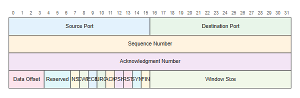
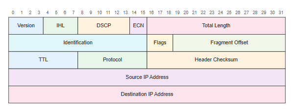
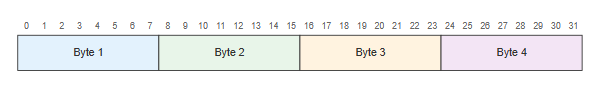
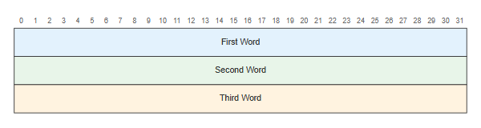

# Packet

## Simple

**Input:**
```
packet-beta
0-15: "Source Port"
16-31: "Destination Port"
```
**Rendered by Naiad:**

<p align="center">
  
</p>


[Open in Mermaid Live](https://mermaid.live/edit#base64:eyJjb2RlIjoicGFja2V0LWJldGFcbjAtMTU6IFx1MDAyMlNvdXJjZSBQb3J0XHUwMDIyXG4xNi0zMTogXHUwMDIyRGVzdGluYXRpb24gUG9ydFx1MDAyMiIsIm1lcm1haWQiOnsidGhlbWUiOiJkZWZhdWx0In19)

## TCPHeader

**Input:**
```
packet-beta
0-15: "Source Port"
16-31: "Destination Port"
32-63: "Sequence Number"
64-95: "Acknowledgment Number"
96-99: "Data Offset"
100-102: "Reserved"
103-103: "NS"
104-104: "CWR"
105-105: "ECE"
106-106: "URG"
107-107: "ACK"
108-108: "PSH"
109-109: "RST"
110-110: "SYN"
111-111: "FIN"
112-127: "Window Size"
```
**Rendered by Naiad:**

<p align="center">
  
</p>


[Open in Mermaid Live](https://mermaid.live/edit#base64:eyJjb2RlIjoicGFja2V0LWJldGFcbjAtMTU6IFx1MDAyMlNvdXJjZSBQb3J0XHUwMDIyXG4xNi0zMTogXHUwMDIyRGVzdGluYXRpb24gUG9ydFx1MDAyMlxuMzItNjM6IFx1MDAyMlNlcXVlbmNlIE51bWJlclx1MDAyMlxuNjQtOTU6IFx1MDAyMkFja25vd2xlZGdtZW50IE51bWJlclx1MDAyMlxuOTYtOTk6IFx1MDAyMkRhdGEgT2Zmc2V0XHUwMDIyXG4xMDAtMTAyOiBcdTAwMjJSZXNlcnZlZFx1MDAyMlxuMTAzLTEwMzogXHUwMDIyTlNcdTAwMjJcbjEwNC0xMDQ6IFx1MDAyMkNXUlx1MDAyMlxuMTA1LTEwNTogXHUwMDIyRUNFXHUwMDIyXG4xMDYtMTA2OiBcdTAwMjJVUkdcdTAwMjJcbjEwNy0xMDc6IFx1MDAyMkFDS1x1MDAyMlxuMTA4LTEwODogXHUwMDIyUFNIXHUwMDIyXG4xMDktMTA5OiBcdTAwMjJSU1RcdTAwMjJcbjExMC0xMTA6IFx1MDAyMlNZTlx1MDAyMlxuMTExLTExMTogXHUwMDIyRklOXHUwMDIyXG4xMTItMTI3OiBcdTAwMjJXaW5kb3cgU2l6ZVx1MDAyMiIsIm1lcm1haWQiOnsidGhlbWUiOiJkZWZhdWx0In19)

## IPv4Header

**Input:**
```
packet-beta
0-3: "Version"
4-7: "IHL"
8-13: "DSCP"
14-15: "ECN"
16-31: "Total Length"
32-47: "Identification"
48-50: "Flags"
51-63: "Fragment Offset"
64-71: "TTL"
72-79: "Protocol"
80-95: "Header Checksum"
96-127: "Source IP Address"
128-159: "Destination IP Address"
```
**Rendered by Naiad:**

<p align="center">
  
</p>


[Open in Mermaid Live](https://mermaid.live/edit#base64:eyJjb2RlIjoicGFja2V0LWJldGFcbjAtMzogXHUwMDIyVmVyc2lvblx1MDAyMlxuNC03OiBcdTAwMjJJSExcdTAwMjJcbjgtMTM6IFx1MDAyMkRTQ1BcdTAwMjJcbjE0LTE1OiBcdTAwMjJFQ05cdTAwMjJcbjE2LTMxOiBcdTAwMjJUb3RhbCBMZW5ndGhcdTAwMjJcbjMyLTQ3OiBcdTAwMjJJZGVudGlmaWNhdGlvblx1MDAyMlxuNDgtNTA6IFx1MDAyMkZsYWdzXHUwMDIyXG41MS02MzogXHUwMDIyRnJhZ21lbnQgT2Zmc2V0XHUwMDIyXG42NC03MTogXHUwMDIyVFRMXHUwMDIyXG43Mi03OTogXHUwMDIyUHJvdG9jb2xcdTAwMjJcbjgwLTk1OiBcdTAwMjJIZWFkZXIgQ2hlY2tzdW1cdTAwMjJcbjk2LTEyNzogXHUwMDIyU291cmNlIElQIEFkZHJlc3NcdTAwMjJcbjEyOC0xNTk6IFx1MDAyMkRlc3RpbmF0aW9uIElQIEFkZHJlc3NcdTAwMjIiLCJtZXJtYWlkIjp7InRoZW1lIjoiZGVmYXVsdCJ9fQ==)

## SingleRow

**Input:**
```
packet-beta
0-7: "Byte 1"
8-15: "Byte 2"
16-23: "Byte 3"
24-31: "Byte 4"
```
**Rendered by Naiad:**

<p align="center">
  
</p>


[Open in Mermaid Live](https://mermaid.live/edit#base64:eyJjb2RlIjoicGFja2V0LWJldGFcbjAtNzogXHUwMDIyQnl0ZSAxXHUwMDIyXG44LTE1OiBcdTAwMjJCeXRlIDJcdTAwMjJcbjE2LTIzOiBcdTAwMjJCeXRlIDNcdTAwMjJcbjI0LTMxOiBcdTAwMjJCeXRlIDRcdTAwMjIiLCJtZXJtYWlkIjp7InRoZW1lIjoiZGVmYXVsdCJ9fQ==)

## Fields

**Input:**
```
packet-beta
0-31: "First Word"
32-63: "Second Word"
64-95: "Third Word"
```
**Rendered by Naiad:**

<p align="center">
  
</p>


[Open in Mermaid Live](https://mermaid.live/edit#base64:eyJjb2RlIjoicGFja2V0LWJldGFcbjAtMzE6IFx1MDAyMkZpcnN0IFdvcmRcdTAwMjJcbjMyLTYzOiBcdTAwMjJTZWNvbmQgV29yZFx1MDAyMlxuNjQtOTU6IFx1MDAyMlRoaXJkIFdvcmRcdTAwMjIiLCJtZXJtYWlkIjp7InRoZW1lIjoiZGVmYXVsdCJ9fQ==)

