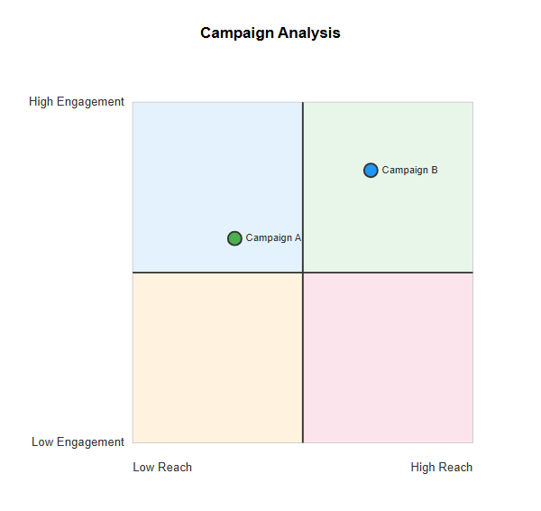
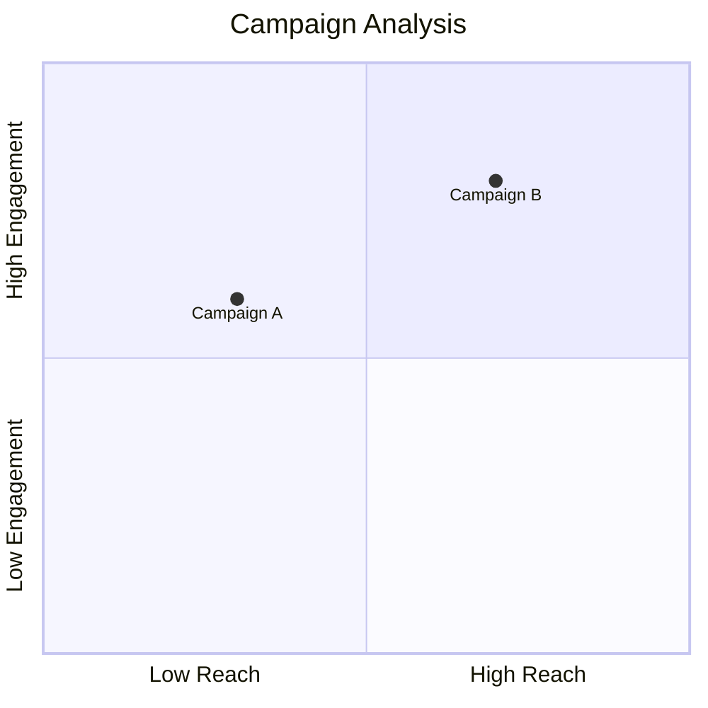
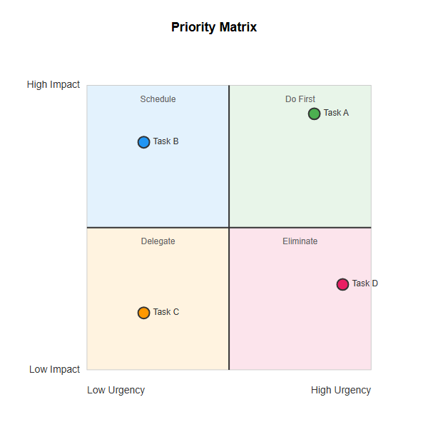
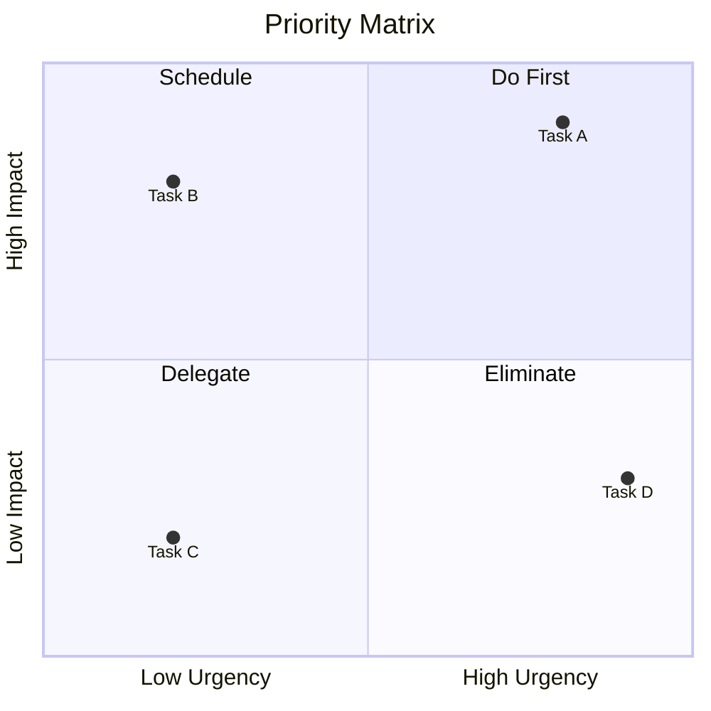
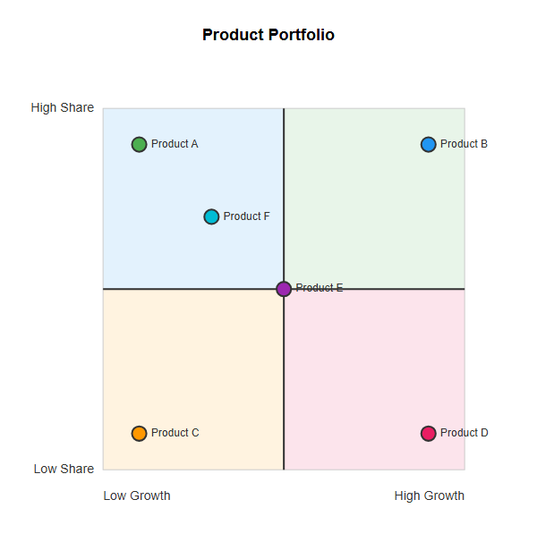
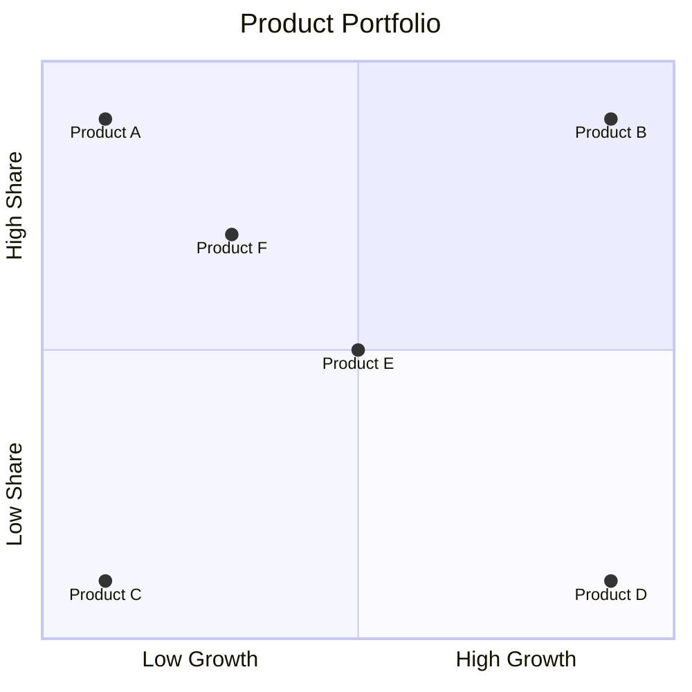
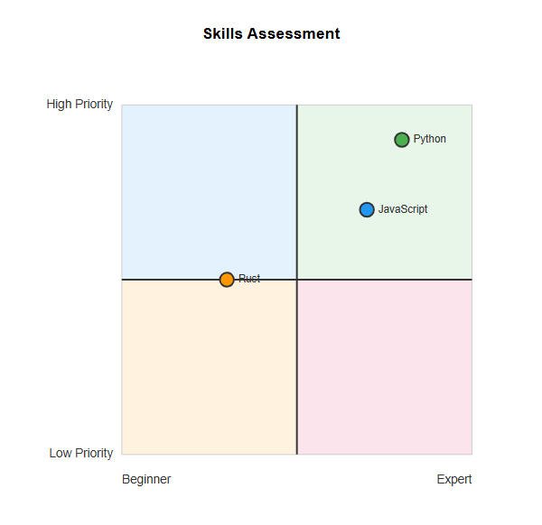
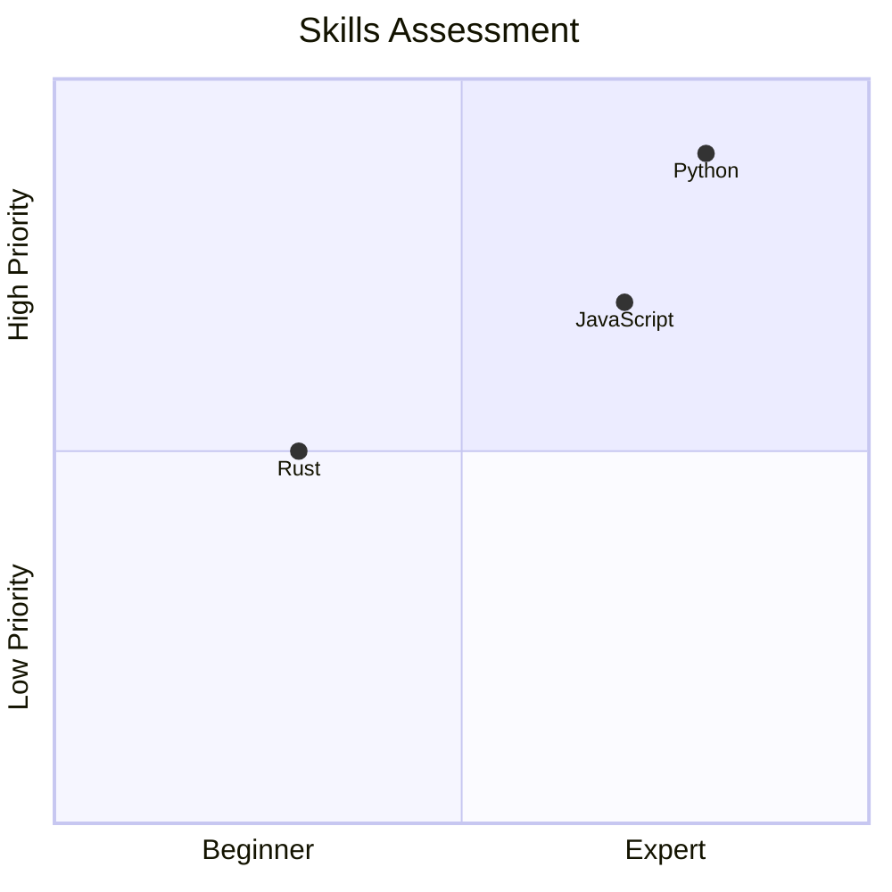
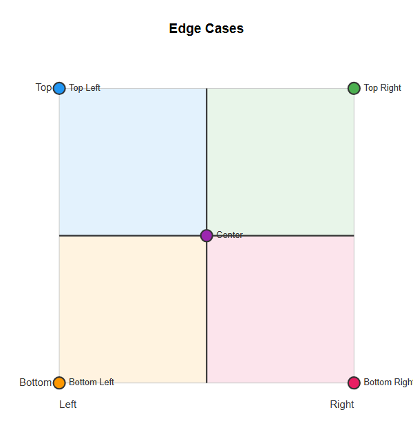

# Quadrant

## Simple

**Input:**
```
quadrantChart
    title Campaign Analysis
    x-axis Low Reach --> High Reach
    y-axis Low Engagement --> High Engagement
    Campaign A: [0.3, 0.6]
    Campaign B: [0.7, 0.8]
```
**Rendered by Naiad:**

<p align="center">
  
</p>

**Rendered by Mermaid:**


[Open in Mermaid Live](https://mermaid.live/edit#base64:eyJjb2RlIjoicXVhZHJhbnRDaGFydFxuICAgIHRpdGxlIENhbXBhaWduIEFuYWx5c2lzXG4gICAgeC1heGlzIExvdyBSZWFjaCAtLVx1MDAzRSBIaWdoIFJlYWNoXG4gICAgeS1heGlzIExvdyBFbmdhZ2VtZW50IC0tXHUwMDNFIEhpZ2ggRW5nYWdlbWVudFxuICAgIENhbXBhaWduIEE6IFswLjMsIDAuNl1cbiAgICBDYW1wYWlnbiBCOiBbMC43LCAwLjhdIiwibWVybWFpZCI6eyJ0aGVtZSI6ImRlZmF1bHQifX0=)

## Labels

**Input:**
```
quadrantChart
    title Priority Matrix
    x-axis Low Urgency --> High Urgency
    y-axis Low Impact --> High Impact
    quadrant-1 Do First
    quadrant-2 Schedule
    quadrant-3 Delegate
    quadrant-4 Eliminate
    Task A: [0.8, 0.9]
    Task B: [0.2, 0.8]
    Task C: [0.2, 0.2]
    Task D: [0.9, 0.3]
```
**Rendered by Naiad:**

<p align="center">
  
</p>

**Rendered by Mermaid:**


[Open in Mermaid Live](https://mermaid.live/edit#base64:eyJjb2RlIjoicXVhZHJhbnRDaGFydFxuICAgIHRpdGxlIFByaW9yaXR5IE1hdHJpeFxuICAgIHgtYXhpcyBMb3cgVXJnZW5jeSAtLVx1MDAzRSBIaWdoIFVyZ2VuY3lcbiAgICB5LWF4aXMgTG93IEltcGFjdCAtLVx1MDAzRSBIaWdoIEltcGFjdFxuICAgIHF1YWRyYW50LTEgRG8gRmlyc3RcbiAgICBxdWFkcmFudC0yIFNjaGVkdWxlXG4gICAgcXVhZHJhbnQtMyBEZWxlZ2F0ZVxuICAgIHF1YWRyYW50LTQgRWxpbWluYXRlXG4gICAgVGFzayBBOiBbMC44LCAwLjldXG4gICAgVGFzayBCOiBbMC4yLCAwLjhdXG4gICAgVGFzayBDOiBbMC4yLCAwLjJdXG4gICAgVGFzayBEOiBbMC45LCAwLjNdIiwibWVybWFpZCI6eyJ0aGVtZSI6ImRlZmF1bHQifX0=)

## ManyPoints

**Input:**
```
quadrantChart
    title Product Portfolio
    x-axis Low Growth --> High Growth
    y-axis Low Share --> High Share
    Product A: [0.1, 0.9]
    Product B: [0.9, 0.9]
    Product C: [0.1, 0.1]
    Product D: [0.9, 0.1]
    Product E: [0.5, 0.5]
    Product F: [0.3, 0.7]
```
**Rendered by Naiad:**

<p align="center">
  
</p>

**Rendered by Mermaid:**


[Open in Mermaid Live](https://mermaid.live/edit#base64:eyJjb2RlIjoicXVhZHJhbnRDaGFydFxuICAgIHRpdGxlIFByb2R1Y3QgUG9ydGZvbGlvXG4gICAgeC1heGlzIExvdyBHcm93dGggLS1cdTAwM0UgSGlnaCBHcm93dGhcbiAgICB5LWF4aXMgTG93IFNoYXJlIC0tXHUwMDNFIEhpZ2ggU2hhcmVcbiAgICBQcm9kdWN0IEE6IFswLjEsIDAuOV1cbiAgICBQcm9kdWN0IEI6IFswLjksIDAuOV1cbiAgICBQcm9kdWN0IEM6IFswLjEsIDAuMV1cbiAgICBQcm9kdWN0IEQ6IFswLjksIDAuMV1cbiAgICBQcm9kdWN0IEU6IFswLjUsIDAuNV1cbiAgICBQcm9kdWN0IEY6IFswLjMsIDAuN10iLCJtZXJtYWlkIjp7InRoZW1lIjoiZGVmYXVsdCJ9fQ==)

## TitleOnly

**Input:**
```
quadrantChart
    title Skills Assessment
    x-axis Beginner --> Expert
    y-axis Low Priority --> High Priority
    Python: [0.8, 0.9]
    JavaScript: [0.7, 0.7]
    Rust: [0.3, 0.5]
```
**Rendered by Naiad:**

<p align="center">
  
</p>

**Rendered by Mermaid:**


[Open in Mermaid Live](https://mermaid.live/edit#base64:eyJjb2RlIjoicXVhZHJhbnRDaGFydFxuICAgIHRpdGxlIFNraWxscyBBc3Nlc3NtZW50XG4gICAgeC1heGlzIEJlZ2lubmVyIC0tXHUwMDNFIEV4cGVydFxuICAgIHktYXhpcyBMb3cgUHJpb3JpdHkgLS1cdTAwM0UgSGlnaCBQcmlvcml0eVxuICAgIFB5dGhvbjogWzAuOCwgMC45XVxuICAgIEphdmFTY3JpcHQ6IFswLjcsIDAuN11cbiAgICBSdXN0OiBbMC4zLCAwLjVdIiwibWVybWFpZCI6eyJ0aGVtZSI6ImRlZmF1bHQifX0=)

## EdgePositions

**Input:**
```
quadrantChart
    title Edge Cases
    x-axis Left --> Right
    y-axis Bottom --> Top
    Top Right: [1.0, 1.0]
    Top Left: [0.0, 1.0]
    Bottom Left: [0.0, 0.0]
    Bottom Right: [1.0, 0.0]
    Center: [0.5, 0.5]
```
**Rendered by Naiad:**

<p align="center">
  
</p>

**Rendered by Mermaid:**
```mermaid
quadrantChart
    title Edge Cases
    x-axis Left --> Right
    y-axis Bottom --> Top
    Top Right: [1.0, 1.0]
    Top Left: [0.0, 1.0]
    Bottom Left: [0.0, 0.0]
    Bottom Right: [1.0, 0.0]
    Center: [0.5, 0.5]
```

[Open in Mermaid Live](https://mermaid.live/edit#base64:eyJjb2RlIjoicXVhZHJhbnRDaGFydFxuICAgIHRpdGxlIEVkZ2UgQ2FzZXNcbiAgICB4LWF4aXMgTGVmdCAtLVx1MDAzRSBSaWdodFxuICAgIHktYXhpcyBCb3R0b20gLS1cdTAwM0UgVG9wXG4gICAgVG9wIFJpZ2h0OiBbMS4wLCAxLjBdXG4gICAgVG9wIExlZnQ6IFswLjAsIDEuMF1cbiAgICBCb3R0b20gTGVmdDogWzAuMCwgMC4wXVxuICAgIEJvdHRvbSBSaWdodDogWzEuMCwgMC4wXVxuICAgIENlbnRlcjogWzAuNSwgMC41XSIsIm1lcm1haWQiOnsidGhlbWUiOiJkZWZhdWx0In19)

