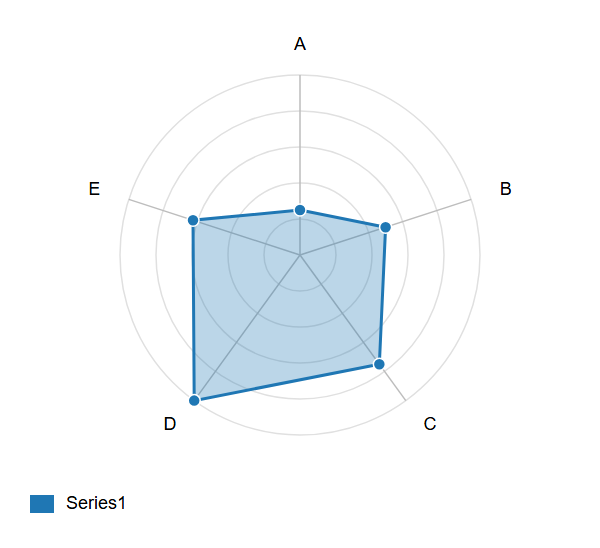
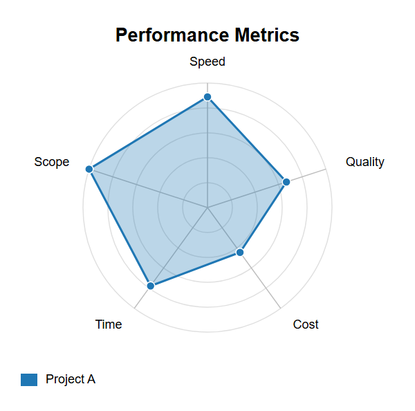
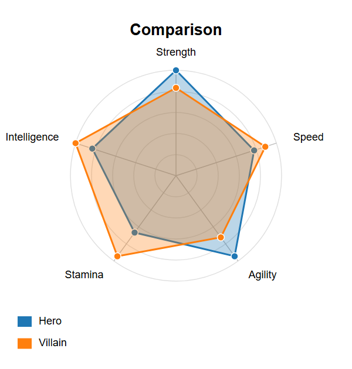
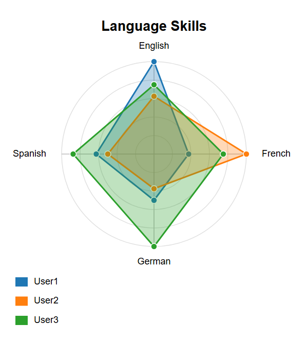
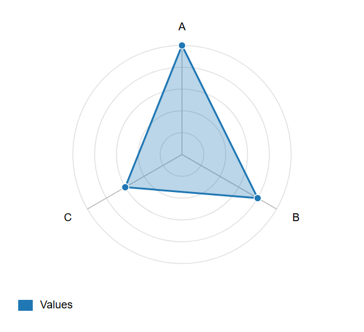
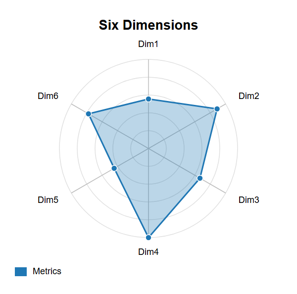

# Radar

## Simple

**Input:**
```
radar-beta
axis A, B, C, D, E
curve data1["Series1"]{20, 40, 60, 80, 50}
```
**Rendered by Naiad:**

<p align="center">
  
</p>


[Open in Mermaid Live](https://mermaid.live/edit#base64:eyJjb2RlIjoicmFkYXItYmV0YVxuYXhpcyBBLCBCLCBDLCBELCBFXG5jdXJ2ZSBkYXRhMVtcdTAwMjJTZXJpZXMxXHUwMDIyXXsyMCwgNDAsIDYwLCA4MCwgNTB9IiwibWVybWFpZCI6eyJ0aGVtZSI6ImRlZmF1bHQifX0=)

## Title

**Input:**
```
radar-beta
title Performance Metrics
axis Speed, Quality, Cost, Time, Scope
curve a["Project A"]{80, 60, 40, 70, 90}
```
**Rendered by Naiad:**

<p align="center">
  
</p>


[Open in Mermaid Live](https://mermaid.live/edit#base64:eyJjb2RlIjoicmFkYXItYmV0YVxudGl0bGUgUGVyZm9ybWFuY2UgTWV0cmljc1xuYXhpcyBTcGVlZCwgUXVhbGl0eSwgQ29zdCwgVGltZSwgU2NvcGVcbmN1cnZlIGFbXHUwMDIyUHJvamVjdCBBXHUwMDIyXXs4MCwgNjAsIDQwLCA3MCwgOTB9IiwibWVybWFpZCI6eyJ0aGVtZSI6ImRlZmF1bHQifX0=)

## MultipleCurves

**Input:**
```
radar-beta
title Comparison
axis Strength, Speed, Agility, Stamina, Intelligence
curve hero["Hero"]{90, 70, 85, 60, 75}
curve villain["Villain"]{75, 80, 65, 85, 90}
```
**Rendered by Naiad:**

<p align="center">
  
</p>


[Open in Mermaid Live](https://mermaid.live/edit#base64:eyJjb2RlIjoicmFkYXItYmV0YVxudGl0bGUgQ29tcGFyaXNvblxuYXhpcyBTdHJlbmd0aCwgU3BlZWQsIEFnaWxpdHksIFN0YW1pbmEsIEludGVsbGlnZW5jZVxuY3VydmUgaGVyb1tcdTAwMjJIZXJvXHUwMDIyXXs5MCwgNzAsIDg1LCA2MCwgNzV9XG5jdXJ2ZSB2aWxsYWluW1x1MDAyMlZpbGxhaW5cdTAwMjJdezc1LCA4MCwgNjUsIDg1LCA5MH0iLCJtZXJtYWlkIjp7InRoZW1lIjoiZGVmYXVsdCJ9fQ==)

## ThreeCurves

**Input:**
```
radar-beta
title Language Skills
axis English, French, German, Spanish
curve a["User1"]{80, 30, 40, 50}
curve b["User2"]{50, 80, 30, 40}
curve c["User3"]{60, 60, 80, 70}
```
**Rendered by Naiad:**

<p align="center">
  
</p>


[Open in Mermaid Live](https://mermaid.live/edit#base64:eyJjb2RlIjoicmFkYXItYmV0YVxudGl0bGUgTGFuZ3VhZ2UgU2tpbGxzXG5heGlzIEVuZ2xpc2gsIEZyZW5jaCwgR2VybWFuLCBTcGFuaXNoXG5jdXJ2ZSBhW1x1MDAyMlVzZXIxXHUwMDIyXXs4MCwgMzAsIDQwLCA1MH1cbmN1cnZlIGJbXHUwMDIyVXNlcjJcdTAwMjJdezUwLCA4MCwgMzAsIDQwfVxuY3VydmUgY1tcdTAwMjJVc2VyM1x1MDAyMl17NjAsIDYwLCA4MCwgNzB9IiwibWVybWFpZCI6eyJ0aGVtZSI6ImRlZmF1bHQifX0=)

## Triangle

**Input:**
```
radar-beta
axis A, B, C
curve data["Values"]{100, 80, 60}
```
**Rendered by Naiad:**

<p align="center">
  
</p>


[Open in Mermaid Live](https://mermaid.live/edit#base64:eyJjb2RlIjoicmFkYXItYmV0YVxuYXhpcyBBLCBCLCBDXG5jdXJ2ZSBkYXRhW1x1MDAyMlZhbHVlc1x1MDAyMl17MTAwLCA4MCwgNjB9IiwibWVybWFpZCI6eyJ0aGVtZSI6ImRlZmF1bHQifX0=)

## Hexagon

**Input:**
```
radar-beta
title Six Dimensions
axis Dim1, Dim2, Dim3, Dim4, Dim5, Dim6
curve data["Metrics"]{50, 80, 60, 90, 40, 70}
```
**Rendered by Naiad:**

<p align="center">
  
</p>


[Open in Mermaid Live](https://mermaid.live/edit#base64:eyJjb2RlIjoicmFkYXItYmV0YVxudGl0bGUgU2l4IERpbWVuc2lvbnNcbmF4aXMgRGltMSwgRGltMiwgRGltMywgRGltNCwgRGltNSwgRGltNlxuY3VydmUgZGF0YVtcdTAwMjJNZXRyaWNzXHUwMDIyXXs1MCwgODAsIDYwLCA5MCwgNDAsIDcwfSIsIm1lcm1haWQiOnsidGhlbWUiOiJkZWZhdWx0In19)

