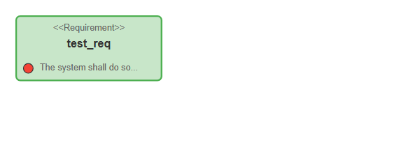
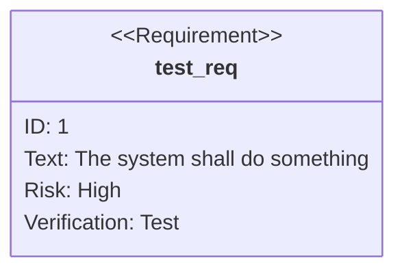
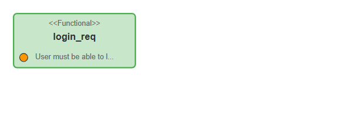
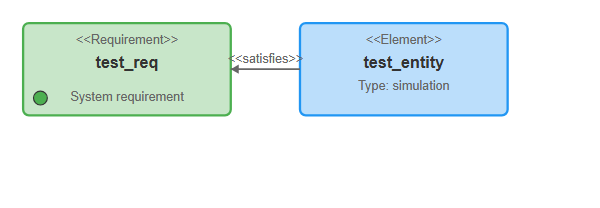
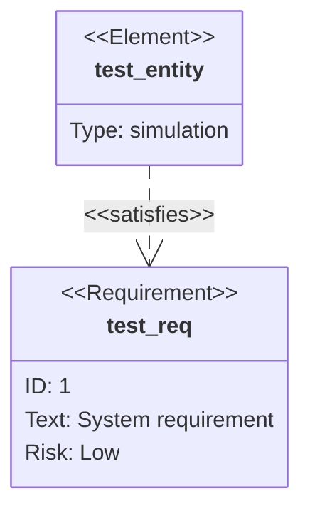
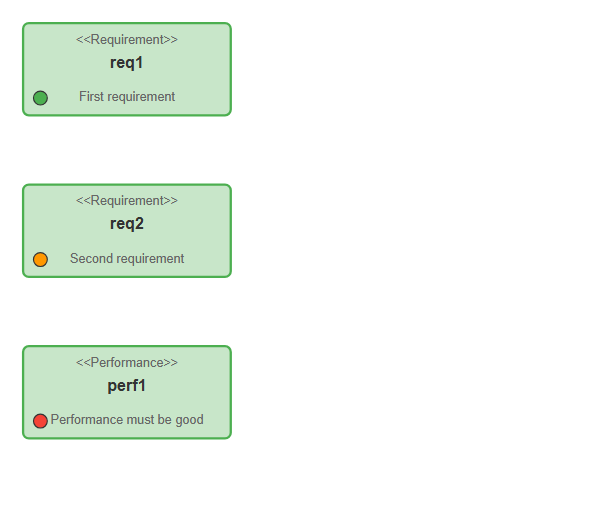
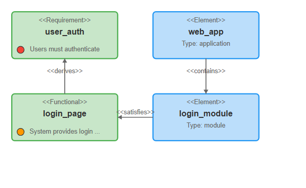
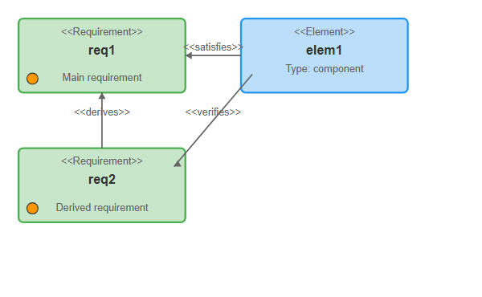
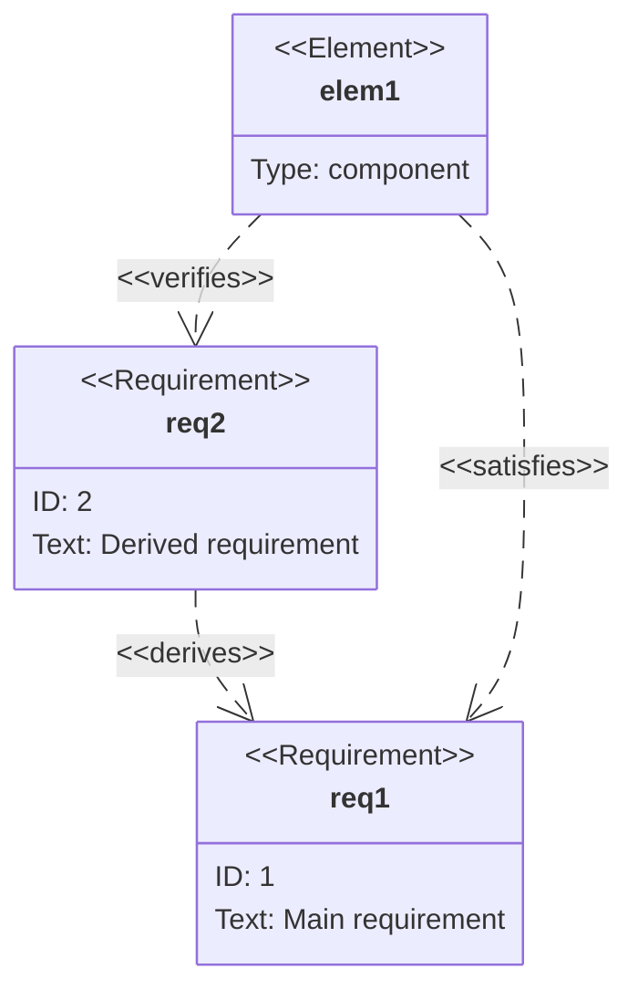

# Requirement

## Simple

**Input:**
```
requirementDiagram

requirement test_req {
    id: 1
    text: The system shall do something
    risk: high
    verifymethod: test
}
```
**Rendered by Naiad:**

<p align="center">
  
</p>

**Rendered by Mermaid:**


[Open in Mermaid Live](https://mermaid.live/edit#base64:eyJjb2RlIjoicmVxdWlyZW1lbnREaWFncmFtXG5cbnJlcXVpcmVtZW50IHRlc3RfcmVxIHtcbiAgICBpZDogMVxuICAgIHRleHQ6IFRoZSBzeXN0ZW0gc2hhbGwgZG8gc29tZXRoaW5nXG4gICAgcmlzazogaGlnaFxuICAgIHZlcmlmeW1ldGhvZDogdGVzdFxufSIsIm1lcm1haWQiOnsidGhlbWUiOiJkZWZhdWx0In19)

## Functional

**Input:**
```
requirementDiagram

functionalRequirement login_req {
    id: REQ-001
    text: User must be able to log in
    risk: medium
    verifymethod: demonstration
}
```
**Rendered by Naiad:**

<p align="center">
  
</p>

**Rendered by Mermaid:**
```mermaid
requirementDiagram

functionalRequirement login_req {
    id: REQ-001
    text: User must be able to log in
    risk: medium
    verifymethod: demonstration
}
```

[Open in Mermaid Live](https://mermaid.live/edit#base64:eyJjb2RlIjoicmVxdWlyZW1lbnREaWFncmFtXG5cbmZ1bmN0aW9uYWxSZXF1aXJlbWVudCBsb2dpbl9yZXEge1xuICAgIGlkOiBSRVEtMDAxXG4gICAgdGV4dDogVXNlciBtdXN0IGJlIGFibGUgdG8gbG9nIGluXG4gICAgcmlzazogbWVkaXVtXG4gICAgdmVyaWZ5bWV0aG9kOiBkZW1vbnN0cmF0aW9uXG59IiwibWVybWFpZCI6eyJ0aGVtZSI6ImRlZmF1bHQifX0=)

## Element

**Input:**
```
requirementDiagram

requirement test_req {
    id: 1
    text: System requirement
    risk: low
}

element test_entity {
    type: simulation
}

test_entity - satisfies -> test_req
```
**Rendered by Naiad:**

<p align="center">
  
</p>

**Rendered by Mermaid:**


[Open in Mermaid Live](https://mermaid.live/edit#base64:eyJjb2RlIjoicmVxdWlyZW1lbnREaWFncmFtXG5cbnJlcXVpcmVtZW50IHRlc3RfcmVxIHtcbiAgICBpZDogMVxuICAgIHRleHQ6IFN5c3RlbSByZXF1aXJlbWVudFxuICAgIHJpc2s6IGxvd1xufVxuXG5lbGVtZW50IHRlc3RfZW50aXR5IHtcbiAgICB0eXBlOiBzaW11bGF0aW9uXG59XG5cbnRlc3RfZW50aXR5IC0gc2F0aXNmaWVzIC1cdTAwM0UgdGVzdF9yZXEiLCJtZXJtYWlkIjp7InRoZW1lIjoiZGVmYXVsdCJ9fQ==)

## Multiple

**Input:**
```
requirementDiagram

requirement req1 {
    id: REQ-001
    text: First requirement
    risk: low
}

requirement req2 {
    id: REQ-002
    text: Second requirement
    risk: medium
}

performanceRequirement perf1 {
    id: PERF-001
    text: Performance must be good
    risk: high
}
```
**Rendered by Naiad:**

<p align="center">
  
</p>

**Rendered by Mermaid:**
```mermaid
requirementDiagram

requirement req1 {
    id: REQ-001
    text: First requirement
    risk: low
}

requirement req2 {
    id: REQ-002
    text: Second requirement
    risk: medium
}

performanceRequirement perf1 {
    id: PERF-001
    text: Performance must be good
    risk: high
}
```

[Open in Mermaid Live](https://mermaid.live/edit#base64:eyJjb2RlIjoicmVxdWlyZW1lbnREaWFncmFtXG5cbnJlcXVpcmVtZW50IHJlcTEge1xuICAgIGlkOiBSRVEtMDAxXG4gICAgdGV4dDogRmlyc3QgcmVxdWlyZW1lbnRcbiAgICByaXNrOiBsb3dcbn1cblxucmVxdWlyZW1lbnQgcmVxMiB7XG4gICAgaWQ6IFJFUS0wMDJcbiAgICB0ZXh0OiBTZWNvbmQgcmVxdWlyZW1lbnRcbiAgICByaXNrOiBtZWRpdW1cbn1cblxucGVyZm9ybWFuY2VSZXF1aXJlbWVudCBwZXJmMSB7XG4gICAgaWQ6IFBFUkYtMDAxXG4gICAgdGV4dDogUGVyZm9ybWFuY2UgbXVzdCBiZSBnb29kXG4gICAgcmlzazogaGlnaFxufSIsIm1lcm1haWQiOnsidGhlbWUiOiJkZWZhdWx0In19)

## Complex

**Input:**
```
requirementDiagram

requirement user_auth {
    id: REQ-001
    text: Users must authenticate
    risk: high
    verifymethod: test
}

functionalRequirement login_page {
    id: REQ-002
    text: System provides login page
    risk: medium
}

element web_app {
    type: application
    docref: /docs/webapp
}

element login_module {
    type: module
}

web_app - contains -> login_module
login_module - satisfies -> login_page
login_page - derives -> user_auth
```
**Rendered by Naiad:**

<p align="center">
  
</p>

**Rendered by Mermaid:**
```mermaid
requirementDiagram

requirement user_auth {
    id: REQ-001
    text: Users must authenticate
    risk: high
    verifymethod: test
}

functionalRequirement login_page {
    id: REQ-002
    text: System provides login page
    risk: medium
}

element web_app {
    type: application
    docref: /docs/webapp
}

element login_module {
    type: module
}

web_app - contains -> login_module
login_module - satisfies -> login_page
login_page - derives -> user_auth
```

[Open in Mermaid Live](https://mermaid.live/edit#base64:eyJjb2RlIjoicmVxdWlyZW1lbnREaWFncmFtXG5cbnJlcXVpcmVtZW50IHVzZXJfYXV0aCB7XG4gICAgaWQ6IFJFUS0wMDFcbiAgICB0ZXh0OiBVc2VycyBtdXN0IGF1dGhlbnRpY2F0ZVxuICAgIHJpc2s6IGhpZ2hcbiAgICB2ZXJpZnltZXRob2Q6IHRlc3Rcbn1cblxuZnVuY3Rpb25hbFJlcXVpcmVtZW50IGxvZ2luX3BhZ2Uge1xuICAgIGlkOiBSRVEtMDAyXG4gICAgdGV4dDogU3lzdGVtIHByb3ZpZGVzIGxvZ2luIHBhZ2VcbiAgICByaXNrOiBtZWRpdW1cbn1cblxuZWxlbWVudCB3ZWJfYXBwIHtcbiAgICB0eXBlOiBhcHBsaWNhdGlvblxuICAgIGRvY3JlZjogL2RvY3Mvd2ViYXBwXG59XG5cbmVsZW1lbnQgbG9naW5fbW9kdWxlIHtcbiAgICB0eXBlOiBtb2R1bGVcbn1cblxud2ViX2FwcCAtIGNvbnRhaW5zIC1cdTAwM0UgbG9naW5fbW9kdWxlXG5sb2dpbl9tb2R1bGUgLSBzYXRpc2ZpZXMgLVx1MDAzRSBsb2dpbl9wYWdlXG5sb2dpbl9wYWdlIC0gZGVyaXZlcyAtXHUwMDNFIHVzZXJfYXV0aCIsIm1lcm1haWQiOnsidGhlbWUiOiJkZWZhdWx0In19)

## AllTypes

**Input:**
```
requirementDiagram

requirement req1 {
    id: 1
    text: Main requirement
}

requirement req2 {
    id: 2
    text: Derived requirement
}

element elem1 {
    type: component
}

req2 - derives -> req1
elem1 - satisfies -> req1
elem1 - verifies -> req2
```
**Rendered by Naiad:**

<p align="center">
  
</p>

**Rendered by Mermaid:**


[Open in Mermaid Live](https://mermaid.live/edit#base64:eyJjb2RlIjoicmVxdWlyZW1lbnREaWFncmFtXG5cbnJlcXVpcmVtZW50IHJlcTEge1xuICAgIGlkOiAxXG4gICAgdGV4dDogTWFpbiByZXF1aXJlbWVudFxufVxuXG5yZXF1aXJlbWVudCByZXEyIHtcbiAgICBpZDogMlxuICAgIHRleHQ6IERlcml2ZWQgcmVxdWlyZW1lbnRcbn1cblxuZWxlbWVudCBlbGVtMSB7XG4gICAgdHlwZTogY29tcG9uZW50XG59XG5cbnJlcTIgLSBkZXJpdmVzIC1cdTAwM0UgcmVxMVxuZWxlbTEgLSBzYXRpc2ZpZXMgLVx1MDAzRSByZXExXG5lbGVtMSAtIHZlcmlmaWVzIC1cdTAwM0UgcmVxMiIsIm1lcm1haWQiOnsidGhlbWUiOiJkZWZhdWx0In19)

