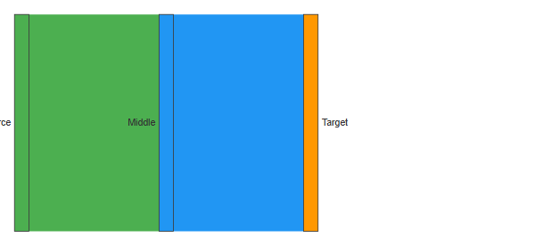
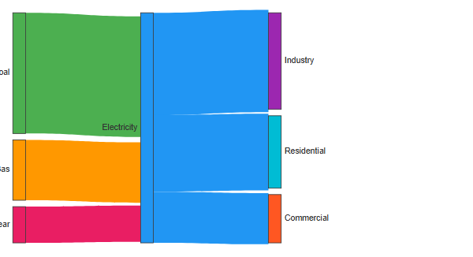
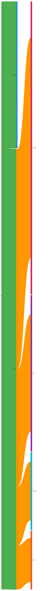
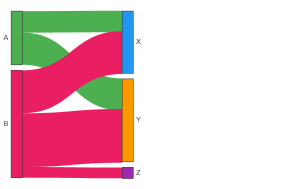

# Sankey

## Simple

**Input:**
```
sankey-beta
A,B,10
A,C,20
```
**Rendered by Naiad:**

<p align="center">
  
</p>


[Open in Mermaid Live](https://mermaid.live/edit#base64:eyJjb2RlIjoic2Fua2V5LWJldGFcbkEsQiwxMFxuQSxDLDIwIiwibWVybWFpZCI6eyJ0aGVtZSI6ImRlZmF1bHQifX0=)

## ThreeColumns

**Input:**
```
sankey-beta
Source,Middle,30
Middle,Target,30
```
**Rendered by Naiad:**

<p align="center">
  
</p>


[Open in Mermaid Live](https://mermaid.live/edit#base64:eyJjb2RlIjoic2Fua2V5LWJldGFcblNvdXJjZSxNaWRkbGUsMzBcbk1pZGRsZSxUYXJnZXQsMzAiLCJtZXJtYWlkIjp7InRoZW1lIjoiZGVmYXVsdCJ9fQ==)

## EnergyFlow

**Input:**
```
sankey-beta
Coal,Electricity,100
Gas,Electricity,50
Nuclear,Electricity,30
Electricity,Industry,80
Electricity,Residential,60
Electricity,Commercial,40
```
**Rendered by Naiad:**

<p align="center">
  
</p>


[Open in Mermaid Live](https://mermaid.live/edit#base64:eyJjb2RlIjoic2Fua2V5LWJldGFcbkNvYWwsRWxlY3RyaWNpdHksMTAwXG5HYXMsRWxlY3RyaWNpdHksNTBcbk51Y2xlYXIsRWxlY3RyaWNpdHksMzBcbkVsZWN0cmljaXR5LEluZHVzdHJ5LDgwXG5FbGVjdHJpY2l0eSxSZXNpZGVudGlhbCw2MFxuRWxlY3RyaWNpdHksQ29tbWVyY2lhbCw0MCIsIm1lcm1haWQiOnsidGhlbWUiOiJkZWZhdWx0In19)

## BudgetFlow

**Input:**
```
sankey-beta
Salary,Savings,1000
Salary,Expenses,3000
Expenses,Housing,1500
Expenses,Food,800
Expenses,Transport,400
Expenses,Other,300
```
**Rendered by Naiad:**

<p align="center">
  
</p>


[Open in Mermaid Live](https://mermaid.live/edit#base64:eyJjb2RlIjoic2Fua2V5LWJldGFcblNhbGFyeSxTYXZpbmdzLDEwMDBcblNhbGFyeSxFeHBlbnNlcywzMDAwXG5FeHBlbnNlcyxIb3VzaW5nLDE1MDBcbkV4cGVuc2VzLEZvb2QsODAwXG5FeHBlbnNlcyxUcmFuc3BvcnQsNDAwXG5FeHBlbnNlcyxPdGhlciwzMDAiLCJtZXJtYWlkIjp7InRoZW1lIjoiZGVmYXVsdCJ9fQ==)

## MultipleSourcesAndTargets

**Input:**
```
sankey-beta
A,X,10
A,Y,15
B,X,20
B,Y,25
B,Z,5
```
**Rendered by Naiad:**

<p align="center">
  
</p>


[Open in Mermaid Live](https://mermaid.live/edit#base64:eyJjb2RlIjoic2Fua2V5LWJldGFcbkEsWCwxMFxuQSxZLDE1XG5CLFgsMjBcbkIsWSwyNVxuQixaLDUiLCJtZXJtYWlkIjp7InRoZW1lIjoiZGVmYXVsdCJ9fQ==)

## SingleLink

**Input:**
```
sankey-beta
Input,Output,100
```
**Rendered by Naiad:**

<p align="center">
  
</p>


[Open in Mermaid Live](https://mermaid.live/edit#base64:eyJjb2RlIjoic2Fua2V5LWJldGFcbklucHV0LE91dHB1dCwxMDAiLCJtZXJtYWlkIjp7InRoZW1lIjoiZGVmYXVsdCJ9fQ==)

