# State

## Simple

**Input:**
```
stateDiagram-v2
    [*] --> Still
    Still --> [*]
```
**Rendered by Naiad:**

<p align="center">
  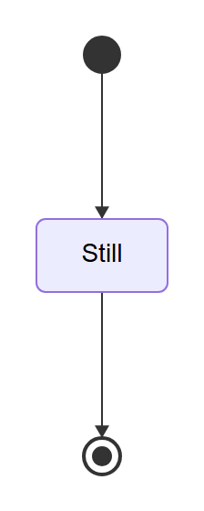
</p>

**Rendered by Mermaid:**
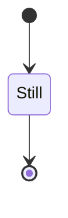

[Open in Mermaid Live](https://mermaid.live/edit#base64:eyJjb2RlIjoic3RhdGVEaWFncmFtLXYyXG4gICAgWypdIC0tXHUwMDNFIFN0aWxsXG4gICAgU3RpbGwgLS1cdTAwM0UgWypdIiwibWVybWFpZCI6eyJ0aGVtZSI6ImRlZmF1bHQifX0=)

## MultipleStates

**Input:**
```
stateDiagram-v2
    [*] --> Still
    Still --> Moving
    Moving --> Still
    Moving --> Crash
    Crash --> [*]
```
**Rendered by Naiad:**

<p align="center">
  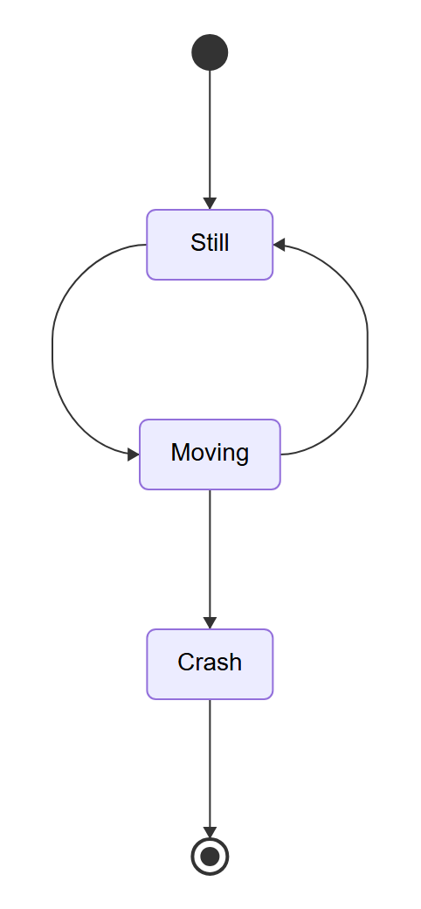
</p>

**Rendered by Mermaid:**
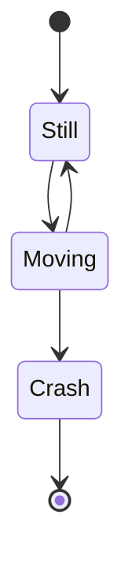

[Open in Mermaid Live](https://mermaid.live/edit#base64:eyJjb2RlIjoic3RhdGVEaWFncmFtLXYyXG4gICAgWypdIC0tXHUwMDNFIFN0aWxsXG4gICAgU3RpbGwgLS1cdTAwM0UgTW92aW5nXG4gICAgTW92aW5nIC0tXHUwMDNFIFN0aWxsXG4gICAgTW92aW5nIC0tXHUwMDNFIENyYXNoXG4gICAgQ3Jhc2ggLS1cdTAwM0UgWypdIiwibWVybWFpZCI6eyJ0aGVtZSI6ImRlZmF1bHQifX0=)

## TransitionLabels

**Input:**
```
stateDiagram-v2
    [*] --> Active
    Active --> Inactive : timeout
    Inactive --> Active : reset
    Active --> [*] : shutdown
```
**Rendered by Naiad:**

<p align="center">
  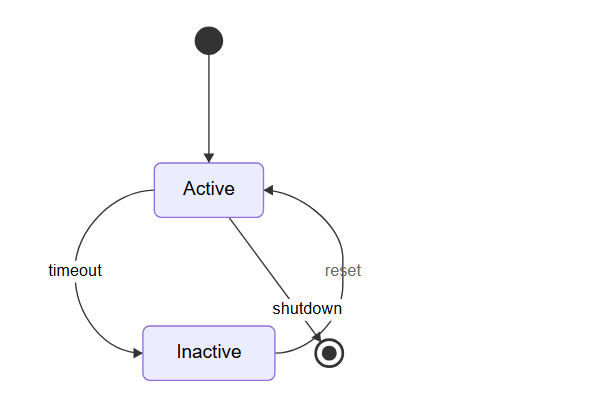
</p>

**Rendered by Mermaid:**
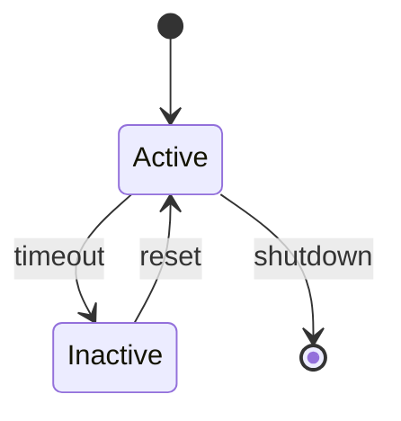

[Open in Mermaid Live](https://mermaid.live/edit#base64:eyJjb2RlIjoic3RhdGVEaWFncmFtLXYyXG4gICAgWypdIC0tXHUwMDNFIEFjdGl2ZVxuICAgIEFjdGl2ZSAtLVx1MDAzRSBJbmFjdGl2ZSA6IHRpbWVvdXRcbiAgICBJbmFjdGl2ZSAtLVx1MDAzRSBBY3RpdmUgOiByZXNldFxuICAgIEFjdGl2ZSAtLVx1MDAzRSBbKl0gOiBzaHV0ZG93biIsIm1lcm1haWQiOnsidGhlbWUiOiJkZWZhdWx0In19)

## Description

**Input:**
```
stateDiagram-v2
    state "This is a state description" as s1
    [*] --> s1
    s1 --> [*]
```
**Rendered by Naiad:**

<p align="center">
  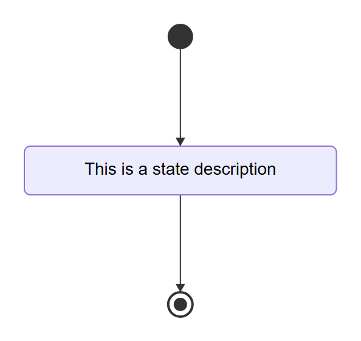
</p>

**Rendered by Mermaid:**
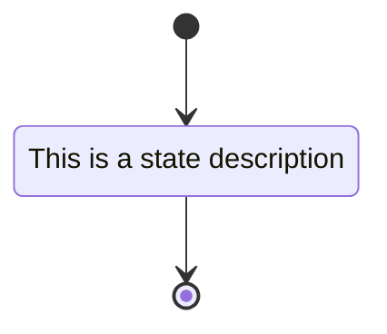

[Open in Mermaid Live](https://mermaid.live/edit#base64:eyJjb2RlIjoic3RhdGVEaWFncmFtLXYyXG4gICAgc3RhdGUgXHUwMDIyVGhpcyBpcyBhIHN0YXRlIGRlc2NyaXB0aW9uXHUwMDIyIGFzIHMxXG4gICAgWypdIC0tXHUwMDNFIHMxXG4gICAgczEgLS1cdTAwM0UgWypdIiwibWVybWFpZCI6eyJ0aGVtZSI6ImRlZmF1bHQifX0=)

## ForkJoinState

**Input:**
```
stateDiagram-v2
    state fork_state <<fork>>
    [*] --> fork_state
    fork_state --> State2
    fork_state --> State3
```
**Rendered by Naiad:**

<p align="center">
  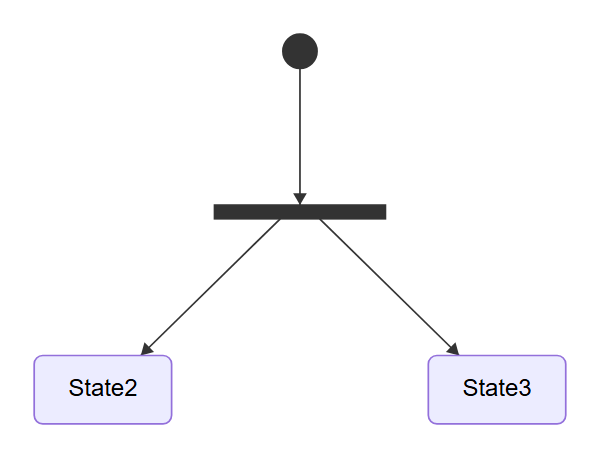
</p>

**Rendered by Mermaid:**
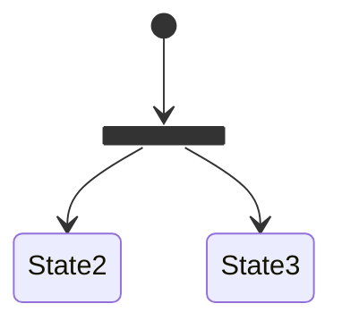

[Open in Mermaid Live](https://mermaid.live/edit#base64:eyJjb2RlIjoic3RhdGVEaWFncmFtLXYyXG4gICAgc3RhdGUgZm9ya19zdGF0ZSBcdTAwM0NcdTAwM0Nmb3JrXHUwMDNFXHUwMDNFXG4gICAgWypdIC0tXHUwMDNFIGZvcmtfc3RhdGVcbiAgICBmb3JrX3N0YXRlIC0tXHUwMDNFIFN0YXRlMlxuICAgIGZvcmtfc3RhdGUgLS1cdTAwM0UgU3RhdGUzIiwibWVybWFpZCI6eyJ0aGVtZSI6ImRlZmF1bHQifX0=)

## ChoiceState

**Input:**
```
stateDiagram-v2
    state choice_state <<choice>>
    [*] --> IsPositive
    IsPositive --> choice_state
    choice_state --> Positive : if n > 0
    choice_state --> Negative : if n < 0
```
**Rendered by Naiad:**

<p align="center">
  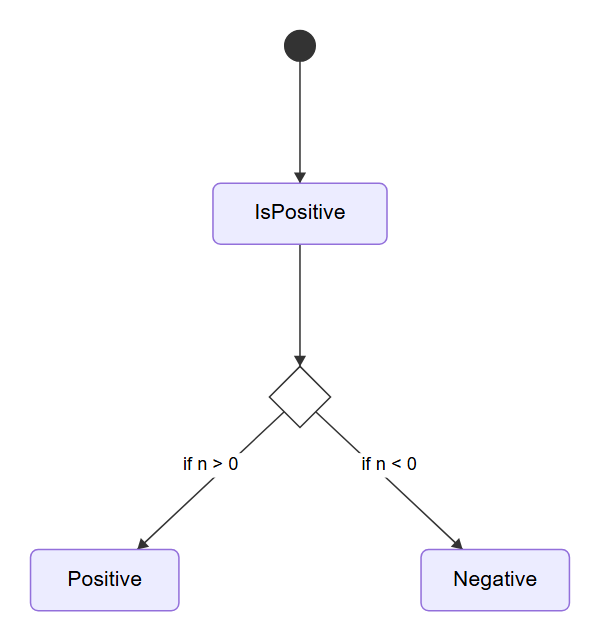
</p>

**Rendered by Mermaid:**
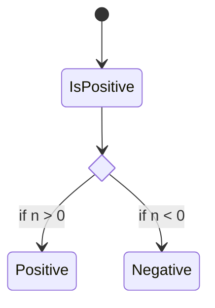

[Open in Mermaid Live](https://mermaid.live/edit#base64:eyJjb2RlIjoic3RhdGVEaWFncmFtLXYyXG4gICAgc3RhdGUgY2hvaWNlX3N0YXRlIFx1MDAzQ1x1MDAzQ2Nob2ljZVx1MDAzRVx1MDAzRVxuICAgIFsqXSAtLVx1MDAzRSBJc1Bvc2l0aXZlXG4gICAgSXNQb3NpdGl2ZSAtLVx1MDAzRSBjaG9pY2Vfc3RhdGVcbiAgICBjaG9pY2Vfc3RhdGUgLS1cdTAwM0UgUG9zaXRpdmUgOiBpZiBuIFx1MDAzRSAwXG4gICAgY2hvaWNlX3N0YXRlIC0tXHUwMDNFIE5lZ2F0aXZlIDogaWYgbiBcdTAwM0MgMCIsIm1lcm1haWQiOnsidGhlbWUiOiJkZWZhdWx0In19)

## StateWithNote

**Input:**
```
stateDiagram-v2
    [*] --> Active
    Active --> [*]
    note right of Active : Important note
```
**Rendered by Naiad:**

<p align="center">
  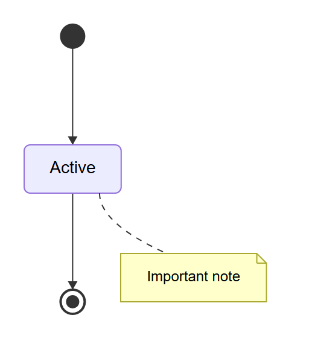
</p>

**Rendered by Mermaid:**
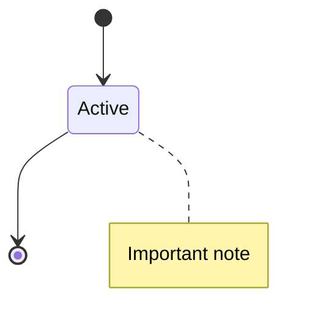

[Open in Mermaid Live](https://mermaid.live/edit#base64:eyJjb2RlIjoic3RhdGVEaWFncmFtLXYyXG4gICAgWypdIC0tXHUwMDNFIEFjdGl2ZVxuICAgIEFjdGl2ZSAtLVx1MDAzRSBbKl1cbiAgICBub3RlIHJpZ2h0IG9mIEFjdGl2ZSA6IEltcG9ydGFudCBub3RlIiwibWVybWFpZCI6eyJ0aGVtZSI6ImRlZmF1bHQifX0=)

## StateDiagramV1

**Input:**
```
stateDiagram
    [*] --> Still
    Still --> [*]
```
**Rendered by Naiad:**

<p align="center">
  
</p>

**Rendered by Mermaid:**


[Open in Mermaid Live](https://mermaid.live/edit#base64:eyJjb2RlIjoic3RhdGVEaWFncmFtXG4gICAgWypdIC0tXHUwMDNFIFN0aWxsXG4gICAgU3RpbGwgLS1cdTAwM0UgWypdIiwibWVybWFpZCI6eyJ0aGVtZSI6ImRlZmF1bHQifX0=)

## Complex

**Input:**
```
stateDiagram-v2
    [*] --> Idle

    state "Processing State" as Processing
    state fork_state <<fork>>
    state join_state <<join>>
    state choice_state <<choice>>

    Idle --> Processing : start
    Processing --> fork_state
    fork_state --> TaskA
    fork_state --> TaskB
    TaskA --> join_state
    TaskB --> join_state
    join_state --> choice_state
    choice_state --> Success : if valid
    choice_state --> Error : if invalid
    Success --> Idle : reset
    Error --> Idle : retry
    Success --> [*] : complete

    note right of Processing : This is a processing note
    note left of Error : Error handling
```
**Rendered by Naiad:**

<p align="center">
  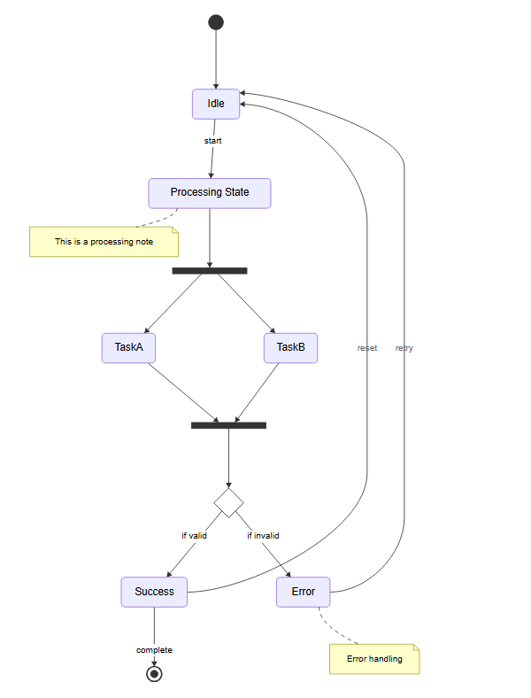
</p>

**Rendered by Mermaid:**
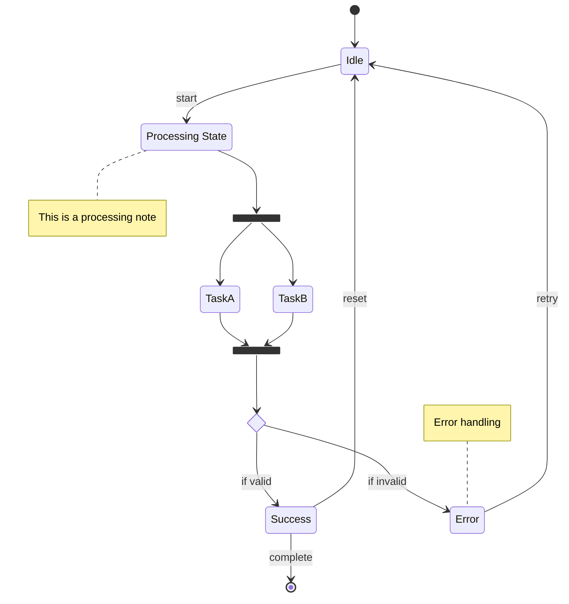

[Open in Mermaid Live](https://mermaid.live/edit#base64:eyJjb2RlIjoic3RhdGVEaWFncmFtLXYyXG4gICAgWypdIC0tXHUwMDNFIElkbGVcblxuICAgIHN0YXRlIFx1MDAyMlByb2Nlc3NpbmcgU3RhdGVcdTAwMjIgYXMgUHJvY2Vzc2luZ1xuICAgIHN0YXRlIGZvcmtfc3RhdGUgXHUwMDNDXHUwMDNDZm9ya1x1MDAzRVx1MDAzRVxuICAgIHN0YXRlIGpvaW5fc3RhdGUgXHUwMDNDXHUwMDNDam9pblx1MDAzRVx1MDAzRVxuICAgIHN0YXRlIGNob2ljZV9zdGF0ZSBcdTAwM0NcdTAwM0NjaG9pY2VcdTAwM0VcdTAwM0VcblxuICAgIElkbGUgLS1cdTAwM0UgUHJvY2Vzc2luZyA6IHN0YXJ0XG4gICAgUHJvY2Vzc2luZyAtLVx1MDAzRSBmb3JrX3N0YXRlXG4gICAgZm9ya19zdGF0ZSAtLVx1MDAzRSBUYXNrQVxuICAgIGZvcmtfc3RhdGUgLS1cdTAwM0UgVGFza0JcbiAgICBUYXNrQSAtLVx1MDAzRSBqb2luX3N0YXRlXG4gICAgVGFza0IgLS1cdTAwM0Ugam9pbl9zdGF0ZVxuICAgIGpvaW5fc3RhdGUgLS1cdTAwM0UgY2hvaWNlX3N0YXRlXG4gICAgY2hvaWNlX3N0YXRlIC0tXHUwMDNFIFN1Y2Nlc3MgOiBpZiB2YWxpZFxuICAgIGNob2ljZV9zdGF0ZSAtLVx1MDAzRSBFcnJvciA6IGlmIGludmFsaWRcbiAgICBTdWNjZXNzIC0tXHUwMDNFIElkbGUgOiByZXNldFxuICAgIEVycm9yIC0tXHUwMDNFIElkbGUgOiByZXRyeVxuICAgIFN1Y2Nlc3MgLS1cdTAwM0UgWypdIDogY29tcGxldGVcblxuICAgIG5vdGUgcmlnaHQgb2YgUHJvY2Vzc2luZyA6IFRoaXMgaXMgYSBwcm9jZXNzaW5nIG5vdGVcbiAgICBub3RlIGxlZnQgb2YgRXJyb3IgOiBFcnJvciBoYW5kbGluZyIsIm1lcm1haWQiOnsidGhlbWUiOiJkZWZhdWx0In19)

