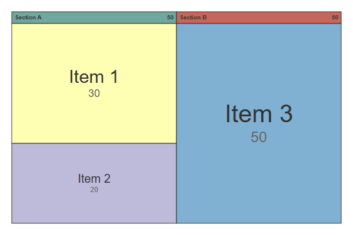
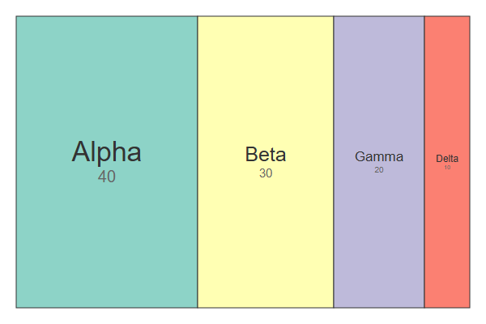
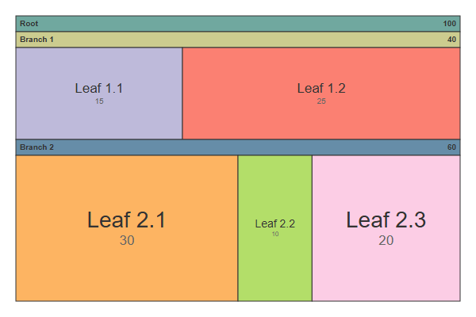
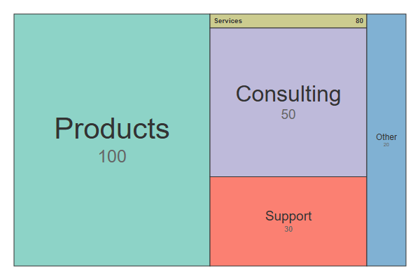
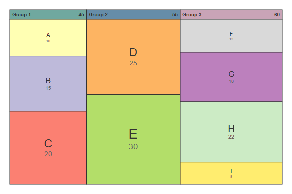

# Treemap

## Simple

**Input:**
```
treemap-beta
"Section A"
    "Item 1": 30
    "Item 2": 20
"Section B"
    "Item 3": 50
```
**Rendered by Naiad:**

<p align="center">
  
</p>


[Open in Mermaid Live](https://mermaid.live/edit#base64:eyJjb2RlIjoidHJlZW1hcC1iZXRhXG5cdTAwMjJTZWN0aW9uIEFcdTAwMjJcbiAgICBcdTAwMjJJdGVtIDFcdTAwMjI6IDMwXG4gICAgXHUwMDIySXRlbSAyXHUwMDIyOiAyMFxuXHUwMDIyU2VjdGlvbiBCXHUwMDIyXG4gICAgXHUwMDIySXRlbSAzXHUwMDIyOiA1MCIsIm1lcm1haWQiOnsidGhlbWUiOiJkZWZhdWx0In19)

## SingleLevel

**Input:**
```
treemap-beta
"Alpha": 40
"Beta": 30
"Gamma": 20
"Delta": 10
```
**Rendered by Naiad:**

<p align="center">
  
</p>


[Open in Mermaid Live](https://mermaid.live/edit#base64:eyJjb2RlIjoidHJlZW1hcC1iZXRhXG5cdTAwMjJBbHBoYVx1MDAyMjogNDBcblx1MDAyMkJldGFcdTAwMjI6IDMwXG5cdTAwMjJHYW1tYVx1MDAyMjogMjBcblx1MDAyMkRlbHRhXHUwMDIyOiAxMCIsIm1lcm1haWQiOnsidGhlbWUiOiJkZWZhdWx0In19)

## NestedSections

**Input:**
```
treemap-beta
"Root"
    "Branch 1"
        "Leaf 1.1": 15
        "Leaf 1.2": 25
    "Branch 2"
        "Leaf 2.1": 30
        "Leaf 2.2": 10
        "Leaf 2.3": 20
```
**Rendered by Naiad:**

<p align="center">
  
</p>


[Open in Mermaid Live](https://mermaid.live/edit#base64:eyJjb2RlIjoidHJlZW1hcC1iZXRhXG5cdTAwMjJSb290XHUwMDIyXG4gICAgXHUwMDIyQnJhbmNoIDFcdTAwMjJcbiAgICAgICAgXHUwMDIyTGVhZiAxLjFcdTAwMjI6IDE1XG4gICAgICAgIFx1MDAyMkxlYWYgMS4yXHUwMDIyOiAyNVxuICAgIFx1MDAyMkJyYW5jaCAyXHUwMDIyXG4gICAgICAgIFx1MDAyMkxlYWYgMi4xXHUwMDIyOiAzMFxuICAgICAgICBcdTAwMjJMZWFmIDIuMlx1MDAyMjogMTBcbiAgICAgICAgXHUwMDIyTGVhZiAyLjNcdTAwMjI6IDIwIiwibWVybWFpZCI6eyJ0aGVtZSI6ImRlZmF1bHQifX0=)

## MixedHierarchy

**Input:**
```
treemap-beta
"Products": 100
"Services"
    "Consulting": 50
    "Support": 30
"Other": 20
```
**Rendered by Naiad:**

<p align="center">
  
</p>


[Open in Mermaid Live](https://mermaid.live/edit#base64:eyJjb2RlIjoidHJlZW1hcC1iZXRhXG5cdTAwMjJQcm9kdWN0c1x1MDAyMjogMTAwXG5cdTAwMjJTZXJ2aWNlc1x1MDAyMlxuICAgIFx1MDAyMkNvbnN1bHRpbmdcdTAwMjI6IDUwXG4gICAgXHUwMDIyU3VwcG9ydFx1MDAyMjogMzBcblx1MDAyMk90aGVyXHUwMDIyOiAyMCIsIm1lcm1haWQiOnsidGhlbWUiOiJkZWZhdWx0In19)

## LargeValues

**Input:**
```
treemap-beta
"Category A"
    "Sub A1": 1000
    "Sub A2": 500
"Category B"
    "Sub B1": 750
    "Sub B2": 250
```
**Rendered by Naiad:**

<p align="center">
  
</p>


[Open in Mermaid Live](https://mermaid.live/edit#base64:eyJjb2RlIjoidHJlZW1hcC1iZXRhXG5cdTAwMjJDYXRlZ29yeSBBXHUwMDIyXG4gICAgXHUwMDIyU3ViIEExXHUwMDIyOiAxMDAwXG4gICAgXHUwMDIyU3ViIEEyXHUwMDIyOiA1MDBcblx1MDAyMkNhdGVnb3J5IEJcdTAwMjJcbiAgICBcdTAwMjJTdWIgQjFcdTAwMjI6IDc1MFxuICAgIFx1MDAyMlN1YiBCMlx1MDAyMjogMjUwIiwibWVybWFpZCI6eyJ0aGVtZSI6ImRlZmF1bHQifX0=)

## Complex

**Input:**
```
treemap-beta
"Group 1"
    "A": 10
    "B": 15
    "C": 20
"Group 2"
    "D": 25
    "E": 30
"Group 3"
    "F": 12
    "G": 18
    "H": 22
    "I": 8
```
**Rendered by Naiad:**

<p align="center">
  
</p>


[Open in Mermaid Live](https://mermaid.live/edit#base64:eyJjb2RlIjoidHJlZW1hcC1iZXRhXG5cdTAwMjJHcm91cCAxXHUwMDIyXG4gICAgXHUwMDIyQVx1MDAyMjogMTBcbiAgICBcdTAwMjJCXHUwMDIyOiAxNVxuICAgIFx1MDAyMkNcdTAwMjI6IDIwXG5cdTAwMjJHcm91cCAyXHUwMDIyXG4gICAgXHUwMDIyRFx1MDAyMjogMjVcbiAgICBcdTAwMjJFXHUwMDIyOiAzMFxuXHUwMDIyR3JvdXAgM1x1MDAyMlxuICAgIFx1MDAyMkZcdTAwMjI6IDEyXG4gICAgXHUwMDIyR1x1MDAyMjogMThcbiAgICBcdTAwMjJIXHUwMDIyOiAyMlxuICAgIFx1MDAyMklcdTAwMjI6IDgiLCJtZXJtYWlkIjp7InRoZW1lIjoiZGVmYXVsdCJ9fQ==)

