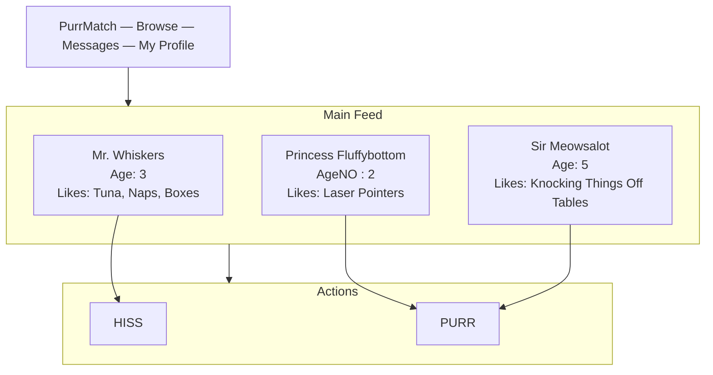
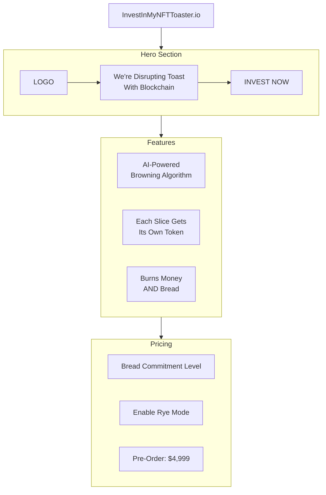
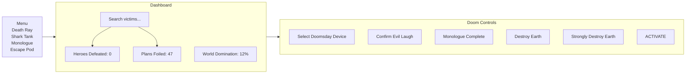
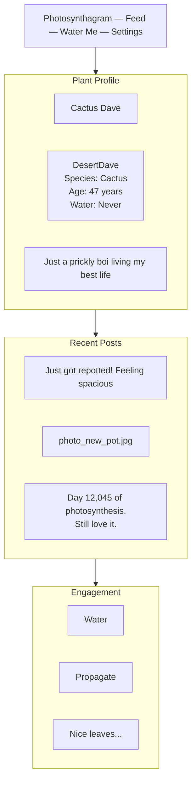
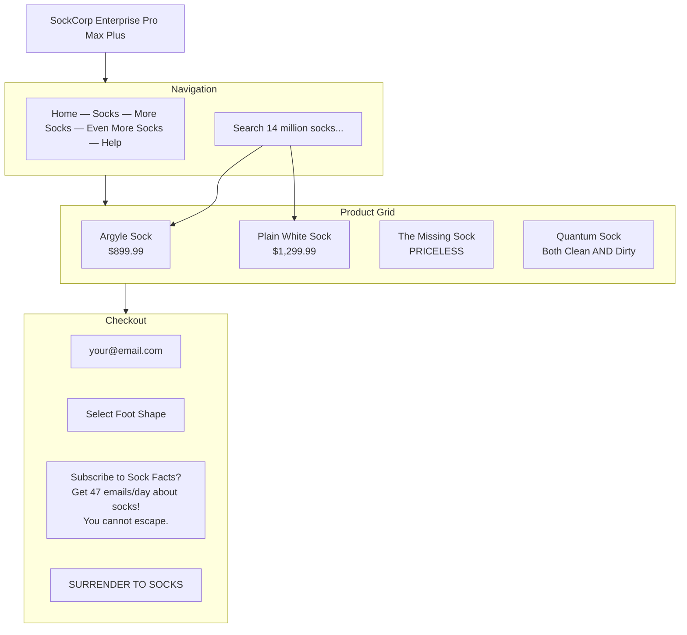
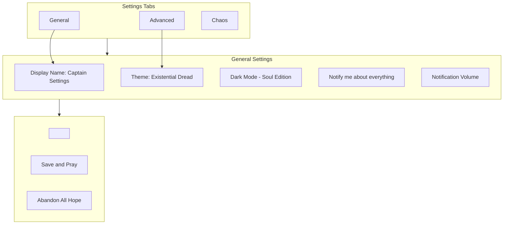

# Wireframe Skin Pack Examples

All examples use standard mermaid flowchart syntax. The `%% naiad:` directives
are mermaid `%%` comments — mermaid.js ignores them and renders normal shapes.
Naiad reads them and applies the wireframe skin shapes.

## Dating App for Cats

## Startup Pitch Deck Wireframe

## Evil Villain's Control Panel

## Social Media for Plants

## E-Commerce for Socks (Enterprise Edition)

## The Ultimate Settings Page

