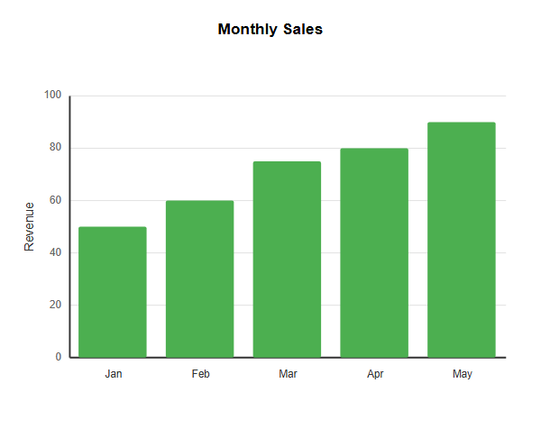
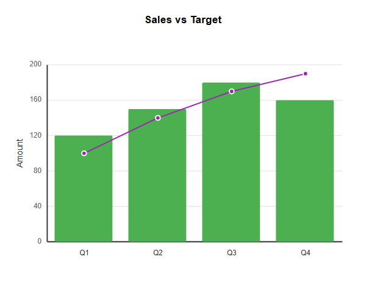
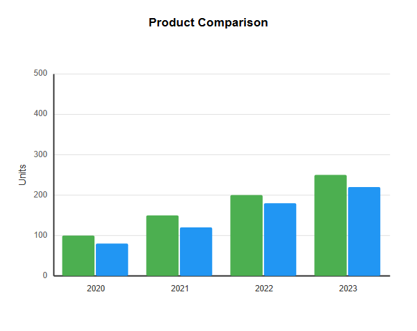
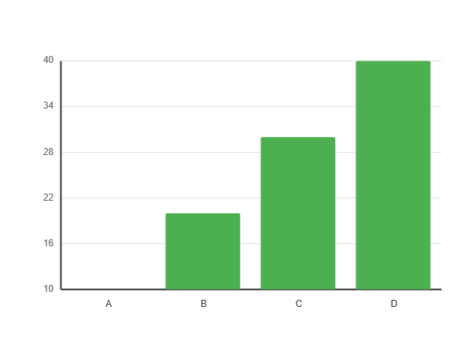
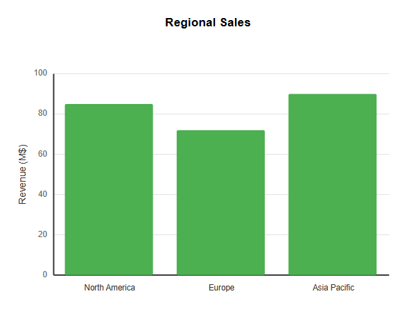

# XYChart

## Simple

**Input:**
```
xychart-beta
    title "Monthly Sales"
    x-axis [Jan, Feb, Mar, Apr, May]
    y-axis "Revenue" 0 --> 100
    bar [50, 60, 75, 80, 90]
```
**Rendered by Naiad:**

<p align="center">
  
</p>


[Open in Mermaid Live](https://mermaid.live/edit#base64:eyJjb2RlIjoieHljaGFydC1iZXRhXG4gICAgdGl0bGUgXHUwMDIyTW9udGhseSBTYWxlc1x1MDAyMlxuICAgIHgtYXhpcyBbSmFuLCBGZWIsIE1hciwgQXByLCBNYXldXG4gICAgeS1heGlzIFx1MDAyMlJldmVudWVcdTAwMjIgMCAtLVx1MDAzRSAxMDBcbiAgICBiYXIgWzUwLCA2MCwgNzUsIDgwLCA5MF0iLCJtZXJtYWlkIjp7InRoZW1lIjoiZGVmYXVsdCJ9fQ==)

## BarAndLine

**Input:**
```
xychart-beta
    title "Sales vs Target"
    x-axis [Q1, Q2, Q3, Q4]
    y-axis "Amount" 0 --> 200
    bar [120, 150, 180, 160]
    line [100, 140, 170, 190]
```
**Rendered by Naiad:**

<p align="center">
  
</p>


[Open in Mermaid Live](https://mermaid.live/edit#base64:eyJjb2RlIjoieHljaGFydC1iZXRhXG4gICAgdGl0bGUgXHUwMDIyU2FsZXMgdnMgVGFyZ2V0XHUwMDIyXG4gICAgeC1heGlzIFtRMSwgUTIsIFEzLCBRNF1cbiAgICB5LWF4aXMgXHUwMDIyQW1vdW50XHUwMDIyIDAgLS1cdTAwM0UgMjAwXG4gICAgYmFyIFsxMjAsIDE1MCwgMTgwLCAxNjBdXG4gICAgbGluZSBbMTAwLCAxNDAsIDE3MCwgMTkwXSIsIm1lcm1haWQiOnsidGhlbWUiOiJkZWZhdWx0In19)

## MultipleBarSeries

**Input:**
```
xychart-beta
    title "Product Comparison"
    x-axis [2020, 2021, 2022, 2023]
    y-axis "Units" 0 --> 500
    bar [100, 150, 200, 250]
    bar [80, 120, 180, 220]
```
**Rendered by Naiad:**

<p align="center">
  
</p>


[Open in Mermaid Live](https://mermaid.live/edit#base64:eyJjb2RlIjoieHljaGFydC1iZXRhXG4gICAgdGl0bGUgXHUwMDIyUHJvZHVjdCBDb21wYXJpc29uXHUwMDIyXG4gICAgeC1heGlzIFsyMDIwLCAyMDIxLCAyMDIyLCAyMDIzXVxuICAgIHktYXhpcyBcdTAwMjJVbml0c1x1MDAyMiAwIC0tXHUwMDNFIDUwMFxuICAgIGJhciBbMTAwLCAxNTAsIDIwMCwgMjUwXVxuICAgIGJhciBbODAsIDEyMCwgMTgwLCAyMjBdIiwibWVybWFpZCI6eyJ0aGVtZSI6ImRlZmF1bHQifX0=)

## WithoutTitle

**Input:**
```
xychart-beta
    x-axis [A, B, C, D]
    bar [10, 20, 30, 40]
```
**Rendered by Naiad:**

<p align="center">
  
</p>


[Open in Mermaid Live](https://mermaid.live/edit#base64:eyJjb2RlIjoieHljaGFydC1iZXRhXG4gICAgeC1heGlzIFtBLCBCLCBDLCBEXVxuICAgIGJhciBbMTAsIDIwLCAzMCwgNDBdIiwibWVybWFpZCI6eyJ0aGVtZSI6ImRlZmF1bHQifX0=)

## QuotedCategories

**Input:**
```
xychart-beta
    title "Regional Sales"
    x-axis ["North America", "Europe", "Asia Pacific"]
    y-axis "Revenue (M$)" 0 --> 100
    bar [85, 72, 90]
```
**Rendered by Naiad:**

<p align="center">
  
</p>


[Open in Mermaid Live](https://mermaid.live/edit#base64:eyJjb2RlIjoieHljaGFydC1iZXRhXG4gICAgdGl0bGUgXHUwMDIyUmVnaW9uYWwgU2FsZXNcdTAwMjJcbiAgICB4LWF4aXMgW1x1MDAyMk5vcnRoIEFtZXJpY2FcdTAwMjIsIFx1MDAyMkV1cm9wZVx1MDAyMiwgXHUwMDIyQXNpYSBQYWNpZmljXHUwMDIyXVxuICAgIHktYXhpcyBcdTAwMjJSZXZlbnVlIChNJClcdTAwMjIgMCAtLVx1MDAzRSAxMDBcbiAgICBiYXIgWzg1LCA3MiwgOTBdIiwibWVybWFpZCI6eyJ0aGVtZSI6ImRlZmF1bHQifX0=)

## Complex

**Input:**
```
xychart-beta
    title "Annual Data"
    x-axis [Jan, Feb, Mar, Apr, May, Jun, Jul, Aug, Sep, Oct, Nov, Dec]
    y-axis "Value" 0 --> 100
    bar [45, 52, 61, 58, 72, 85, 91, 88, 76, 65, 55, 48]
    line [40, 48, 58, 55, 70, 82, 88, 85, 73, 62, 52, 45]
```
**Rendered by Naiad:**

<p align="center">
  
</p>


[Open in Mermaid Live](https://mermaid.live/edit#base64:eyJjb2RlIjoieHljaGFydC1iZXRhXG4gICAgdGl0bGUgXHUwMDIyQW5udWFsIERhdGFcdTAwMjJcbiAgICB4LWF4aXMgW0phbiwgRmViLCBNYXIsIEFwciwgTWF5LCBKdW4sIEp1bCwgQXVnLCBTZXAsIE9jdCwgTm92LCBEZWNdXG4gICAgeS1heGlzIFx1MDAyMlZhbHVlXHUwMDIyIDAgLS1cdTAwM0UgMTAwXG4gICAgYmFyIFs0NSwgNTIsIDYxLCA1OCwgNzIsIDg1LCA5MSwgODgsIDc2LCA2NSwgNTUsIDQ4XVxuICAgIGxpbmUgWzQwLCA0OCwgNTgsIDU1LCA3MCwgODIsIDg4LCA4NSwgNzMsIDYyLCA1MiwgNDVdIiwibWVybWFpZCI6eyJ0aGVtZSI6ImRlZmF1bHQifX0=)

