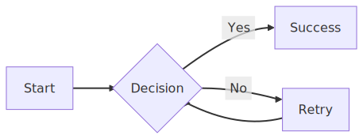
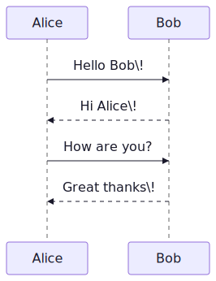
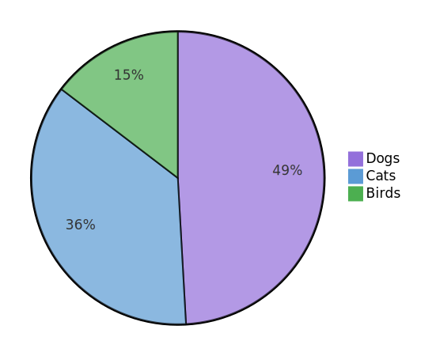

# ***lucid*VIEW**

An Avalonia Markdown Viewer with code highlighting and Mermaid support using Naiad Time-boxed weekend project. Fork it,
fix it, ship it. Public domain.

**by [***mostly*lucid**](https://www.mostlylucid.net)**


---

## Why?

Every markdown viewer either:

- Wraps a Chromium browser (100MB+ bloat)
- Looks like it's from 2005
- Doesn't support mermaid diagrams
- Can't handle local images

This one doesn't. Single exe. Cross-platform. Fast.

*Time-boxed weekend project. Fork it, fix it, ship it. Public domain.*

---

## Diagram Examples

All diagrams rendered natively by Naiad -- no browser, no JavaScript, no external services.

<p align="center">
  
</p>

<p align="center">
  
  
</p>

---

## Features

**Rendering**

- Real-time markdown with [LiveMarkdown.Avalonia](https://github.com/DearVa/LiveMarkdown.Avalonia) - syntax highlighting
  built-in
- Mermaid diagrams via an [experimental Naiad fork](Naiad/readme.md) — **32 diagram types** rendered natively in .NET (see [Naiad differences](#naiad-fork) below)
- Mermaid-compatible Naiad directives via comments (`%% naiad: ...`) for per-file theme/skin configuration
- Local & remote images that actually work

**UI**

- 4 themes: Light, Dark, VS Code, GitHub
- TOC navigation panel
- Search (Ctrl+F)
- Zoom slider
- Preview/Raw toggle

**Deployment**

- Single file executable
- No dependencies
- ~50MB

**Extensibility**

- Pluginized native diagram replacement pipeline (`MarkdownViewer/Plugins`)
- Shape skin packs from folder or archive (`Naiad/skins`)

---

## Install

Grab from [Releases](../../releases):

| Platform    | Download                  |
|-------------|---------------------------|
| Windows     | `lucidVIEW-win-x64.zip`   |
| macOS Intel | `lucidVIEW-osx-x64.zip`   |
| macOS ARM   | `lucidVIEW-osx-arm64.zip` |
| Linux       | `lucidVIEW-linux-x64.zip` |

Extract. Run. Done.

---

## Usage

```bash
lucidVIEW document.md
```

Or drag & drop. Or Ctrl+O. Or paste a URL (Ctrl+Shift+O).

### Naiad Per-File Options (Mermaid-Compatible)


See:

- `Naiad/skins/README.md`
- `MarkdownViewer/Plugins/README.md`

### Shortcuts

| Key            | Action     |
|----------------|------------|
| `Ctrl+O`       | Open file  |
| `Ctrl+Shift+O` | Open URL   |
| `Ctrl+F`       | Search     |
| `Ctrl+B`       | Menu panel |
| `Ctrl++/-`     | Zoom       |
| `F11`          | Fullscreen |
| `F1`           | Help       |

---

## Build

```bash
git clone https://github.com/scottgal/markdown.viewer.git
cd markdown.viewer
dotnet run --project MarkdownViewer/MarkdownViewer.csproj
```

Publish:

```bash
dotnet publish MarkdownViewer/MarkdownViewer.csproj -c Release -r win-x64
```

---

## Naiad Fork

lucidVIEW uses a temporary experimental fork of [Naiad](https://github.com/SimonCropp/Naiad) (Simon Cropp's pure C# Mermaid renderer). The fork — published as `Mostlylucid.Naiad` — extends the upstream project with:

- **12 additional diagram types** not in upstream Naiad or Mermaid: Dendrogram, Bubble Pack, Voronoi, Parallel Coordinates, Geo Map, BPMN, plus Wireframe skin pack
- **Multiple rendering surfaces** — core SVG plus [SkiaSharp](Naiad/src/Naiad.Surfaces.Skia/README.md), [ImageSharp](Naiad/src/Naiad.Surfaces.ImageSharp/README.md), [Blazor](Naiad/src/Naiad.Blazor/README.md), and [WebAssembly](Naiad/src/Naiad.Wasm/README.md) targets
- **Plugin system** — Render surface plugins, skin packs, and fluent API plugins for typed diagram authoring ([building a custom renderer](docs/blog/2026-02-21-building-a-renderer-for-naiad.md), [fluent plugin spec](docs/plans/2026-02-21-fluent-plugin-spec.md))
- **[Mostlylucid.Dagre](https://github.com/scottgal/mostlylucid.dagre)** layout engine — a C# port of dagre with improved edge routing
- **Tulip TLP** graph format import/export ([docs](Naiad/docs/tulip/README.md))
- **Theming** — light/dark themes, Mermaid `%%init%%` directive support, per-diagram theme overrides

The intention is to contribute these changes back upstream. See the full [Naiad README](Naiad/readme.md) for diagram previews and documentation.


## Stack

| Package                                                                  | Version | Purpose                                  |
|--------------------------------------------------------------------------|---------|------------------------------------------|
| [Avalonia](https://avaloniaui.net/)                                      | 11.3.10 | Cross-platform UI                        |
| [LiveMarkdown.Avalonia](https://github.com/DearVa/LiveMarkdown.Avalonia) | 1.7.0   | Markdown rendering + syntax highlighting |
| [Mostlylucid.Naiad](Naiad/readme.md)                                     | fork    | Mermaid diagrams (32 types, pure C#)     |
| [Mostlylucid.Dagre](https://github.com/scottgal/mostlylucid.dagre)      | latest  | Graph layout engine (C# dagre port)      |
| [SkiaSharp](https://github.com/mono/SkiaSharp)                           | 3.119.1 | Graphics                                 |
| [Svg.Skia](https://github.com/wieslawsoltes/Svg.Skia)                    | 3.4.1   | SVG support                              |

---

## License

[The Unlicense](https://unlicense.org/) - Do whatever you want.

---

*View this file in lucidVIEW: F1 or Help menu*
