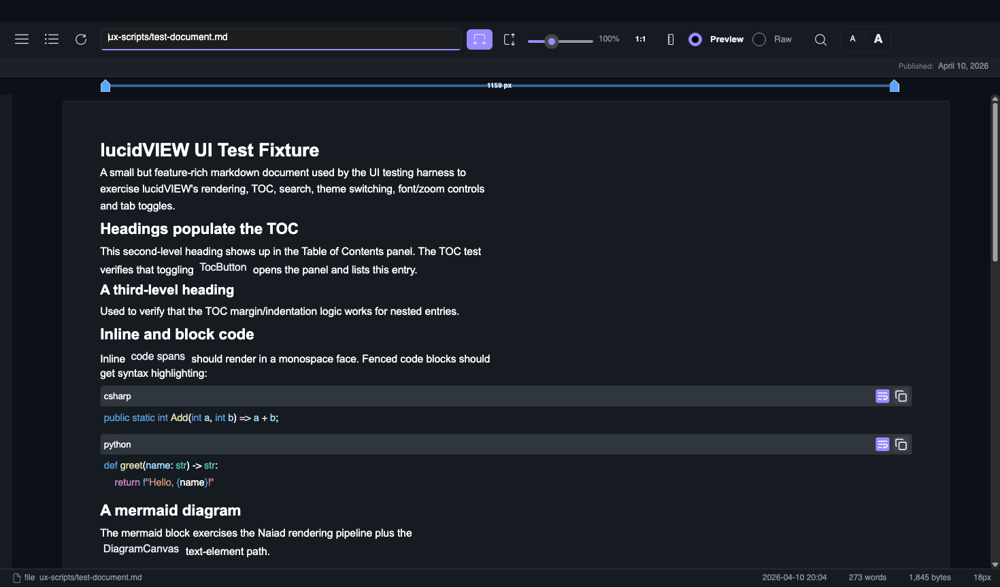
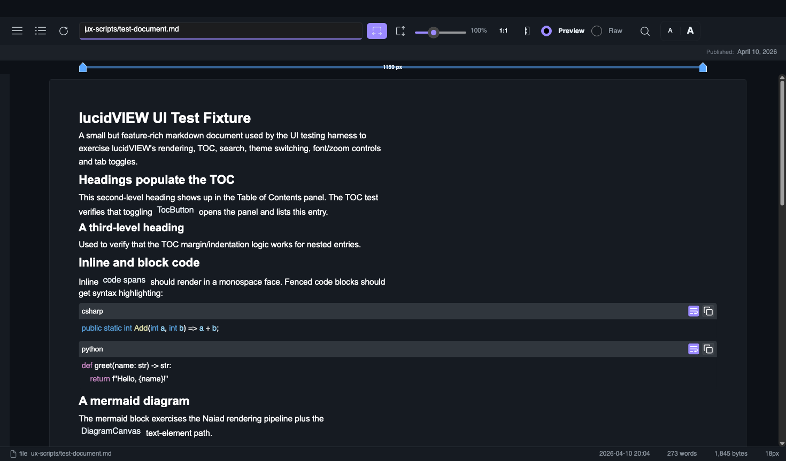
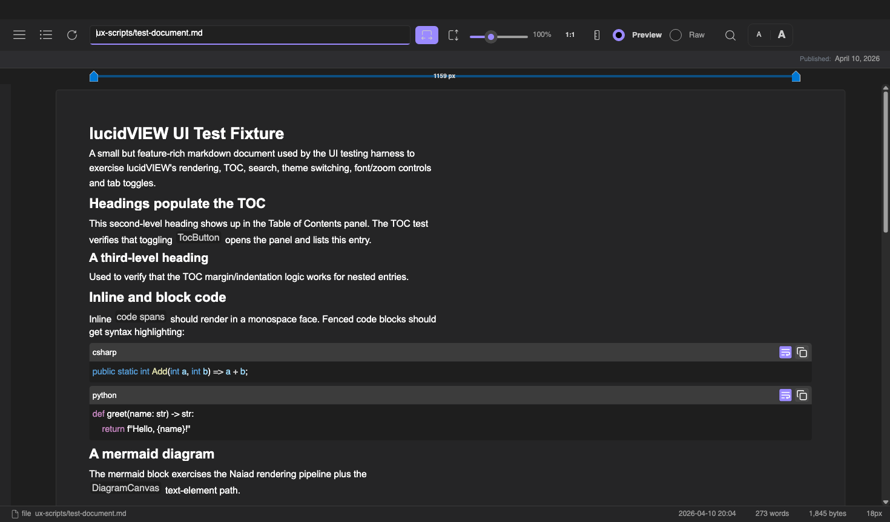
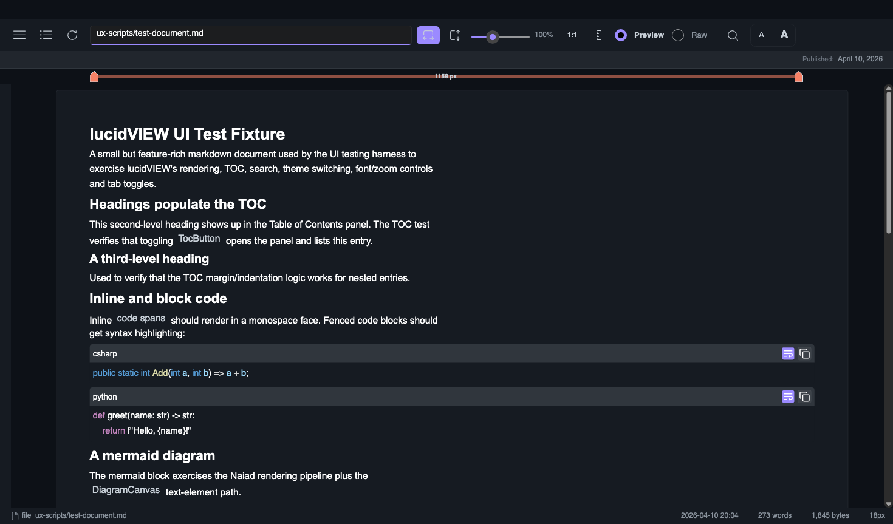
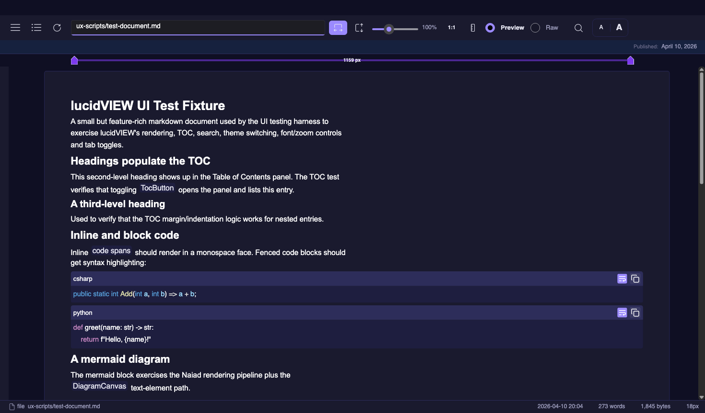
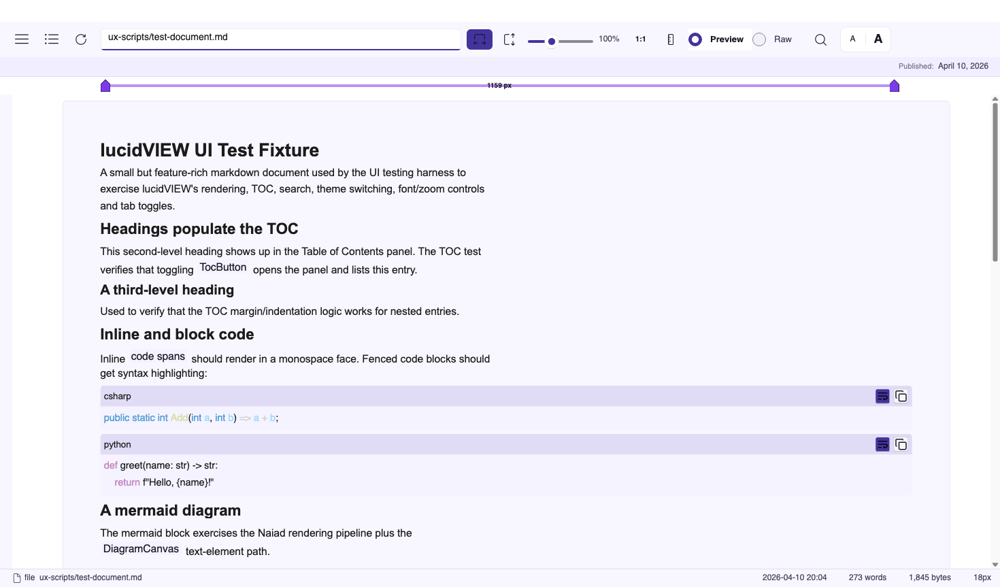
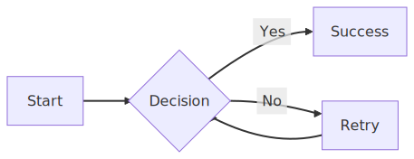
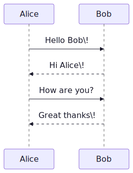
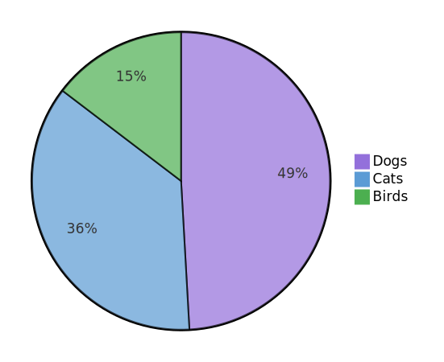

# ***lucid*VIEW**

**The cross-platform markdown viewer that doesn't wrap a browser.** Native
Avalonia rendering, mermaid diagrams via the bundled Naiad engine, real
print, PDF export, six themes, and a self-documenting in-app User Manual.
Single executable, ~50 MB. By [***mostly*lucid**](https://www.mostlylucid.net).


<p align="center">
  
</p>

---

## Why?

Every other markdown viewer either:

- Wraps a Chromium browser (100MB+ bloat, slow startup, weird font rendering)
- Looks like it's from 2005
- Doesn't render mermaid diagrams without an internet round-trip
- Can't open a `.md` file you double-click

lucidVIEW does none of those. It's a real native desktop app that opens
instantly, prints to your printer, and renders mermaid offline.

---

## Features

| | |
|---|---|
| **Real native rendering** | [LiveMarkdown.Avalonia](https://github.com/DearVa/LiveMarkdown.Avalonia) on top of Avalonia 11.3 — no browser, no JavaScript runtime |
| **Mermaid diagrams** | 30+ diagram types via the bundled [Mostlylucid.Naiad](Naiad/readme.md) engine, fully offline |
| **6 themes** | Light, Dark, VS Code, GitHub, mostlylucid Dark, mostlylucid Light, **Pride**, plus user-defined Custom themes via `settings.json` |
| **Real Print** (`Ctrl+P`) | Sends a generated PDF to your default printer (ShellExecute on Windows, `lp` on macOS / Linux) |
| **PDF Export** (`Ctrl+Shift+P`) | Save the document as a real PDF via QuestPDF, mermaid diagrams embedded as PNG |
| **Word-style ruler** | Toggle a ruler with draggable margin handles to live-resize the document column |
| **Auto TOC** | Headings populate a docked Table of Contents panel |
| **Search** (`Ctrl+F`) | Full-text search inside the rendered markdown |
| **Open from URL** | `Ctrl+Shift+O` fetches a remote markdown file with `Accept: text/markdown` so Cloudflare URL→markdown / Jina Reader return clean MD |
| **In-app User Manual** (`F1`) | 17-screenshot walkthrough auto-generated by the UI testing harness |
| **Drag-and-drop** | Drop any `.md` file on the window to open it |
| **macOS .app bundle** | Proper Dock icon, file associations, no Terminal launch on double-click |
| **Single executable** | One ~50 MB self-contained binary per platform — no .NET install required on the target machine |

### Themes at a glance

| Light | Dark | VS Code |
|---|---|---|
|  |  |  |

| GitHub | mostlylucid Dark | mostlylucid Light |
|---|---|---|
|  |  |  |

The full feature walkthrough lives in the in-app **User Manual** — press
`F1` from inside lucidVIEW or read [`MarkdownViewer/Assets/manual/user-manual.md`](MarkdownViewer/Assets/manual/user-manual.md).

---

## Install

Grab the latest release from <https://github.com/scottgal/lucidview/releases>.

### 🪟 Windows

```powershell
cd $env:USERPROFILE\Downloads
Expand-Archive lucidVIEW-win-x64.zip -DestinationPath "$env:LOCALAPPDATA\Programs\lucidVIEW" -Force
& "$env:LOCALAPPDATA\Programs\lucidVIEW\lucidVIEW.exe"
```

On first launch SmartScreen may flag the unsigned binary — click **More
info** → **Run anyway**.

### 🍎 macOS

```bash
cd ~/Downloads
unzip -o lucidVIEW-osx-arm64.zip            # or osx-x64 on Intel
mv lucidVIEW.app /Applications/
xattr -dr com.apple.quarantine /Applications/lucidVIEW.app
open /Applications/lucidVIEW.app
```

The `xattr` step is required because the bundle is ad-hoc codesigned (not
notarized). Without it, Gatekeeper refuses to launch the first time.

### 🐧 Linux

```bash
cd ~/Downloads
unzip -o lucidVIEW-linux-x64.zip -d ~/.local/opt/lucidVIEW
chmod +x ~/.local/opt/lucidVIEW/lucidVIEW
ln -sf ~/.local/opt/lucidVIEW/lucidVIEW ~/.local/bin/lucidview
lucidview
```

Printing requires CUPS (`sudo apt install cups` on Debian/Ubuntu).

---

## Usage

```bash
lucidVIEW path/to/document.md       # opens directly
lucidVIEW                           # welcome screen, then drag/drop or Ctrl+O
```

### Shortcuts

| Shortcut | Action |
|---|---|
| `Ctrl+O` | Open file... |
| `Ctrl+Shift+O` | Open URL... |
| `Ctrl+P` | Print to default printer |
| `Ctrl+Shift+P` | Export PDF... |
| `Ctrl+F` | Search |
| `Ctrl+B` | Toggle side panel |
| `Ctrl+=` / `Ctrl+-` | Increase / decrease font size |
| `Ctrl+wheel` | Zoom |
| `F1` | Open the in-app User Manual |
| `Shift+F1` | Open the README |
| `F11` | Fullscreen |
| `Escape` | Close panels / dialogs / fullscreen |

---

## Build from source

```bash
git clone https://github.com/scottgal/lucidview.git
cd lucidview
dotnet run --project MarkdownViewer/MarkdownViewer.csproj
```

Publish a single-file binary for your platform:

```bash
pwsh ./publish.ps1 -Platform osx-arm64    # win | linux | osx-x64 | osx-arm64 | all
```

The macOS targets assemble a proper `.app` bundle. See
[`docs/macos-bundle.md`](docs/macos-bundle.md) for the full bundle layout
and [`docs/windows-store.md`](docs/windows-store.md) for the MSIX packaging
flow.

### UI testing

lucidVIEW ships with a Debug-only [UI testing harness](ux-scripts/README.md)
(`Mostlylucid.Avalonia.UITesting`) that drives the app from YAML scripts:

```bash
dotnet run --project MarkdownViewer -- --ux-test --script ux-scripts/smoke-all-functions.yaml --output ux-results
dotnet run --project MarkdownViewer -- --ux-repl    # interactive REPL
dotnet run --project MarkdownViewer -- --ux-mcp     # MCP server for LLM-driven testing
```

The same harness regenerates the in-app User Manual screenshots
(`ux-scripts/capture-manual.yaml`).

---

## Naiad fork

lucidVIEW bundles a fork of [Naiad](https://github.com/SimonCropp/Naiad)
(Simon Cropp's pure C# Mermaid renderer), published as `Mostlylucid.Naiad`.
The fork extends upstream with:

- **12 additional diagram types** — Dendrogram, Bubble Pack, Voronoi, Parallel
  Coordinates, Geo Map, BPMN, Wireframe skin pack, and more
- **Multiple render surfaces** — core SVG plus
  [SkiaSharp](Naiad/src/Naiad.Surfaces.Skia/README.md),
  [ImageSharp](Naiad/src/Naiad.Surfaces.ImageSharp/README.md),
  [Blazor](Naiad/src/Naiad.Blazor/README.md), and
  [WebAssembly](Naiad/src/Naiad.Wasm/README.md) targets
- **Plugin system** — render-surface plugins, skin packs, fluent API plugins
- **[Mostlylucid.Dagre](https://github.com/scottgal/mostlylucid.dagre)**
  layout engine — a C# port of dagre with improved edge routing
- **Tulip TLP** graph format import/export
- **Theming** — light/dark themes, Mermaid `%%init%%` directive support

The intention is to contribute these changes back upstream. See the full
[Naiad README](Naiad/readme.md) for diagram previews and documentation.

### Diagram examples

<p align="center">
  
</p>

<p align="center">
  
  
</p>

All rendered natively by Naiad — no browser, no JavaScript, no external
services.

---

## Stack

| Package | Purpose |
|---|---|
| [Avalonia](https://avaloniaui.net/) 11.3 | Cross-platform UI |
| [FluentAvaloniaUI](https://github.com/amwx/FluentAvalonia) 2.5 | WinUI 3-style controls and theming |
| [FluentIcons.Avalonia.Fluent](https://github.com/davidxuang/FluentIcons) | 1,800+ Microsoft Fluent UI icons |
| [LiveMarkdown.Avalonia](https://github.com/DearVa/LiveMarkdown.Avalonia) 1.7 | Markdown rendering + syntax highlighting |
| [Mostlylucid.Naiad](Naiad/readme.md) (fork) | Mermaid diagrams, 30+ types, pure C# |
| [Mostlylucid.Dagre](https://github.com/scottgal/mostlylucid.dagre) | Graph layout engine |
| [QuestPDF](https://www.questpdf.com/) + QuestPDF.Markdown | PDF export |
| [SkiaSharp](https://github.com/mono/SkiaSharp) 3.119 | 2D graphics, mermaid rasterization |
| [Mostlylucid.Avalonia.UITesting](https://github.com/scottgal/lucidRESUME) (Debug only) | UI testing harness — YAML scripts, REPL, MCP server |

---

## License

[The Unlicense](https://unlicense.org/) — do whatever you want.

---

*View this README inside lucidVIEW with `Shift+F1`. The in-app User Manual
(`F1`) has the full feature walkthrough.*
