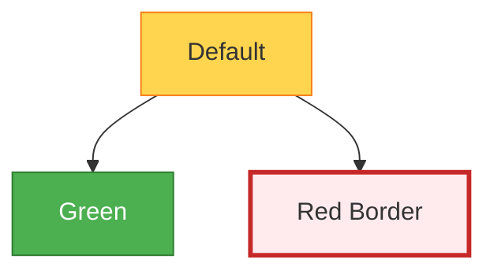

# Naiad Mermaid Rendering in lucidVIEW

## Attribution

Naiad is a .NET library for rendering [Mermaid](https://mermaid.js.org/) diagrams to SVG, created and maintained by **Simon Cropp** ([github.com/SimonCropp/Naiad](https://github.com/SimonCropp/Naiad)). Licensed under the MIT License. lucidVIEW uses a local fork with project-specific extensions; see [LOCAL_FORK_POLICY.md](../Naiad/LOCAL_FORK_POLICY.md) for details.

## Overview

lucidVIEW embeds Naiad to render all 25 Mermaid diagram types found in Markdown code blocks. Naiad parses the Mermaid syntax and renders each diagram type to SVG using dedicated C# parsers and renderers — no browser or JavaScript required. Flowchart diagrams additionally support a **native Avalonia vector control** pipeline with interactive hover highlighting, while all diagram types are also available via the SVG-to-SkiaSharp rasterisation pipeline.

## Supported Diagram Types (25)

All diagram types supported by Naiad, with the syntax keyword that triggers each and links to the official mermaid.js documentation. All 31 test samples (including styling variants) render successfully via [RenderCli](../Naiad/src/Naiad.RenderCli/Program.cs) samples.

| # | Type | Keyword(s) | Mermaid Docs | RenderCli Sample | Notes |
|---|------|-----------|-------------|-----------------|-------|
| 1 | Flowchart | `flowchart`, `graph` | [Flowchart](https://mermaid.js.org/syntax/flowchart.html) | `flowchart-simple-lr`, `flowchart-fanout-td`, `flowchart-subgraph-lr`, `flowchart-back-edge`, `flowchart-multi-shape`, `flowchart-custom-styles`, `flowchart-classDef` | Native Avalonia rendering with hover highlighting. Supports `style`, `classDef`, `class` directives. |
| 2 | Sequence | `sequenceDiagram` | [Sequence](https://mermaid.js.org/syntax/sequenceDiagram.html) | `sequence` | |
| 3 | Class | `classDiagram` | [Class](https://mermaid.js.org/syntax/classDiagram.html) | `class` | |
| 4 | State | `stateDiagram-v2`, `stateDiagram` | [State](https://mermaid.js.org/syntax/stateDiagram.html) | `state` | |
| 5 | Entity Relationship | `erDiagram` | [ER](https://mermaid.js.org/syntax/entityRelationshipDiagram.html) | `er` | |
| 6 | Gantt | `gantt` | [Gantt](https://mermaid.js.org/syntax/gantt.html) | `gantt` | |
| 7 | Pie | `pie` | [Pie](https://mermaid.js.org/syntax/pie.html) | `pie` | |
| 8 | Git Graph | `gitGraph` | [Git Graph](https://mermaid.js.org/syntax/gitgraph.html) | `gitgraph` | |
| 9 | Mindmap | `mindmap` | [Mindmap](https://mermaid.js.org/syntax/mindmap.html) | `mindmap` | |
| 10 | Timeline | `timeline` | [Timeline](https://mermaid.js.org/syntax/timeline.html) | `timeline` | |
| 11 | C4 Context | `C4Context` | [C4](https://mermaid.js.org/syntax/c4.html) | `c4context` | |
| 12 | C4 Container | `C4Container` | [C4](https://mermaid.js.org/syntax/c4.html) | `c4container` | |
| 13 | C4 Component | `C4Component` | [C4](https://mermaid.js.org/syntax/c4.html) | `c4component` | |
| 14 | C4 Deployment | `C4Deployment` | [C4](https://mermaid.js.org/syntax/c4.html) | `c4deployment` | |
| 15 | Block | `block-beta` | [Block](https://mermaid.js.org/syntax/block.html) | `block` | |
| 16 | Kanban | `kanban` | [Kanban](https://mermaid.js.org/syntax/kanban.html) | `kanban` | |
| 17 | Quadrant | `quadrantChart` | [Quadrant](https://mermaid.js.org/syntax/quadrantChart.html) | `quadrant` | |
| 18 | Requirement | `requirementDiagram` | [Requirement](https://mermaid.js.org/syntax/requirementDiagram.html) | `requirement` | |
| 19 | Sankey | `sankey-beta` | [Sankey](https://mermaid.js.org/syntax/sankey.html) | `sankey` | |
| 20 | User Journey | `journey` | [User Journey](https://mermaid.js.org/syntax/userJourney.html) | `journey` | |
| 21 | XY Chart | `xychart-beta` | [XY Chart](https://mermaid.js.org/syntax/xyChart.html) | `xychart` | |
| 22 | Architecture | `architecture-beta` | [Architecture](https://mermaid.js.org/syntax/architecture.html) | `architecture` | |
| 23 | Packet | `packet-beta` | [Packet](https://mermaid.js.org/syntax/packet.html) | `packet` | |
| 24 | Radar | `radar-beta` | [Radar](https://mermaid.js.org/syntax/radar.html) | `radar` | |
| 25 | Treemap | `treemap-beta` | [Treemap](https://mermaid.js.org/syntax/treemap.html) | `treemap` | |

**Not yet implemented:** ZenUML (declared in enum only; [mermaid docs](https://mermaid.js.org/syntax/zenuml.html)).

### Mermaid.js Diagram Types NOT in Naiad

These diagram types exist in mermaid.js but are not implemented in Naiad:

| Type | Mermaid Docs | Status |
|------|-------------|--------|
| ZenUML | [ZenUML](https://mermaid.js.org/syntax/zenuml.html) | Enum declared, no parser/renderer |

### Flowchart Custom Styling

Naiad supports the following flowchart styling directives:

- **`style <nodeId> <css-props>`** — inline style on a specific node
- **`classDef <name> <css-props>`** — define a reusable style class
- **`class <nodeId>[,<nodeId>...] <className>`** — apply a class to nodes

Supported CSS properties: `fill`, `stroke`, `stroke-width`, `stroke-dasharray`, `color` (text colour), `font-family`, `font-size`, `font-weight`.

Example:


> **Note:** The `:::className` inline syntax (e.g. `A[Text]:::primary`) is not currently supported. Use the `class` directive instead.

## Rendering Pipelines

### Standard Pipeline (non-flowchart diagrams)

1. MarkdownService detects mermaid fenced code blocks
2. [Mermaid.Render()](../Naiad/src/Naiad/Mermaid.cs) produces an SVG string
3. SkiaSharp rasterises the SVG to PNG
4. An Image control displays the PNG in the Avalonia visual tree

### Native Pipeline (flowcharts only)

1. [MarkdownService](../MarkdownViewer/Services/MarkdownService.cs) detects flowchart code blocks
2. [Mermaid.ParseAndLayoutFlowchart()](../Naiad/src/Naiad/Mermaid.cs) returns a FlowchartLayoutResult
3. [FlowchartCanvas](../MarkdownViewer/Controls/FlowchartCanvas.cs) renders natively via Avalonia DrawingContext
4. Vector graphics with interactive hover/click — no rasterisation

The native pipeline produces a [FlowchartLayoutResult](../Naiad/src/Naiad/Diagrams/Flowchart/FlowchartLayoutResult.cs) containing:
- Positioned nodes with shape, label, style, and bounds
- Routed edges with orthogonal point lists and label positions
- Subgraph bounds and titles
- Resolved theme skin (colours for nodes, edges, text, backgrounds)
- Diagram bounding box dimensions

## Native Flowchart Features

### Interactive Hover Highlighting

Hovering over a node highlights the **data flow path** through the graph:
- **Upstream trace:** follows incoming edges back to the source
- **Downstream trace:** follows single outgoing edges forward; at branch points, highlights all immediate branches
- **Edge hover:** highlights the specific edge and its two endpoint nodes

Highlighted edges display **animated marching ants** showing flow direction.

### Shape-Aware Colouring

Each node shape has a dedicated colour palette (light and dark variants):

| Shape | Light Fill | Light Stroke | Purpose |
|-------|-----------|-------------|---------|
| RoundedRectangle | Soft blue | Bold blue | Processes |
| Rectangle | Lavender | Purple | Data/IO |
| Stadium | Mint green | Green | Terminals |
| Diamond | Warm amber | Gold | Decisions |
| Hexagon | Rose | Red | Preparation |
| Circle | Cyan | Teal | Connectors |
| Subroutine | Deep purple | Violet | Subroutines |
| Cylinder | Orange | Burnt orange | Databases |
| Parallelogram | Indigo | Deep indigo | IO |
| Trapezoid | Brown | Dark brown | Manual operations |

### Semantic Decision Edge Colouring

Edges with labels matching common decision patterns are colour-coded:
- **Green:** `yes`, `true`, `ok`, `success`, `pass`, `accept`
- **Red:** `no`, `false`, `fail`, `error`, `reject`, `cancel`

### Click-to-Navigate

Nodes with `click` directives (URLs) show a hand cursor on hover and navigate on click.

### Right-Click Context Menu

Right-clicking a native flowchart shows:
- **Save Diagram as PNG...** — re-renders via Naiad SVG→SkiaSharp at 3x scale
- **Save Diagram as SVG...** — exports raw SVG from Naiad

### Responsive Scaling

The FlowchartCanvas scales down to fit the available width (never scales up), maintaining crisp vector rendering at any size.

## Edge Routing

### Orthogonal Manhattan Routing

All edges use orthogonal (horizontal/vertical only) paths with optional curved corners at bends. The routing system:

1. **Exit port assignment:** Each outgoing edge gets a specific port on the source node:
   - Diamond (2 outputs): uses opposite side ports (North/South for LR, East/West for TB)
   - Off-axis targets: route via the side port closest to the target (e.g., North for targets above in LR flow)
   - Inline targets: distribute offsets along the default exit port

2. **Entry port distribution:** When multiple edges enter the same node, they're spread across the entry side with even offsets.

3. **Channel separation:** Sibling edges from the same source use different mid-channel positions (14px spacing) so their intermediate segments don't overlap.

4. **Back-edge detection:** Edges pointing "upstream" (against flow direction) are routed with wide 6-point detour loops around both nodes.

5. **Node overlap avoidance:** A post-processing pass detects edges that pass through intermediate nodes and adds detours around them.

### Self-Loop Routing

Edges where source and target are the same node create a loop path routed to the right and below the node.

## Theme Integration

Flowcharts support 6 built-in themes via [FlowchartSkin](../Naiad/src/Naiad/Diagrams/Flowchart/FlowchartSkin.cs):
- **Default** — React Flow-inspired pastel palette
- **Dark** — deep backgrounds with lighter strokes
- **Forest** — green-tinted natural palette
- **Neutral** — greyscale
- (Plus custom skins from Mermaid `%%{init: {theme: ...}}%%` directives)

The [FlowchartCanvas](../MarkdownViewer/Controls/FlowchartCanvas.cs) detects dark/light mode from the skin's background luminance and selects the appropriate shape colour palette. Theme changes update via the SkinOverride property without re-running layout.

## Caching

### [MermaidCacheService](../MarkdownViewer/Services/MermaidCacheService.cs)

Rendered diagram PNGs are cached to disk at `%APPDATA%/MarkdownViewer/mermaid-cache/`. Cache keys are SHA256 hashes of the mermaid code, theme, and render options. The cache:
- Avoids re-rendering unchanged diagrams on file reload
- Persists across application restarts
- Evicts entries older than 7 days on startup

### Native Flowchart Layouts

[FlowchartLayoutResult](../Naiad/src/Naiad/Diagrams/Flowchart/FlowchartLayoutResult.cs) objects are stored in memory per document load. They're lightweight (just positioned model data) and don't need disk caching.

## RenderCli — Visual Testing Tool

[Naiad.RenderCli](../Naiad/src/Naiad.RenderCli/Program.cs) is a CLI tool for rendering and comparing diagrams:

```bash
# Render a single diagram from stdin
echo "flowchart LR; A-->B" | dotnet run --project Naiad/src/Naiad.RenderCli -- render test.png

# Render all 31 built-in samples (light + dark)
dotnet run --project Naiad/src/Naiad.RenderCli -- samples ./test-output

# Side-by-side comparison: Naiad vs mermaid.js (via Playwright)
dotnet run --project Naiad/src/Naiad.RenderCli -- compare ./compare-output
```

The `compare` command:
1. Renders all samples with Naiad (C#)
2. Renders the same samples with real mermaid.js via a Playwright headless browser
3. Generates an HTML report (`index.html`) showing both side-by-side

## Security

Naiad enforces resource limits for untrusted input: max 1000 nodes, 500 edges, 50KB input, 10-second timeout. CSS injection protection, icon class validation, and XSS prevention via XML/HTML encoding. See [SECURITY.md](../Naiad/SECURITY.md) for the full threat model.
