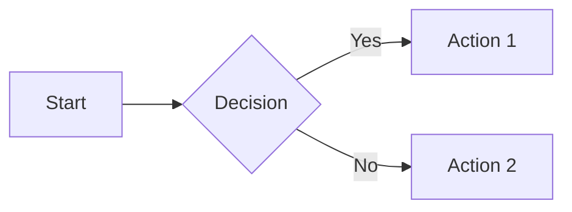

# Building a Custom Renderer for Naiad

**Date:** 2026-02-21

What if you could render Mermaid diagrams in a terminal using nothing but colored text blocks? It sounds improbable, but with ISO half block characters and ANSI color codes, you can get surprisingly good results. In this post, I'll walk through building a console renderer for Naiad, and in doing so, show you how to create your own custom render surface plugins.

## The Console Renderer in Action

Before we dive into the code, here's what we're building—a console renderer that turns this:



Into ANSI terminal output using half-block characters:

```
▀▀▀▀▀▀▀   ▀▀▀▀▀▀▀   ▀▀▀▀▀▀▀
█Start█───█Decision█──█Action 1█
▄▄▄▄▄▄▄   ▄▄▄▄▄▄▄   ▄▄▄▄▄▄▄
              │
              ▼
          ▀▀▀▀▀▀▀
          █Action 2█
          ▄▄▄▄▄▄▄
```

Each character represents two vertical pixels, with foreground and background colors independently controlled.

## Understanding the Plugin Architecture

Naiad uses a **Render Surface** plugin system for output formats. The core renderer produces an `SvgDocument`, and plugins transform that into different output formats like PNG, PDF, XAML, or in our case—ANSI text.

### The Key Interfaces

```csharp
// Define what format you support
public enum RenderSurfaceFormat
{
    Svg, Png, Pdf, Jpeg, Webp, Xps, Xaml, ReactFlow, Console
}

// The plugin interface
public interface IDiagramRenderSurfacePlugin
{
    string Name { get; }
    IReadOnlyCollection<RenderSurfaceFormat> SupportedFormats { get; }
    bool Supports(RenderSurfaceFormat format);
    RenderSurfaceOutput Render(RenderSurfaceContext context, RenderSurfaceRequest request);
}

// What you receive
public sealed record RenderSurfaceContext(
    string MermaidSource,
    DiagramType DiagramType,
    SvgDocument SvgDocument,
    RenderOptions? RenderOptions);

// What you return
public sealed record RenderSurfaceOutput(
    byte[]? Bytes,
    string? Text,
    string MimeType);
```

## Building the Console Renderer

### Step 1: The Plugin Skeleton

```csharp
public sealed class ConsoleDiagramRenderSurfacePlugin : IDiagramRenderSurfacePlugin
{
    public string Name => "console";
    public IReadOnlyCollection<RenderSurfaceFormat> SupportedFormats => [RenderSurfaceFormat.Console];
    public bool Supports(RenderSurfaceFormat format) => format == RenderSurfaceFormat.Console;

    public RenderSurfaceOutput Render(RenderSurfaceContext context, RenderSurfaceRequest request)
    {
        // We'll fill this in
    }
}
```

### Step 2: Rasterizing the SVG

The trick is that we need pixel data, not vectors. We use SkiaSharp to rasterize the SVG to a bitmap:

```csharp
using var svg = new SKSvg();
svg.FromSvg(context.SvgDocument.ToXml());

var scale = request.Scale;
var bounds = svg.Picture.CullRect;
var width = (int)Math.Ceiling(bounds.Width * scale);
var height = (int)Math.Ceiling(bounds.Height * scale);

using var bitmap = new SKBitmap(width, height);
using var canvas = new SKCanvas(bitmap);
canvas.Clear(backgroundColor);
canvas.Scale(scale);
canvas.DrawPicture(svg.Picture);
```

Now we have pixel data we can sample.

### Step 3: The Half Block Algorithm

The magic is in the Unicode block characters:

| Character | Code Point | Top Half | Bottom Half |
|-----------|------------|----------|-------------|
| ▀ | U+2580 | Foreground | Background |
| ▄ | U+2584 | Background | Foreground |
| █ | U+2588 | Foreground | Foreground |
| (space) | U+0020 | Background | Background |

For each pair of vertical pixels (y, y+1), we output one character with appropriate colors:

```csharp
for (var y = 0; y < height; y += 2)
{
    for (var x = 0; x < width; x++)
    {
        var topPixel = bitmap.GetPixel(x, y);
        var bottomPixel = bitmap.GetPixel(x, y + 1);

        if (topPixel == bottomPixel)
        {
            // Same color: use full block or space
            output.Append(FullBlock);
            SetForegroundColor(topPixel);
        }
        else
        {
            // Different colors: use half block
            output.Append(UpperHalfBlock);
            SetForegroundColor(topPixel);
            SetBackgroundColor(bottomPixel);
        }
    }
    output.AppendLine();
}
```

### Step 4: ANSI Color Codes

For 24-bit true color support:

```csharp
// Foreground: \x1b[38;2;R;G;Bm
// Background: \x1b[48;2;R;G;Bm

void SetForegroundColor(SKColor color) =>
    output.Append($"\x1b[38;2;{color.Red};{color.Green};{color.Blue}m");

void SetBackgroundColor(SKColor color) =>
    output.Append($"\x1b[48;2;{color.Red};{color.Green};{color.Blue}m");
```

### Step 5: Optimization - Color Caching

ANSI escape codes add overhead. Cache the previous colors to avoid redundant sequences:

```csharp
SKColor prevFg = default;
SKColor prevBg = default;

void WriteColorBoth(SKColor fg, SKColor bg)
{
    if (fg != prevFg || bg != prevBg)
    {
        output.Append($"\x1b[38;2;{fg.Red};{fg.Green};{fg.Blue}" +
                      $";48;2;{bg.Red};{bg.Green};{bg.Blue}m");
        prevFg = fg;
        prevBg = bg;
    }
}
```

## The Complete Plugin

Here's the full implementation (about 120 lines):

```csharp
using System.Text;
using SkiaSharp;
using Svg.Skia;

namespace MermaidSharp.Rendering.Surfaces;

public sealed class ConsoleDiagramRenderSurfacePlugin : IDiagramRenderSurfacePlugin
{
    const char UpperHalfBlock = '\u2580';
    const char LowerHalfBlock = '\u2584';
    const char FullBlock = '\u2588';
    const char Space = ' ';

    public string Name => "console";
    public IReadOnlyCollection<RenderSurfaceFormat> SupportedFormats => [RenderSurfaceFormat.Console];
    public bool Supports(RenderSurfaceFormat format) => format == RenderSurfaceFormat.Console;

    public RenderSurfaceOutput Render(RenderSurfaceContext context, RenderSurfaceRequest request)
    {
        var xml = context.SvgDocument.ToXml();
        using var svg = new SKSvg();
        svg.FromSvg(xml);

        var scale = Math.Max(0.1f, request.Scale);
        var bounds = svg.Picture!.CullRect;
        var width = (int)Math.Ceiling(bounds.Width * scale);
        var height = (int)Math.Ceiling(bounds.Height * scale);

        using var bitmap = Rasterize(svg.Picture, width, height, scale);
        var ansi = RenderToAnsi(bitmap, request.Quality);

        return RenderSurfaceOutput.FromText(ansi, "text/plain");
    }

    static string RenderToAnsi(SKBitmap bitmap, int quality)
    {
        var sb = new StringBuilder();
        var threshold = (255 - quality) * 3;

        for (var y = 0; y < bitmap.Height; y += 2)
        {
            for (var x = 0; x < bitmap.Width; x++)
            {
                var top = bitmap.GetPixel(x, y);
                var bottom = y + 1 < bitmap.Height 
                    ? bitmap.GetPixel(x, y + 1) 
                    : default;

                if (ColorsSimilar(top, bottom, threshold))
                {
                    sb.Append($"\x1b[38;2;{top.Red};{top.Green};{top.Blue}m{FullBlock}");
                }
                else
                {
                    sb.Append($"\x1b[38;2;{top.Red};{top.Green};{top.Blue}" +
                              $";48;2;{bottom.Red};{bottom.Green};{bottom.Blue}m{UpperHalfBlock}");
                }
            }
            sb.AppendLine("\x1b[0m");
        }
        return sb.ToString();
    }

    static bool ColorsSimilar(SKColor a, SKColor b, int threshold) =>
        Math.Abs(a.Red - b.Red) + Math.Abs(a.Green - b.Green) + Math.Abs(a.Blue - b.Blue) < threshold;

    static SKBitmap Rasterize(SKPicture picture, int width, int height, float scale)
    {
        var bitmap = new SKBitmap(width, height);
        using var canvas = new SKCanvas(bitmap);
        canvas.Clear(new SKColor(0x1E, 0x1E, 0x2E)); // Dark background
        canvas.Scale(scale);
        canvas.DrawPicture(picture);
        return bitmap;
    }
}
```

## Registering Your Plugin

Create an extension method for easy registration:

```csharp
public static class SkiaRenderSurfaceExtensions
{
    public static void RegisterSkiaPlugins(this DiagramRenderSurfaceRegistry registry)
    {
        registry.Register(new SkiaDiagramRenderSurfacePlugin());
        registry.Register(new ConsoleDiagramRenderSurfacePlugin());
    }
}
```

Then in your application startup:

```csharp
MermaidRenderSurfaces.RegisterSkiaPlugins();
```

## Using the Console Renderer

```csharp
var mermaidCode = """
    flowchart LR
        A[Start] --> B{Decision}
        B -->|Yes| C[Action 1]
        B -->|No| D[Action 2]
    """;

var success = MermaidRenderSurfaces.TryRender(
    mermaidCode,
    new RenderSurfaceRequest(RenderSurfaceFormat.Console, Scale: 0.5f),
    out var output,
    out var error);

if (success)
{
    Console.Write(output.Text);
}
```

## Tips for Building Your Own Renderers

1. **Start from SVG** - The `SvgDocument` is your universal input. Everything you need is there.

2. **Consider Scale** - The `Scale` parameter in `RenderSurfaceRequest` lets users control output resolution. For console, lower scale = fewer characters.

3. **Handle Backgrounds** - Use `request.Background` if provided, otherwise pick a sensible default for your format.

4. **Quality Parameter** - For raster formats, `request.Quality` (0-100) controls compression. We repurpose it as a color similarity threshold for console output.

5. **Return the Right MIME Type** - It helps consumers know how to handle your output.

## Conclusion

The Naiad render surface plugin system makes it straightforward to add new output formats. Whether you're targeting console, images, documents, or something more exotic, the pattern is the same:

1. Implement `IDiagramRenderSurfacePlugin`
2. Rasterize or transform the SVG as needed
3. Return `RenderSurfaceOutput` with your format's MIME type

The console renderer is a fun example that shows the flexibility of the system—and produces surprisingly readable diagrams in any terminal that supports 24-bit ANSI colors.

---

*The full source for the console renderer is in `Naiad/src/Naiad.Surfaces.Skia/ConsoleDiagramRenderSurfacePlugin.cs`.*
