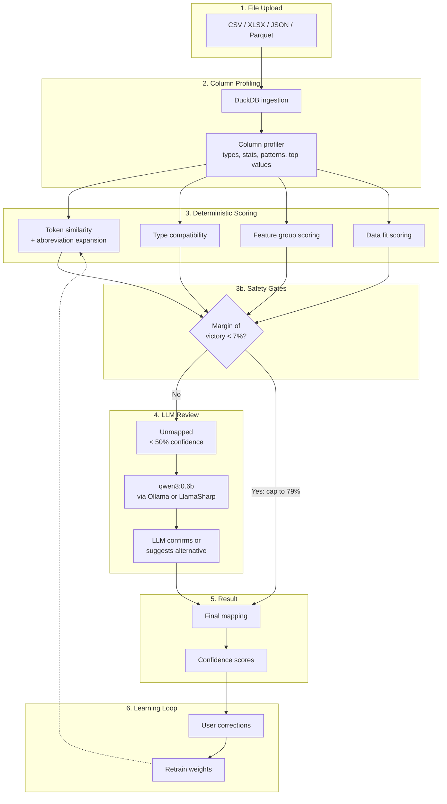

# Complex Mapping Engine Test

```mermaid
flowchart TB
    subgraph S1["1. File Upload"]
        A["CSV / XLSX / JSON / Parquet"]
    end

    subgraph S2["2. Column Profiling"]
        B["DuckDB ingestion"]
        C["Column profiler<br/>types, stats, patterns, top values"]
    end

    subgraph S3["3. Deterministic Scoring"]
        D["Token similarity<br/>+ abbreviation expansion"]
        E["Type compatibility"]
        F["Feature group scoring"]
        G["Data fit scoring"]
    end

    subgraph S3b["3b. Safety Gates"]
        H{"Margin of<br/>victory < 7%?"}
    end

    subgraph S4["4. LLM Review"]
        I["Unmapped<br/>< 50% confidence"]
        J["qwen3:0.6b<br/>via Ollama or LlamaSharp"]
        K["LLM confirms or<br/>suggests alternative"]
    end

    subgraph S5["5. Result"]
        L["Final mapping"]
        M["Confidence scores"]
    end

    subgraph S6["6. Learning Loop"]
        N["User corrections"]
        O["Retrain weights"]
    end

    A --> B
    B --> C
    C --> D
    C --> E
    C --> F
    C --> G
    D --> H
    E --> H
    F --> H
    G --> H
    H -->|"No"| I
    H -->|"Yes: cap to 79%"| L
    I --> J
    J --> K
    K --> L
    L --> M
    M --> N
    N --> O
    O -.-> D
```
