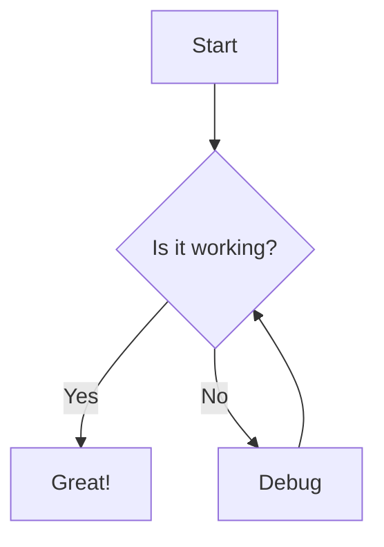
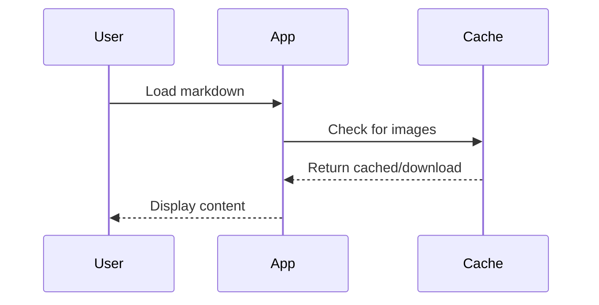

# Image Loading Test

This document tests various image formats and sources.

## Remote Images (HTTP/HTTPS)

### PNG Badges (shields.io)


### GitHub Avatars


### SVG Images


### Animated GIF


### WebP Image


## HTML img Tags


## Relative Paths (should work when loaded locally)

These would resolve relative to the markdown file location:
- `./images/local.png`
- `../assets/image.jpg`

## Data URIs


## Mermaid Diagrams





## Code Blocks

```csharp
public class ImageCacheService
{
    public async Task<string> CacheRemoteImageAsync(string url)
    {
        // Download and cache the image
        return localPath;
    }
}
```

```javascript
// JavaScript example
const loadImage = async (url) => {
    const response = await fetch(url);
    return response.blob();
};
```

## Tables

| Format | Supported | Notes |
|--------|-----------|-------|
| PNG | Yes | Standard format |
| JPG | Yes | Standard format |
| GIF | Yes | Including animated |
| WebP | Yes | Modern format |
| SVG | Yes | Converted to PNG |

## Lists

1. First item
2. Second item
   - Nested bullet
   - Another nested
3. Third item

- Bullet list
- Another bullet
  1. Nested numbered
  2. Another nested

## Blockquotes

> This is a blockquote.
> It can span multiple lines.

> **Note:** Important information here.

## Links

- [mostlylucid.net](https://mostlylucid.net)
- [GitHub](https://github.com)
- **[Bold Link](https://example.com)**

---

*End of test document*
