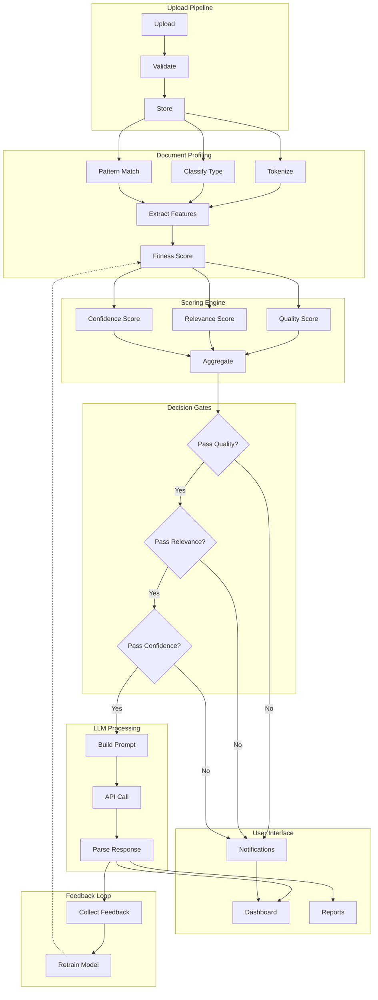
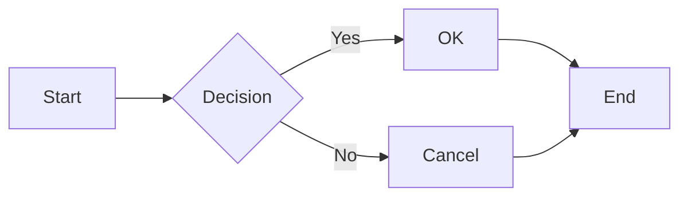

# Complex Subgraph Flowchart Test

This diagram has 7 subgraphs with cross-subgraph edges, fan-out patterns, and back-edges.

## Simple Flowchart (no subgraphs - should still use orthogonal routing)

