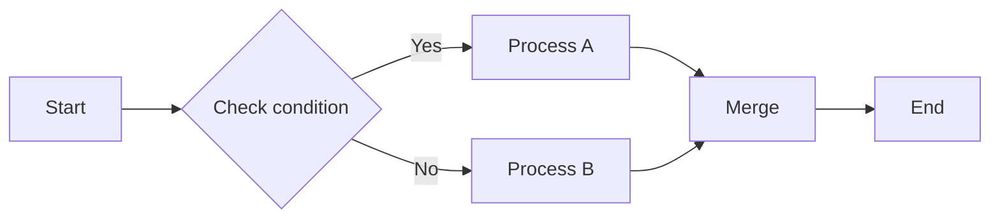

# LR Diamond Branch Test

Tests decision diamonds in LR flow:
- Diamond uses North/South ports for 2-branch decisions
- Labels on Yes/No branches don't overlap
- Both branches reconnect cleanly downstream

