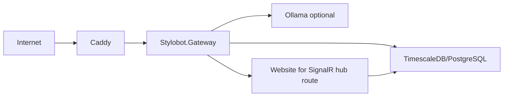

# LR Fan-out Test

Tests that edges from a single node to multiple targets in LR flow:
- All exit via the East port (no awkward North/South side ports)
- Offsets are distributed evenly along the source node's height
- No overlapping edge paths
- Arrows connect cleanly to target nodes

