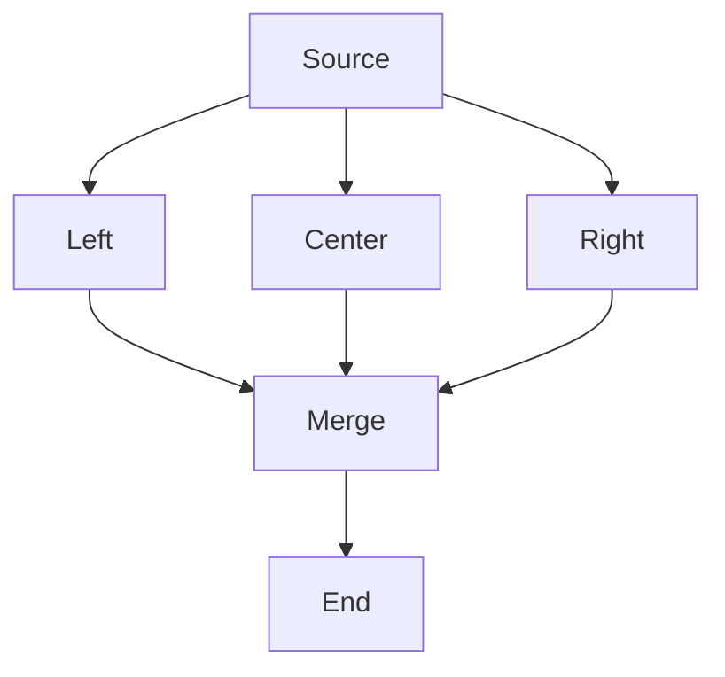

# TB Fan-out and Fan-in Test

Tests nodes that fan out to multiple targets then converge:
- Fan-out edges distribute evenly from source
- Fan-in edges distribute evenly into target
- No overlapping edge segments
- Minimal bends

