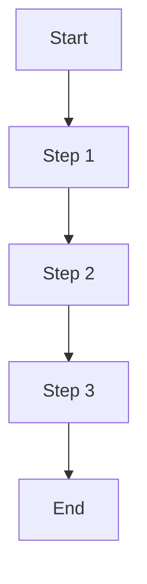

# TB Linear Chain Test

Tests simple top-to-bottom linear flow:
- All edges should be perfectly straight vertical lines
- No unnecessary bends
- Consistent spacing between nodes

```mermaid
flowchart TB
    A[Start] --> B[Step 1]
    B --> C[Step 2]
    C --> D[Step 3]
    D --> E[End]
```
