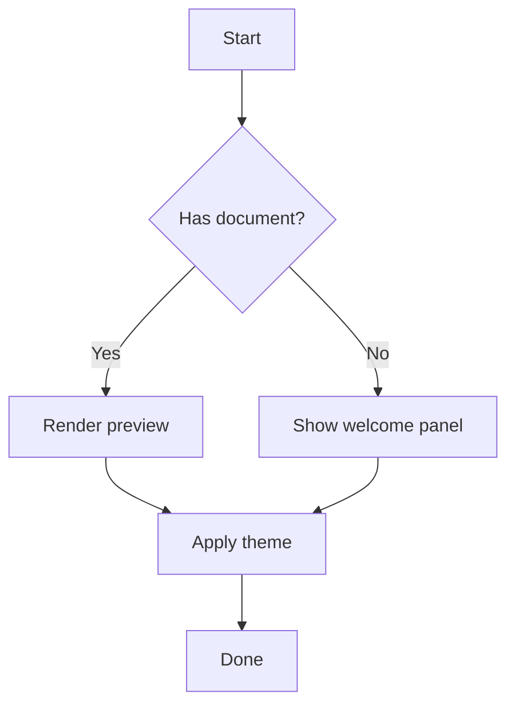

<!--testing-- ui-test, fixture, smoke -->
<datetime class="hidden">2026-04-10T12:00</datetime>

# lucidVIEW UI Test Fixture

A small but feature-rich markdown document used by the UI testing harness to
exercise lucidVIEW's rendering, TOC, search, theme switching, font/zoom controls
and tab toggles.

## Headings populate the TOC

This second-level heading shows up in the Table of Contents panel. The TOC test
verifies that toggling `TocButton` opens the panel and lists this entry.

### A third-level heading

Used to verify that the TOC margin/indentation logic works for nested entries.

## Inline and block code

Inline `code spans` should render in a monospace face. Fenced code blocks should
get syntax highlighting:

```csharp
public static int Add(int a, int b) => a + b;
```

```python
def greet(name: str) -> str:
    return f"Hello, {name}!"
```

## A mermaid diagram

The mermaid block exercises the Naiad rendering pipeline plus the
`DiagramCanvas` text-element path.



## A table

| Theme           | Background  | Accent    |
|-----------------|-------------|-----------|
| Light           | `#ffffff`   | `#0969da` |
| Dark            | `#0d1117`   | `#58a6ff` |
| MostlyLucidDark | `#0f0f23`   | `#7c3aed` |

## A list

- First item — used by the **search** test to find the word "first"
- Second item with a [link to Avalonia](https://avaloniaui.net/)
- Third item

## A blockquote

> This blockquote contains a sentence the search test will look for.
> Searching for the word `blockquote` should land on this paragraph.

## An image (broken on purpose)


